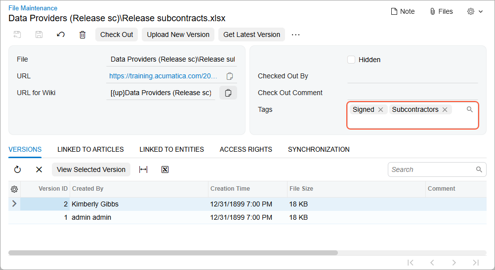
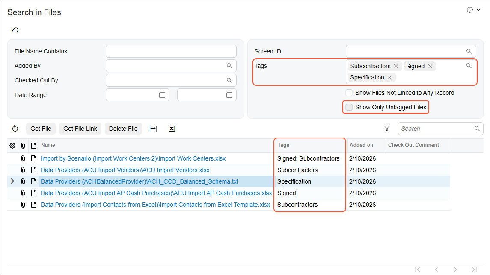

# Attachments: File Maintenance {#_707c3e2d-dc3c-41b3-a75b-ed8bb53b82ef .concept}

Acumatica ERP provides additional capabilities for managing file attachments. By using the [File Maintenance](SM_20_25_10.md) \(SM202510\) form, you can control access to a file attachment and maintain multiple versions of a file \(if needed\); also, if you’re considering deleting a file, you can first review its links to records.

On the [Search in Files](SM_20_25_20.md) \(SM202520\) form, you can search for an uploaded file to link it to a record or search for files without any links, which you may opt to delete.

You use the [File Upload Preferences](SM_20_25_50.md) \(SM202550\) form to specify the permitted file types and the maximum size for files that may be uploaded.

## Access to Files { .section}

You use the **Inherit Access Rights from Entities** check box on the **Access Rights** tab of the [File Maintenance](SM_20_25_10.md) \(SM202510\) form to control how the system determines access to a file. By default, the check box is selected, and the system determines access rights to a file attachment by combining the user’s access rights to:

-   The form or wiki article that was used when the file was uploaded
-   The records linked to the file

For example, suppose that a file was uploaded by using the [Sales Orders](SO_30_10_00.md) \(SO301000\) form and then linked to a purchase order on the [Purchase Orders](PO_30_10_00.md) \(PO301000\) form. In this case, users will have access to the file if they have access to at least one of these forms.

Suppose that you clear the **Inherit Access Rights from Entities** check box on the [File Maintenance](SM_20_25_10.md) form for a file. Users will have access to it only if they have access to the form specified for the file in the **Primary Screen** or **Primary Page** box on the **Access Rights** tab of the form.

Also, you can make the file available to all users by selecting the **Public** check box on the **Access Rights** tab of the [File Maintenance](SM_20_25_10.md) form.

To make the file unavailable to users accessing the system from outside, such as through file transfer protocol \(FTP\), you select the **Hidden** check box in the Summary area of the form.

For more granular control of access to project and construction files, you can use tag-based access. You can assign one or more tags to a file. Each tag has its own access rights that define what users with that role can do with the file. For details, see [Managing Project Files: Tag and File Access Setup](Projects_File_Management_Configuration.md).

## Version Maintenance { .section}

If you need to modify an uploaded file and attach the modified version while keeping its previous version, you can upload an unlimited number of versions for the file. To do this, click **Upload New Version** on the form toolbar of the [File Maintenance](SM_20_25_10.md) \(SM202510\) form. For each new version of the file, you should provide a comment about its contents. This will help users find the file and file version they need.

The system displays the list of available file versions on the **Versions** tab of the form. You can download and review any version by selecting the corresponding table row and clicking **View Selected Version** on the table toolbar of the tab. To download the latest version of the file, you click **Get Latest Version** on the form toolbar. You can delete an unnecessary version of a file by clicking the row of the version and then clicking **Delete Row** on the table toolbar.

You can make the file unavailable for editing to other users while you are updating it by clicking **Check Out** on the form toolbar. When you are done with the modifications, you click **Upload New Version** on the form toolbar. Then you select the **Check In** check box in the **File Upload** dialog box to make the file available for editing to other users. Alternatively, you can click **Undo Check Out** on the form toolbar to release the file without uploading a new version.

## File Deletion { .section}

To delete a file, you open it on the [File Maintenance](SM_20_25_10.md) \(SM202510\) form and click **Delete** on the form toolbar. The system deletes the file itself, as well as links to the entities and wiki articles \(if any\) to which it was linked.

**Important:** Deleted files cannot be restored.

If you delete a record with any attached files, the system removes the attached files and all their versions, along with the record they were attached to, if there are no other links to these files in the system. If an attachment to the deleted record has links to other records in the system, then the system deletes only the link to the record that is to be deleted.

For example, suppose that the `ABC.png` file was uploaded and attached to a sales order by using the [Sales Orders](SO_30_10_00.md) \(SO301000\) form. Then the same file was linked to a purchase order. The system displays both entities that the file is linked to on the **Linked to Entities** tab of the [File Maintenance](SM_20_25_10.md) \(SM202510\) form.

Further suppose that a user deletes the sales order. The system deletes the link to the sales order for the `ABC.png` file, but keeps the file in the system because it is linked to the purchase order. If a user deletes the purchase order, then the system deletes the link for the file, verifies that the file has no other links on the **Entities** tab, and then deletes the file from the database.

In Acumatica ERP versions earlier than 2021 R1, when a record was deleted or some of its details were deleted, the record’s attached files remained in the database, taking up space. To find these files in Version 2021 R1 or later, you select the **Show Files Not Linked to Any Record** check box on the Selection area of the [Search in Files](SM_20_25_20.md) \(SM202520\) form, and the system displays the list of files without links in the table below. For each file you want to delete, you select the file and click **Delete File** on the table toolbar. Alternatively, you can click a file name to go to the [File Maintenance](SM_20_25_10.md) \(SM202510\) form, where you can review the file’s settings and then delete it, if needed.

## File Type and Size Preferences { .section}

In Acumatica ERP, you can allow or deny the importing of specific file types \(by their extensions\) and set a maximum size for imported files. You use the [File Upload Preferences](SM_20_25_50.md) \(SM202550\) form to view and edit the file types and sizes that users may import to the site.

## Assigning Tags {#section_hsg_rtf_khc .section}

You can label files with tags to organize them to your liking. Additionally, for project and construction documents, you can use tags to establish role-based access to files.

At first, administrators should create any needed tags on the [File Tags](SM_20_25_60.md) \(SM202560\) form and assign access rights to them.

Once done, you can assign tags a file, using the **Tags** box on the [File Maintenance](SM_20_25_10.md) \(SM202510\) form. Clicking the magnifier icon in this box displays the **Select Tags** dialog box, where you can select from the tags you have access to.

## Searching by Tags {#section_o5v_kwf_khc .section}

While searching for files on the [Search in Files](SM_20_25_20.md) \(SM202520\) form, you can use tags as search criteria, as shown below:

-   To search for files with specific tags, specify them in the **Tags** box in the Selection area.
-   To search for files with no assigned tags, select the **Show Only Untagged Files** check box in the Selection area.

In the new **Tags** column of the search results table \(also shown below\), you can see what tags are assigned to each file.

**Parent topic:**[Working with Attachments](../UserGuide/GS_Working_With_Attachments_Mapref.md)

