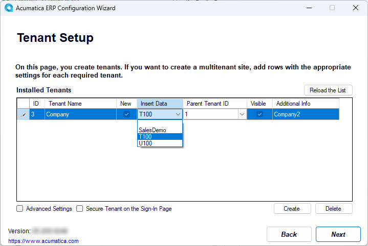

# Instance Deployment: To Deploy an Instance with Demo Data {#_44b97b93-f850-4600-aa0a-fa5e5e76d8f6 .task}

In this activity, you will learn how to deploy an Acumatica ERP application instance with demo data.

## Story { .section}

Suppose that you are the system administrator of your company, and you need to deploy the Acumatica ERP application instance with the *T100* dataset.

## Process Overview { .section}

In this activity, you will deploy the Acumatica ERP application instance with the *T100* dataset.

## System Preparation { .section}

Before you begin deploying an Acumatica ERP application instance, make sure that you have performed the following prerequisite activity: [Acumatica ERP Installation On-Premises: To Install the Acumatica ERP Configuration Wizard](INST_Installing_Configuration_Wizard_Activity.md).

## Step: Deploying an Instance with the Demo Data { .section}

To create an Acumatica ERP instance with the *T100* dataset inserted, do the following:

1.  On the Start menu, click **Acumatica ERP Configuration** to open the Acumatica ERP Configuration wizard.
2.  On the Welcome page, which opens, click **Perform Application Maintenance**.
3.  Below the list of existing application instances, click **Create**.
4.  On the Database Server Connection page, specify the following settings, and then click **Next** to go to the next page:
    -   **Server Type**: *Microsoft SQL Server*
    -   **Server Name**: `(local)`
    -   **Windows Authentication**: Selected
5.  On the Database Configuration page, specify the following settings, and then click **Next** to go to the next page:
    -   **Create a New Database**: Selected
    -   **New Database's Name**: `AcumaticaT100`
6.  On the Tenant Setup page, double-click in the **Insert Data** column for the automatically created row with the *Company* tenant name, and select *T100*, as shown in the following screenshot.

    

7.  Click **Next** to go to the next page.
8.  On the Database Connection page, select **Windows Authentication**; click **Next**.
9.  On the Instance Configuration page, specify the following settings, and then click **Next** to go to the next page:
    -   **Instance Name**: `AcumaticaT100`
    -   **Create Acumatica ERP Site**: Selected
    -   **Local Path to the Instance**: The path to the application instance on the local computer
10. On the Website Configuration page, specify the following settings, and then click **Next** to go to the next page:

    -   **Website Settings**: *Default Web Site*
    -   **Create Virtual Directory**: Selected
    -   **Virtual Directory Name**: `AcumaticaT100`
    -   **Compile the Site**: Selected
    -   **Install Node.js**: Selected
    -   **Use Modern UI as Default**: Selected
    -   **Use Existing Application Pool**: Selected
    -   **Available Application Pools**: *DefaultAppPool*
    Leave the other settings without changes.

11. On the RabbitMQ Configuration page, which opens, make sure the **Set up RabbitMQ on this server automatically** option is selected and then click **Next**.

12. On the Confirmation of Configuration page, review the settings, and click **Finish**. Wait while the new application instance is created.
13. After the installation is completed, click **OK** in the dialog box to return to the Acumatica ERP Configuration wizard.
14. Click **Perform Application Maintenance**.
15. Click the row with *AcumaticaT100* instance, and then click **Launch**.

    The instance opens in a new tab of your default browser.

16. Use the *admin* username and the *setup* password to sign in to the instance for the first time, and change the default password.

    **Important:** By default, a password must be at least eight characters and contain characters from three of the following four categories: English uppercase characters \(*A* through *Z*\), English lowercase characters \(*a* through *z*\), numerals \(*0* through *9*\), and special characters \(such as *!*, *$*, *\#*, and *%*\). For details, see [Preparing an Instance: System-Wide Security Policy](../ImplementationGuide/config_SA_Prep_Instance_for_Implem_Secure_Access_Implementers.md).

    The home page of the Acumatica ERP instance opens.

17. To verify that the demo data has been inserted, open the [Employees](EP_20_30_00.md) \(EP203000\) form, and make sure that there are six employees \(Michael Andrews, Maxwell Baker, Layla Beauvoir, Joseph Becher, Martin Bernia, and Todd Bloom\). These employees do not come in the out-of-the-box tenant; they have appeared in the instance because you directed the wizard to insert the demo data.

**Parent topic:**[Deploying Acumatica ERP Instances](../UserGuide/INST_Deploying_Instances_Mapref.md)

