# Instance Deployment: To Deploy an Out-of-the-Box Instance {#_bc648ef2-ed0a-4ade-8d27-9262d9c1c7cd .task}

In this activity, you will learn how to deploy an Acumatica ERP out-of-the-box application instance \(that is, the instance without demo data\) and sign in to it for the first time.

## Story { .section}

Suppose that you are the system administrator of your company, and you need to deploy the Acumatica ERP out-of-the-box instance.

## Process Overview { .section}

In this activity, you will do the following:

1.  Deploy the Acumatica ERP out-of-the-box instance
2.  Sign in to the Acumatica ERP out-of-the-box instance for the first time

## System Preparation { .section}

Before you begin deploying an Acumatica ERP out-of-the-box application instance, make sure you have installed the Acumatica ERP Configuration wizard by performing the following prerequisite activity: [Acumatica ERP Installation On-Premises: To Install the Acumatica ERP Configuration Wizard](INST_Installing_Configuration_Wizard_Activity.md).

## Step 1: Deploying an Out-of-the-Box Instance { .section}

To deploy an Acumatica ERP out-of-the-box instance, do the following:

1.  On the Start menu, click **Acumatica ERP Configuration** to open the Acumatica ERP Configuration wizard.
2.  On the Welcome page, click **Deploy a New Acumatica ERP Instance**, as shown in the following screenshot.

    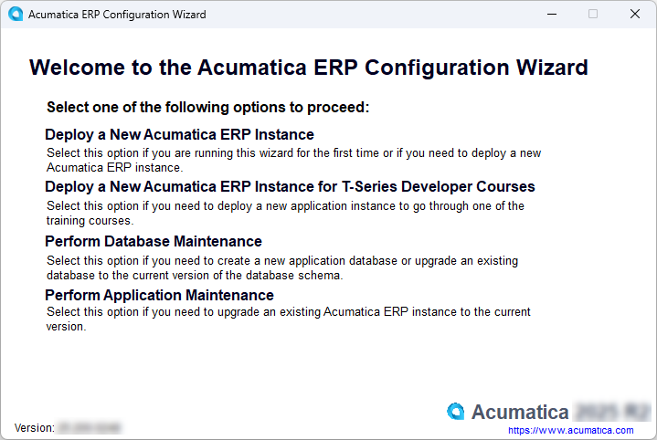

3.  On the Database Server Connection page, which opens, specify the following settings, and then click **Next**:
    1.  **Server Type**: *Microsoft SQL Server*
    2.  **Server Name**: `(local)`

        **Note:** If you are using the Microsoft SQL Server Express edition, enter `LOCALHOST\SQLEXPRESS`.

    3.  **Windows Authentication**: Selected
    4.  Optionally. **Encrypt Database Server Connection**: Selected

        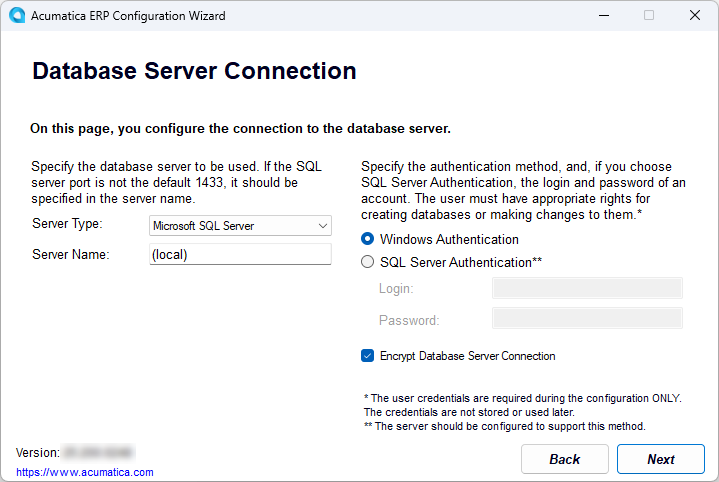

4.  On the Database Configuration page, which opens, enter the following settings to create a new database, and then click **Next**:

    1.  **Create a New Database**: Selected
    2.  **New Database's Name**: `AcumaticaS100` .

        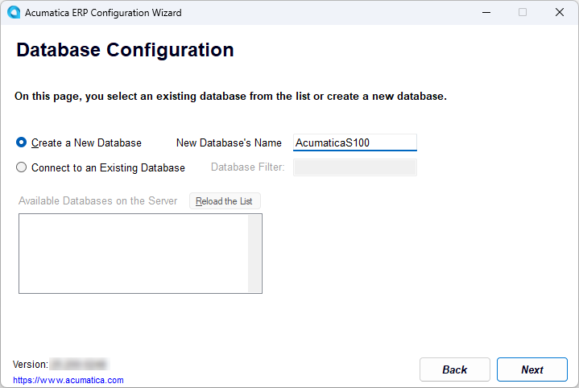

    The Tenant Setup page opens. By default, the wizard creates a new tenant with no data preloaded and with the default name *Company* in the **Tenant Name** column. The name specified in this column is displayed on the Sign-in page of the application instance and in the instance’s user interface.

5.  On the Tenant Setup page, change the tenant name to `MyCompany`, and then click **Next** to go to the next page.

    Leave the default values in other boxes, as shown in the following screenshot.

    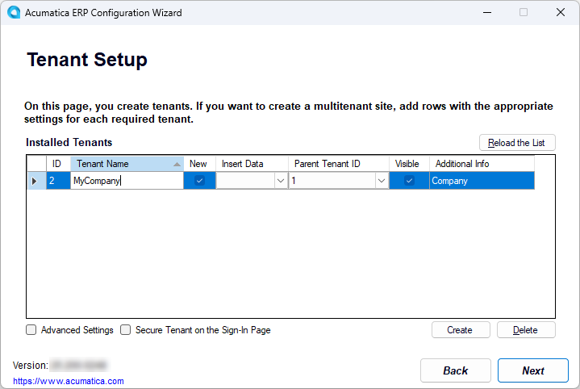

6.  On the Database Connection page, which opens, leave the default **Windows Authentication** option selected, and click **Next**.

    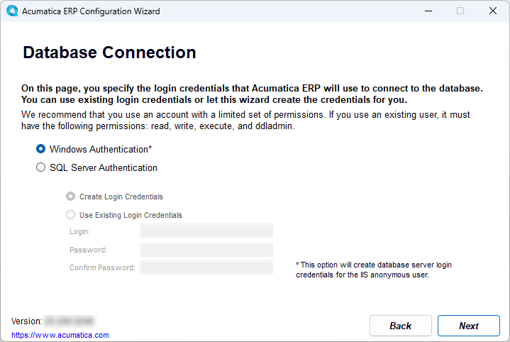

    The default anonymous user account used by Internet Information Services, which is *ApplicationPoolIdentity*, will be used to connect to the database.

7.  On the Instance Configuration page, which opens, enter the following settings, and then click **Next**:
    1.  **Instance Name**: *AcumaticaS100*.

        By default, this is the name that you have specified for the database. You can change it.

    2.  **Create Acumatica ERP Site**: Selected.
    3.  **Local Path to the Instance**: The path on the local computer to the application instance being created.

        By default, this is the folder with the instance name, which is located in the folder where the Acumatica ERP Configuration wizard has been installed. The path should have the following format: `%Program Files%\Acumatica ERP\AcumaticaS100`, as shown in the following screenshot.

        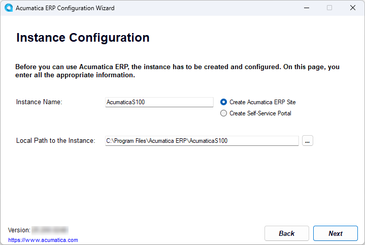

8.  On the Website Configuration page, which opens, specify the following settings, and then click **Next**:
    1.  **Available Websites**: *Default Web Site*
    2.  **Create Virtual Directory**: Selected
    3.  **Virtual Directory Name**: Name of the virtual directory, which matches the instance name
    4.  **Compile the Site**: Selected
    5.  **Install Node.js**: Selected
    6.  **Use Modern UI as Default**: Selected
    7.  **Use Existing Application Pool**: Selected
    8.  **Available Application Pools**: *DefaultAppPool*

        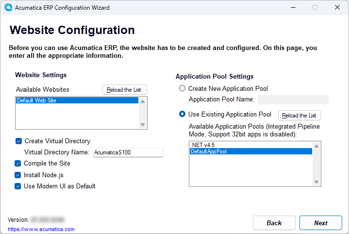

9.  On the RabbitMQ Configuration page, which opens, make sure the **Set up RabbitMQ on this server automatically** option is selected and then click **Next**.

    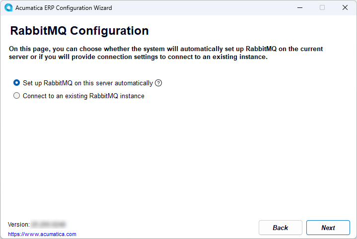

10. On the Confirmation of Configuration page, click **Finish**, and wait while the installation process completes.

    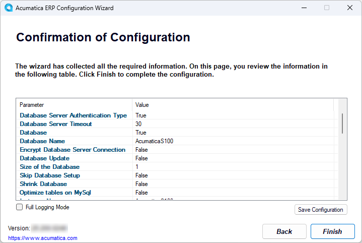

11. Click **OK** in the dialog box after the installation is complete; the system returns you to the Welcome page of the Acumatica ERP Configuration wizard.

The new Acumatica ERP instance is created, and now you can access it for the first time.

## Step 2: Accessing the Instance for the First Time { .section}

To access the *AcumaticaS100* application instance for the first time, do the following:

1.  While you are viewing the Welcome page of the Acumatica ERP Configuration wizard, click **Perform Application Maintenance**.
2.  On the Application Maintenance page, which opens, in the list of installed sites, click the *AcumaticaS100* instance, and then click the **Launch** button, as shown in the following screenshot.

    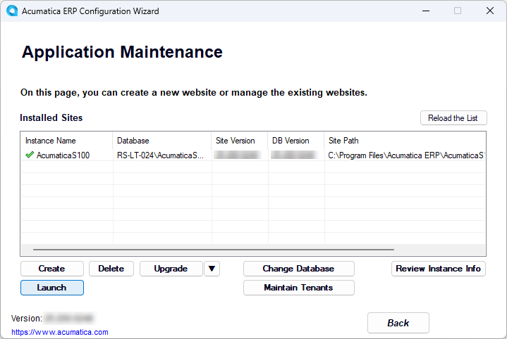

    The instance opens in a new tab of your default browser.

3.  Use the following credentials for the first sign-in:
    -   **Username**: *admin*
    -   **Password**: *setup*
4.  Click **Sign In**.

    The system prompts you to enter a new password and confirm it.

5.  Type the new password in the **New Password** and **Confirm Password** boxes.

    By default, passwords must be at least 8 characters and contain characters from three of the following four categories:

    -   English uppercase characters: *A* through *Z*
    -   English lowercase characters: *a* through *z*
    -   Numerals: *0* through *9*
    -   Special characters: *!*, *$*, *\#*, and *%*
6.  Click the link of the Acumatica User Agreement above the **Sign In** button, read the agreement, and then select the check box to indicate that you have read the terms of the agreement and agree to them, as shown in the following screenshot.

    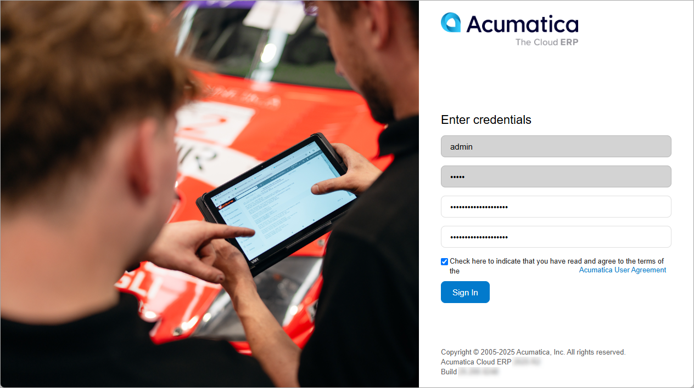

7.  Click **Sign In**.

    The home page of the Acumatica ERP instance opens.

**Parent topic:**[Deploying Acumatica ERP Instances](../UserGuide/INST_Deploying_Instances_Mapref.md)

