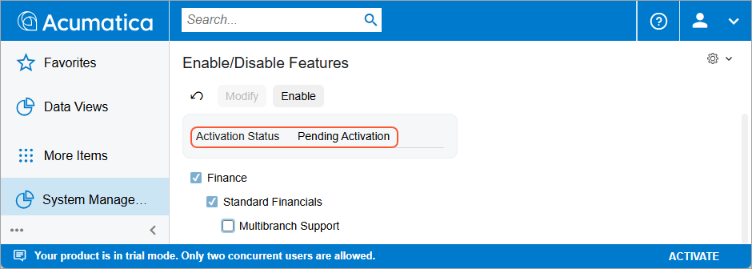
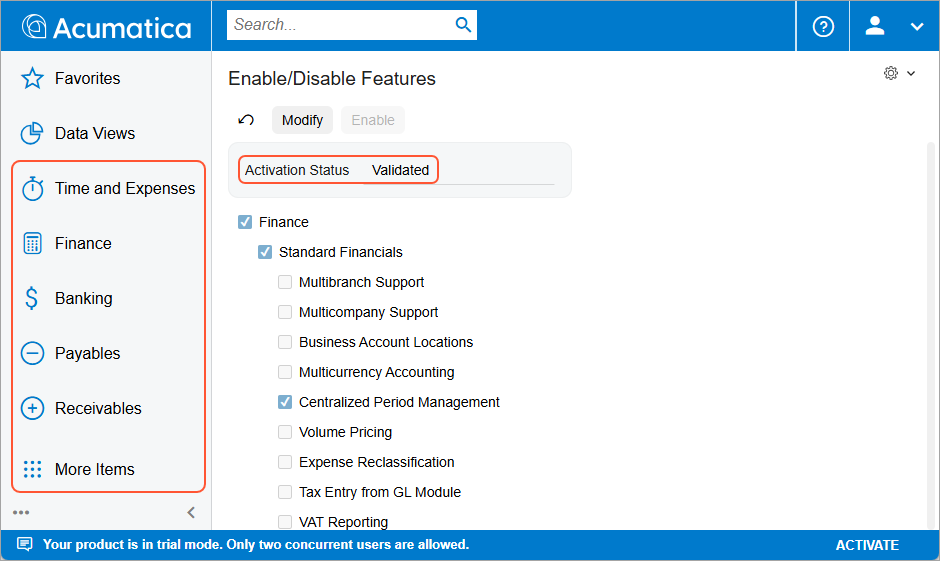
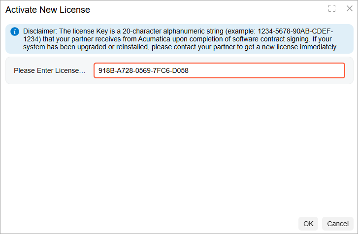
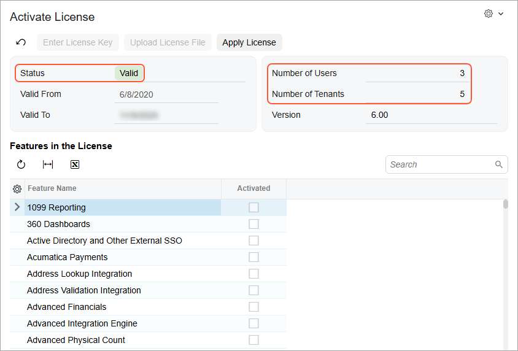
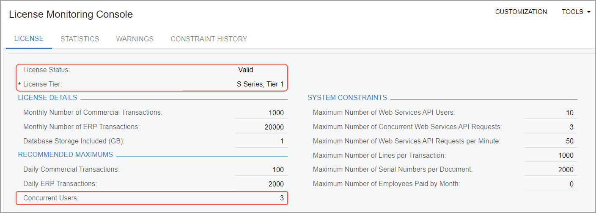

# Instance Deployment: To Enable Features and Activate the License {#_f94d9dbb-c377-40ab-a266-27355765f4b9 .task}

In the following activity, you will learn how to enable features in Acumatica ERP, activate the license, and review the license information.

## Story { .section}

Suppose that the SweetLife Fruits &amp; Jams company has purchased an Acumatica ERP subscription in Acumatica Business Cloud. The instance has been installed by SaaS engineers.

As a system administrator, you have received the instance URL and the credentials to the *admin* user. Now you need to prepare the instance for implementation. You will be the first one to sign in to the instance, and you will activate and license it with the product key you have obtained from the sales representative.

The company has purchased the S1 license tier with three concurrent users and five tenants. In addition to the default set of features, your company has purchased the basic functionality associated with the *Inventory and Order Management* group of features.

## Process Overview { .section}

To begin using the system after the installation, you will use the [Enable/Disable Features](CS_10_00_00.md#) \(CS100000\) form to enable the standard set of features, which gives you the ability to access the [Activate License](SM_20_15_10.md#) \(SM201510\) form.

When you enable the features, you will still be in trial mode. To remove the restrictions of the trial mode, you will activate the license and enable the features that you bought in addition to the standard set.

## System Preparation { .section}

Before you begin enabling features on an Acumatica ERP application instance, make sure that you have performed the following prerequisite activity: [Instance Deployment: To Deploy an Out-of-the-Box Instance](INST_Deploying_Instances_Deploy_Tenant_Without_Demodata_Activity.md).

## Step 1: Enabling Features for the First Time { .section}

To enable features in Acumatica ERP for the first time, do the following:

1.  Launch the Acumatica ERP application instance with an out-of-the-box tenant and sign in with the following credentials:

    -   Username: *admin*
    -   Password: *setup* \(or the one provided to you by the person who performed the installation\)
    **Attention:** When you sign in for the first time, the system requires you to change the password.

2.  Open the [Enable/Disable Features](CS_10_00_00.md#) \(CS100000\) form.

    Notice that a number of features are selected by default and the activation status is *Pending Activation*, as shown in the following screenshot.

    

3.  On the toolbar, click **Enable** to activate the selected features.

    The activation status of the currently selected feature set is now *Validated*, as the screenshot below shows. On the main menu, notice that new menu items \(**Time and Expenses**, **Finance**, **Banking**, **Payables**, and **Receivables**\) have appeared \(also shown in the screenshot\) that correspond to the features you have enabled. You can now click any of these menu items to go to the corresponding workspace and go to the forms within it.

    

## Step 2: Activating the License { .section}

To activate the license, do the following:

**Important:** Before you proceed with license activation on a real website, make sure that all Acumatica ERP users have saved their work and signed out of the system. During license activation, the Acumatica ERP instance will be restarted, and any unsaved work will be lost.

1.  Open the [Activate License](SM_20_15_10.md#) \(SM201510\) form and do the following:

    1.  On the form toolbar, click **Enter License Key**.
    2.  In the **Activate New License** dialog box, enter the `918B-A728-0569-7FC6-D058` license key, as shown below.

        

    3.  Click **OK** at the bottom of the dialog box.
    The system contacts the licensing server and validates the license online.

    **Attention:** The license key used in this activity is for training purposes only. The license will be deactivated in 24 hours and the instance will return to the trial mode. The license can be applied to an instance only once.

2.  In the **Agree to Proceed** dialog box, which opens, click the link to read the software license agreement. If you agree to the terms, click **Agree** to proceed with activation. The dialog box closes.
3.  In the Summary area of the form, review the status of the license \(*Valid*\), its validity period, and the number of users and tenants, as shown in the following screenshot.

    

4.  In the table, review the features that this license supports.

    **Tip:** You can use the filter for the **Activated** column to filter the activated features.

5.  On the form toolbar, click **Apply License** to activate your license, and the system will restart the instance.

## Step 3: Enabling Additional Features { .section}

To enable additional features in Acumatica ERP, do the following:

1.  Open the [Enable/Disable Features](CS_10_00_00.md#) \(CS100000\) form.

    Notice that the list of features is narrowed to the features allowed by the applied license.

2.  On the form toolbar, click **Modify**.
3.  In the list of features, select the **Inventory and Order Management** check box.
4.  On the toolbar, click **Enable** to activate the selected features.

    The status of the currently selected feature set is now *Validated*. On the main menu, notice that new workspace menu items \(**Sales Orders**, **Purchases**, and **Inventory**\) have appeared that correspond to the feature you have enabled. You can now open the forms in these workspaces.

## Step 4: Reviewing the License Information { .section}

To review the license information—which includes the license status and limitations, warnings about any exceeded limits, and statistics about commercial transactions and constraints—do the following:

1.  Open the [License Monitoring Console](SM_60_40_00.md#) \(SM604000\) form.
2.  On the **License** tab, which is shown in the screenshot below, review the information about your license as follows:

    -   In the **License Status** read-only box, verify that the license status is *Valid*, which means that the instance is licensed and has been activated.
    -   In the **License Details** section, review the instance limitations.
    -   In the **Recommended Maximums** section, notice that **Concurrent Users** is set to *3*. This means that three users can work in the system at the same time.
    

**Parent topic:**[Deploying Acumatica ERP Instances](../UserGuide/INST_Deploying_Instances_Mapref.md)

