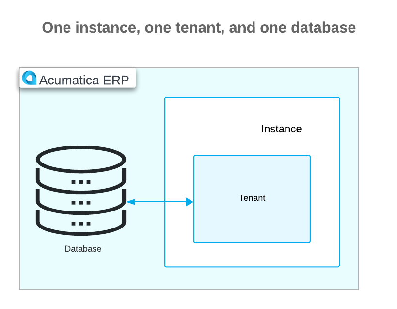
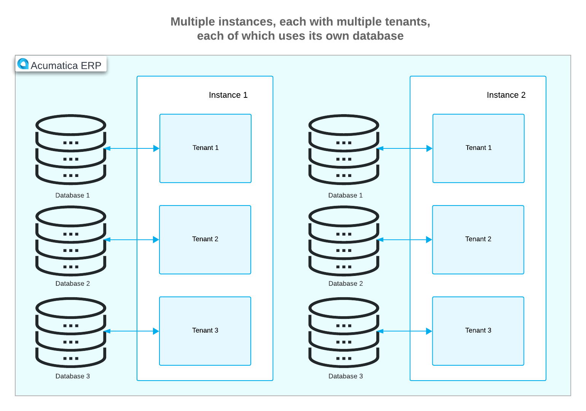
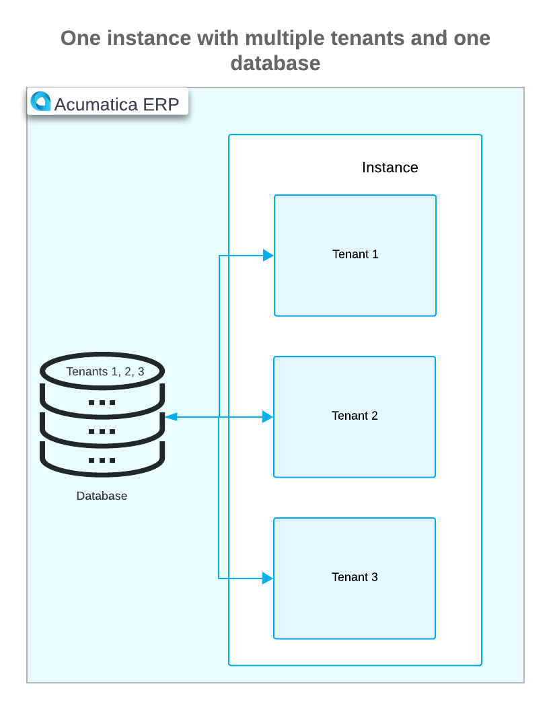
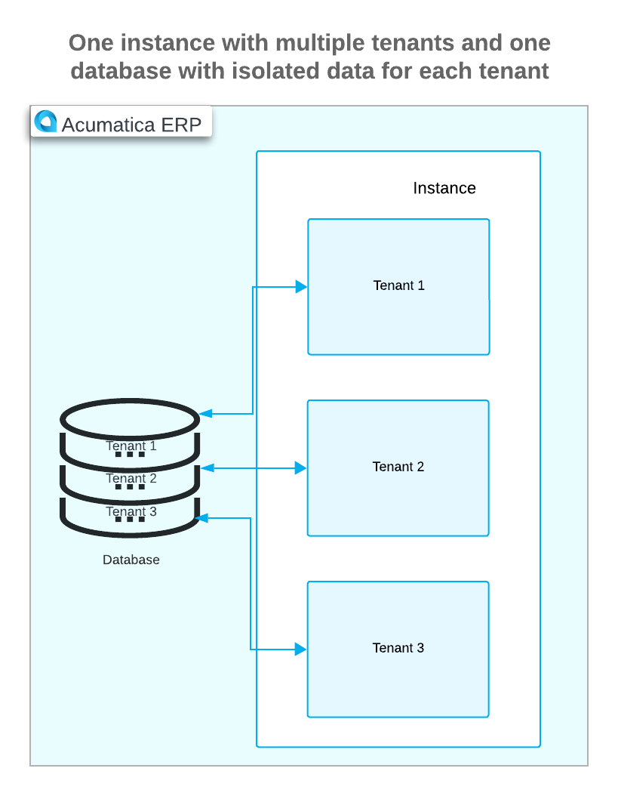

# Instance Deployment: General Information {#_4b65b79b-e09d-46bd-9a85-7c1c0bb4eba5 .concept}

You can deploy an application instance with one tenant or multiple tenants by using the Acumatica ERP Configuration wizard.

This topic provides an overview of an Acumatica ERP instance deployment, as well as tenant creation, and the possible combinations of instances, databases, and tenants.

## Learning Objectives { .section}

In this chapter, you will do the following:

-   Become familiar with the possible deployment configuration of instances, tenants, and databases
-   Review the process of deploying an instance
-   Deploy an out-of-the-box instance
-   Deploy an instance with a tenant with the demo data
-   Change password before the first sign-in to the instance
-   Activate the default set of features in the instance
-   Activate the product license for the instance
-   Review product license details
-   Deploy a Self-Service Portal instance and connect it to the database of the existing instance

## Applicable Scenarios { .section}

You may need to learn how to deploy an Acumatica ERP application instance in scenarios that include the following:

-   You are an implementation consultant who needs to deploy an Acumatica ERP application instance.
-   You are a system administrator who needs to deploy an Acumatica ERP application instance for the employees of your company.

## Application Instances and Tenants { .section}

In Acumatica ERP, when you create an application instance, at least one tenant is defined. A tenant represents a separate company. It is not possible to configure an instance without a tenant.

Acumatica ERP is an application with a multitenant architecture, making it possible for a single instance of the application to serve multiple tenants. You can deploy various combinations of instances, databases, and tenants depending on your company's business needs. These combinations are described below.

The following diagram shows an architecture with one application instance, one database, and one tenant.

The following diagram shows an architecture with multiple application instances. Each instance has multiple tenants, and each tenant has its own database.

The following diagram shows an architecture with one application instance that has one database and multiple tenants with web access to the same database.

The following diagram shows an application instance with one database, where multiple tenants use the same database with completely isolated data. Although the application looks identical to all tenants, each tenant has exclusive access to only its own data.

You can deploy an instance with a tenant that does not contain any predefined data and represents an out-of-the-box company. You can also deploy a tenant that contains demo data that you can use for training purposes. For details, see [Instance Deployment: To Deploy an Out-of-the-Box Instance](INST_Deploying_Instances_Deploy_Tenant_Without_Demodata_Activity.md) and [Instance Deployment: To Deploy an Instance with Demo Data](INST_Deploying_Instances_Deploy_Tenant_With_Demodata_Activity.md).

**Parent topic:**[Deploying Acumatica ERP Instances](../UserGuide/INST_Deploying_Instances_Mapref.md)

