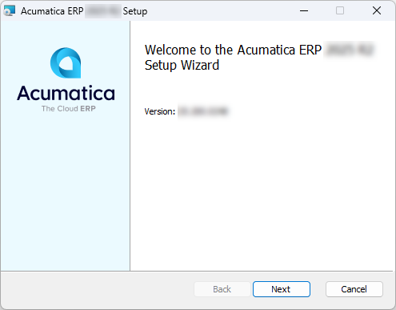
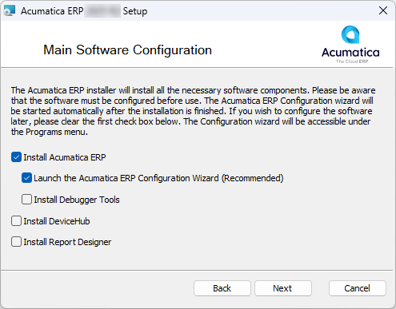

# Acumatica ERP Installation On-Premises: To Install the Acumatica ERP Configuration Wizard {#_7298d85b-4fce-487a-9ca6-27c0e2c39a06 .task}

In this implementation activity, you will learn how to download an Acumatica ERP version and install the Acumatica ERP Configuration wizard.

## Story { .section}

Suppose that you, as the system administrator of the SweetLife Fruits &amp; Jams company, need to download the Acumatica ERP 2026 R1 GA version and install the Acumatica ERP Configuration wizard for this version.

## Process Overview { .section}

In this activity, you will do the following:

1.  Download the installation package for the needed version of Acumatica ERP
2.  Install the Acumatica ERP Configuration wizard

## Step 1: Obtaining an Installation Package for a Specific Acumatica ERP Version { .section}

In this step, you will find the build for the Acumatica ERP 2026 R1 GA version and download it.

To find and download the needed Acumatica ERP build, do the following:

1.  Open the [Acumatica Community](https://community.acumatica.com/) website.

    You will need your partner username and password to access the site.

2.  On the **Product** menu on top of the page, click **2026 R1**.

    The Acumatica ERP 2026 R1 Downloads and Release Notes page opens. On this page, you can find the latest release and prior releases of the selected version; you can also read the release notes.

3.  Click the *Show Content* link in the **Prior Releases** section.
4.  Click the *Acumatica 2026 R1 GA Build ХХ.ХХХ.ХХХХ* link.

    The page with the release opens.

5.  In the **Download Links** section, click the *Acumatica ERP 2026 R1 GA* link to download the `AcumaticaERPInstall.msi` Windows installer package.

    Wait until the package is downloaded to your computer.

## Step 2: Installing Acumatica ERP { .section}

In this step, you will install the Acumatica ERP Configuration wizard on your computer.

To install the Acumatica ERP Configuration wizard, do the following:

1.  Run the `AcumaticaERPInstall.msi` file that you have downloaded in the previous step.
2.  On the Welcome page of the Setup wizard, click **Next**, as shown in the following screenshot.

    

3.  On the End-User License Agreement page, read the license agreement, and select the **I accept the terms in the License Agreement** check box.
4.  Click **Next**.
5.  On the Main Software Configuration page, which opens, notice that the **Install Acumatica ERP** and **Launch the Acumatica ERP Configuration Wizard \(Recommended\)** check boxes are selected by default, as shown in the following screenshot.

    

    **Tip:** You can also select any of the following check boxes to install the Acumatica ERP Tools:

    -   **Install Debugger Tools**
    -   **Install DeviceHub**
    -   **Install Report Designer**
6.  Click **Next**.
7.  On the Destination Folder page, check the path to the default folder to which Acumatica ERP will be installed, and change it if needed.

    By default, the address of the folder is `C:\Program Files\Acumatica ERP\`.

8.  Click **Next**.
9.  On the confirmation page, click **Install** to install the Acumatica ERP Configuration wizard.

    Wait while the Acumatica ERP software is being installed.

10. When the installation process has completed, click **Finish**.

    The Acumatica ERP Configuration wizard is started automatically. You can also run the Acumatica ERP Configuration wizard anytime by clicking it on the Start menu.

Now you can proceed with deploying the Acumatica ERP application instances.

**Parent topic:**[Installing Acumatica ERP On-Premises](../UserGuide/INST_Installing_Locally_Mapref.md)

