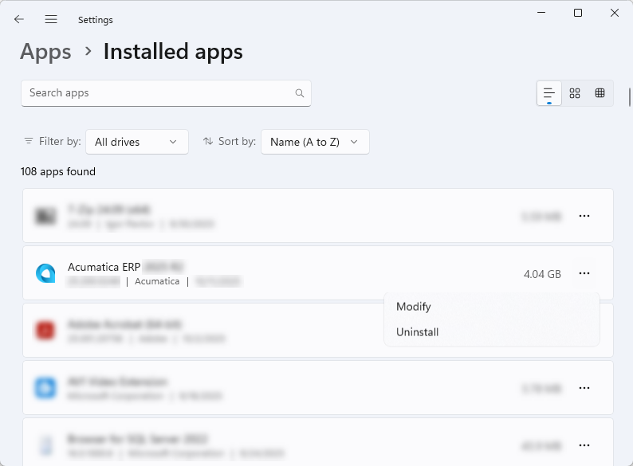
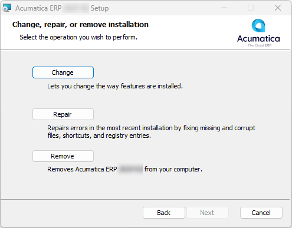
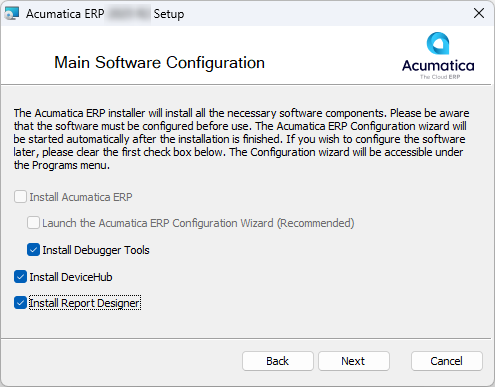
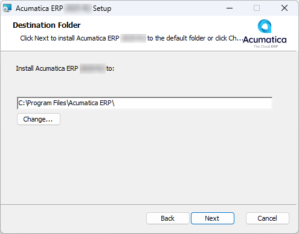
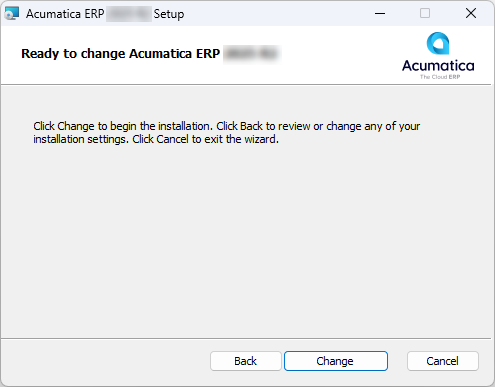

# Acumatica ERP Installation On-Premises: To Install the Acumatica ERP Tools \(Optional\) {#_8c7eb99e-31ca-4c1c-8f44-d6960080a450 .task}

The following activity will walk you through the process of installing the Acumatica ERP Tools separately from the Acumatica ERP Configuration wizard.

## Story { .section}

Suppose that you, as the system administrator of the SweetLife Fruits &amp; Jams company, need to install the Acumatica ERP Tools when the Acumatica ERP Configuration wizard has already been installed.

## Process Overview { .section}

In this activity, you will install the Acumatica ERP Tools by modifying the Acumatica ERP installation settings on your computer.

## System Preparation { .section}

Before you begin installing the Acumatica ERP Tools, as a prerequisite activity, make sure you have installed the Acumatica ERP Configuration wizard, as described in [Acumatica ERP Installation On-Premises: To Install the Acumatica ERP Configuration Wizard](INST_Installing_Configuration_Wizard_Activity.md).

## Step: Installing the Acumatica ERP Tools { .section}

To install the Acumatica ERP Tools, do the following:

1.  On the Start menu, click **Settings** &gt; **Apps** &gt; **Installed apps**.
2.  In the list of installed applications, find Acumatica ERP 2026 R1, and click the **Modify** button.

    

3.  On the Welcome page of the Acumatica ERP 2026 R1 Setup wizard, which opens, click **Next**.
4.  On the Change, Repair, or Remove installation page, click **Change**.

    

5.  On the Main Software Configuration page, select any of the following check boxes for the Acumatica ERP tool installation:

    -   **Install Debugger Tools**: Select this check box to install Debugger Tools.
    -   **Install DeviceHub**: Select this check box to install DeviceHub.
    -   **Install Report Designer**: Select this check box to install Acumatica Report Designer.
    

6.  Click **Next**.
7.  On the Destination Folder page, specify the location where you want to install Acumatica ERP Tools, and then click **Next**.

    

8.  On the Ready to Change Acumatica ERP 2026 R1 page, click **Change**.

    

9.  After the tool installation has been completed, click **Finish**.

**Parent topic:**[Installing Acumatica ERP On-Premises](../UserGuide/INST_Installing_Locally_Mapref.md)

