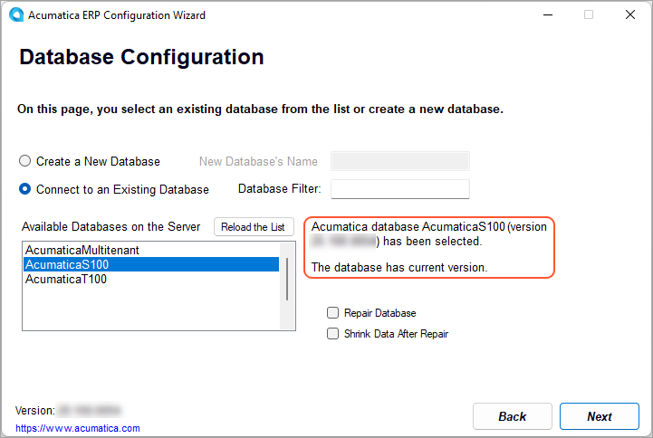
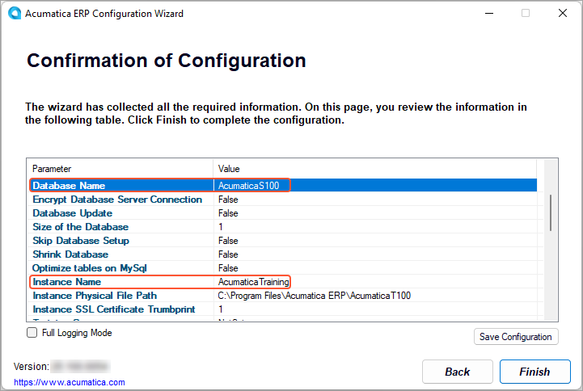

# Instance Maintenance: To Change the Database of an Instance {#_ebd79c24-6c66-47c2-a3b1-d473b498aee6 .task}

The following activity will walk you through the process of changing the database for an existing Acumatica ERP application instance.

## Story { .section}

Suppose that you are the system administrator of your company, and you need to change the database of the existing Acumatica ERP application instance to perform some maintenance activities on the original database.

## Process Overview { .section}

In this activity, you will change the database of the Acumatica ERP application instance and connect the instance to the database of another Acumatica ERP instance.

## System Preparation { .section}

Before you begin performing the step of this activity, make sure that you have performed the following prerequisite activity: [Instance Deployment: To Deploy an Instance with Demo Data](INST_Deploying_Instances_Deploy_Tenant_With_Demodata_Activity.md).

## Step: Changing the Database { .section}

To change the database of the existing application instance, do the following:

1.  On the Start menu, click **Acumatica ERP Configuration** to open the Acumatica ERP Configuration wizard.
2.  On the Welcome page, click **Perform Application Maintenance**.
3.  In the list of existing application instances, click the row with the Acumatica ERP instance that you want to reconnect to another database, and click the **Change Database** button.

    This opens the Database Server Connection page, which provides the list of available servers.

4.  On the Database Server Connection page, specify the following settings, and click **Next** to go to the next page:
    -   **Server Type**: *Microsoft SQL Server*
    -   **Server Name**: *\(local\)*
    -   **Windows Authentication**: Selected
5.  On the Database Configuration page, specify the following settings, and click **Next** to go to the next page:

    -   **Connect to an Existing Database**: Selected
    -   **Available Databases on the Server**: The name of the database you want to connect the instance to

        Notice that the version of the selected database is automatically detected \(as shown in the following screenshot\), and it is the same version that the Acumatica ERP Configuration wizard has.

    

6.  On the Tenant Setup page, click **Next**.
7.  On the Database Connection page, click **Next**.
8.  On the Confirmation of Configuration page, review your changes \(see the following screenshot\), and click **Finish**.

    

9.  Wait while the application instance settings are updated, and click **OK** in the confirmation dialog box.
10. On the Welcome page of the Acumatica ERP Configuration wizard, which opens, click **Perform Application Maintenance**.
11. On the Application Maintenance page, notice the values in the **Database** column. Two instances are now connected to the same database.

**Parent topic:**[Maintaining Instances](../UserGuide/INST_Maintaning_Instances_Mapref.md)

