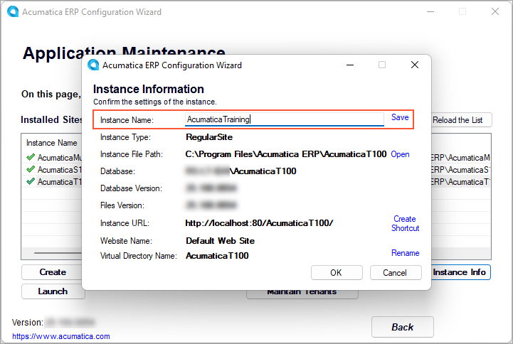
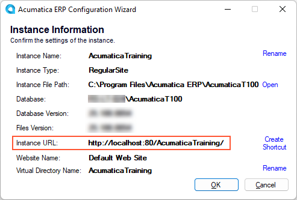

# Instance Maintenance: To View the Settings of an Instance {#_07069168-7055-455f-8c6f-4be14ca1226b .task}

The following activity will walk you through the process of viewing and modifying the settings of the Acumatica ERP application instance.

## Story { .section}

Suppose that you are the system administrator of your company, and you need to review the settings of the existing Acumatica ERP application instance and change its name.

## Process Overview { .section}

In this activity, you will review the settings of the Acumatica ERP application instance and change the instance name.

## System Preparation { .section}

Before you begin performing the step of this activity, make sure that you have performed the following prerequisite activity: [Instance Deployment: To Deploy an Instance with Demo Data](INST_Deploying_Instances_Deploy_Tenant_With_Demodata_Activity.md).

## Step: Changing the Settings of an Application Instance { .section}

To review the settings of the instance and change its name, do the following:

1.  On the Start menu, click **Acumatica ERP Configuration** to open the Acumatica ERP Configuration wizard.
2.  On the Welcome page, click **Perform Application Maintenance**.
3.  In the list of existing application instances, click the row with the Acumatica ERP application instance you want to review, and then click the **Review Instance Info** button.

    This opens the Instance Information page.

4.  To change the instance name, do the following:
    1.  Right of the **Instance Name** box, click **Rename**.
    2.  Change the name of the instance to `AcumaticaTraining`, as shown in the following screenshot.

        

    3.  Right of the **Instance Name** box, click **Save**.
5.  Right of the **Instance Files Path** box, click **Open**.

    This opens the folder where the selected application instance is installed. In particular, this folder contains the `web.config` file of the current instance.

6.  To change the virtual directory name, go back to the Acumatica ERP Configuration wizard, and do the following:
    1.  Right of the **Virtual Directory Name** box, click **Rename**.
    2.  Change the virtual directory name to `AcumaticaTraining`.
    3.  Right of the **Virtual Directory Name** box, click **Save**.
7.  Click **OK** to save your changes.
8.  In the dialog box with the notification message, click **OK**.

    This closes the Instance Information page and returns you to the Application Maintenance page.

9.  Open the Instance Information page again and notice that the URL of the renamed *AcumaticaTraining* instance has also been updated, as shown in the following screenshot.

    

**Parent topic:**[Maintaining Instances](../UserGuide/INST_Maintaning_Instances_Mapref.md)

