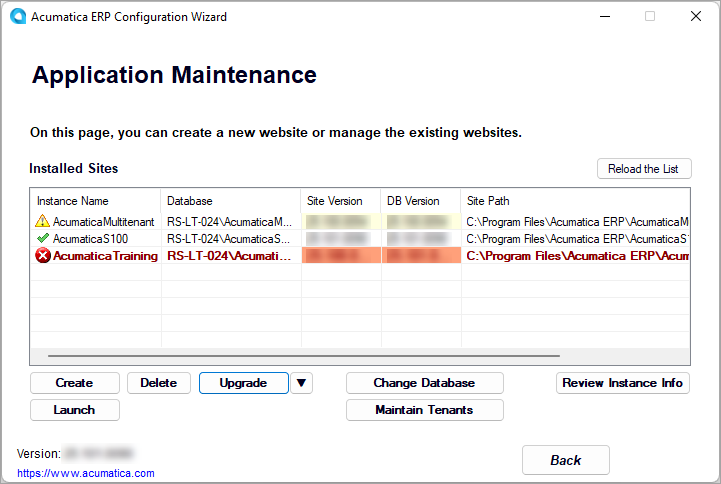

# Instance Maintenance: Possible Update Statuses of an Instance {#_953a6182-dbd9-48d6-b70a-7d53ce81c635 .concept}

In Acumatica ERP, you can see which instances and databases you need to update.

You can check the update status of your application instances and databases on the Application Maintenance page of the Acumatica ERP Configuration wizard, as shown in the following screenshot.

In the list of installed sites, you can see the following icons indicating the update status of each application instance:

-   *Green check mark*: The instance and the associated database are up to date. \(Also, the versions of the application instance, the database, and the Acumatica ERP Configuration wizard are the same.\)
-   *Yellow triangle with exclamation point*: The instance and the instance database are outdated. \(That is, the version of the application instance is the same as the version of the database and is older than the version of the installed Acumatica ERP Configuration wizard.\) The application instance will still work, even if the instance and database are out of date.
-   *Red circle with a white X*: The instance or the instance database requires an update; that is, the versions of the instance and the instance's database are different. The application instance does not work, and you must update it, or update only the instance or the instance database if their versions are outdated.

    This icon is also displayed when the database of the instance has not been found, or when the version of the instance, the database, or both is higher than the current version of the Acumatica ERP Configuration wizard.

On the Application Maintenance page, you can also see the following information:

-   The version of the Acumatica ERP Configuration wizard that is installed on your server. The version is shown in the lower left corner of the page.
-   The application instance version, which is displayed in the **Site Version** column for each application instance.
-   The database version, which is displayed in the **DB Version** column for each application instance.

Note the following points about versions:

-   The site version and the database version must be the same.
-   The Acumatica ERP Configuration wizard version cannot be lower than the site or database version.

    That is, you first upgrade the Acumatica ERP Configuration wizard, and you may then upgrade the site and the database. If you do not upgrade the site and the database, they will continue functioning.

-   You can upgrade only the site, only the database, or both the site and the database.
-   You cannot use the Acumatica ERP Configuration wizard with a higher version to deploy an application instance with a lower version.
-   Versions of the system that are lower than the current version can be installed only by first uninstalling the current version of the Acumatica ERP Configuration wizard and then installing the desired version. The instances with a higher version will remain functional.

**Parent topic:**[Maintaining Instances](../UserGuide/INST_Maintaning_Instances_Mapref.md)

