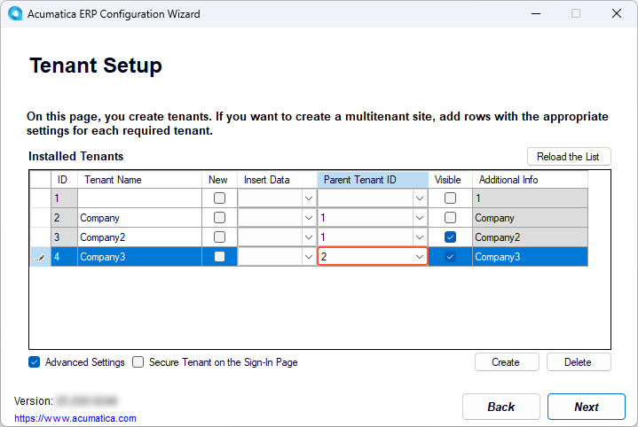
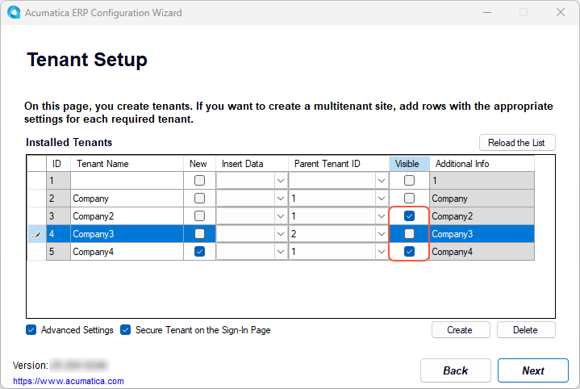
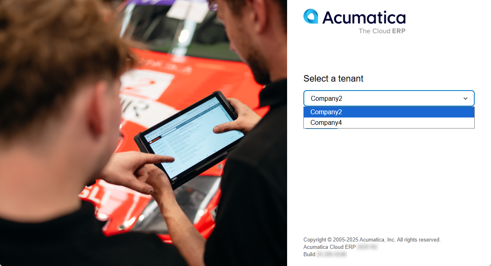
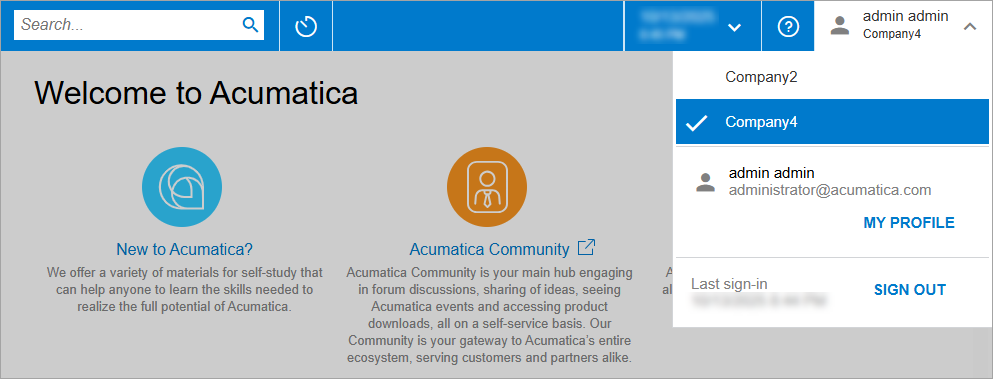

# Tenant Maintenance: To Deploy an Instance with Multiple Tenants {#_505ddffa-5f90-4a3e-914c-47519ca95bd5 .task}

The following activity will walk you through the process of creating an Acumatica ERP application instance with three tenants. You will also make some changes to the tenants of the instance.

## Story { .section}

Suppose that you are the system administrator for a group of companies, and you need to deploy the Acumatica ERP application instance with three tenants, one for each of the companies included in the group. You also need to make some changes to the tenants and then delete one of the existing tenants.

## Process Overview { .section}

In this activity, you will do the following:

1.  Deploy the Acumatica ERP application instance with three tenants.
2.  Set up the visibility of a tenant.
3.  Delete an existing tenant.

## System Preparation { .section}

Before you begin deploying an Acumatica ERP application instance, make sure that you have performed the following prerequisite activity: [Acumatica ERP Installation On-Premises: To Install the Acumatica ERP Configuration Wizard](INST_Installing_Configuration_Wizard_Activity.md).

## Step 1: Creating an Instance with Multiple Tenants and Changing Tenants’ Visibility Settings { .section}

To create a multitenant Acumatica ERP instance, do the following:

1.  On the Start menu, click **Acumatica ERP Configuration** to open the Acumatica ERP Configuration wizard.
2.  On the Welcome page, click **Deploy a New Acumatica ERP Instance**.
3.  On the Database Server Connection page, specify the following settings, and then click **Next** to go to the next page:
    -   **Server Type**: *Microsoft SQL Server*
    -   **Server Name**: `(local)`
    -   **Windows Authentication**: Selected
4.  On the Database Configuration page, specify the following settings, and then click **Next** to go to the next page:
    -   **Create a New Database**: Selected
    -   **New Database's Name**: `AcumaticaMultitenant`
5.  On the Tenant Setup page, do the following to configure the tenants of the instance:
    1.  Click the **Create** button twice to add two more new tenants in addition to the default new tenant, so that there are three new tenants in the list.

        The system automatically assigns the following names to the tenants in the **Tenant Name** column:

        -   For a tenant with an *ID* of *2*: Company
        -   For a tenant with an *ID* of *3*: Company2
        -   For a tenant with an *ID* of *4*: Company3
    2.  In the first tenant in the list \(the *Company* tenant\), double-click in the **Parent Tenant ID** column.

        Notice that you can select only the default parent tenant \(the *System* tenant, which has an **ID** of *1*\).

    3.  Select the **Advanced Settings** check box below the table.

        Now the wizard also displays the *System* tenant in the table. Notice that the **Visible** check box for this tenant is cleared, meaning that users do not see it.

    4.  In the row with the *Company* tenant, clear the **Visible** check box.
    5.  In the row with the *Company3* tenant, double-click in the **Parent Tenant ID** column and select *2*, as shown in the screenshot below.

        This makes *Company3* the child of *Company*. In this configuration, users will be able to sign in to only *Company2* and *Company3*, because these tenants do not have children.

        

    6.  Click **Next** to go to the next page.
6.  On the Database Connection page, select **Windows Authentication**; click **Next**.
7.  On the Instance Configuration page, specify the following settings, and then click **Next** to go to the next page:
    -   **Instance Name**: `AcumaticaMultitenant`
    -   **Create Acumatica ERP Site**: Selected
    -   **Local Path to the Instance**: The path on the local computer to the application instance
8.  On the Website Configuration page, specify the following settings, and then click **Next** to go to the next page:

    -   **Website Settings**: *Default Web Site*
    -   **Create Virtual Directory**: Selected
    -   **Virtual Directory Name**: `AcumaticaMultitenant`
    -   **Use Existing Application Pool**: Selected
    -   List of existing application pools: *DefaultAppPool*
    Leave the other settings without changes.

9.  On the RabbitMQ Configuration page, which opens, make sure the **Set up RabbitMQ on this server automatically** option is selected and then click **Next**.

10. On the Confirmation of Configuration page, click **Finish**, and wait while the new application instance is created.
11. After the installation is completed, click **OK** in the dialog box to return to the Acumatica ERP Configuration wizard.
12. Click **Perform Application Maintenance**.
13. Click the row with the *AcumaticaMultitenant* instance, and then click **Launch**.

    The instance opens in a new tab of your default browser. Notice that the instance’s Sign-In page has the tenant selection box above the **Sign In** button with the *Company2* and *Company3* tenants you have created in this step, as shown in the following screenshot.

    

## Step 2: Setting Up Tenant Visibility { .section}

To make changes to tenants of the created instance, do the following:

1.  Go back to the Acumatica ERP Configuration wizard.
2.  On the Application Maintenance page, click the row with the *AcumaticaMultitenant* instance, and click **Maintain Tenants**.
3.  In the SQL Server Authentication dialog box, leave **Windows Authentication** selected, and click **OK**.

    The Tenant Setup page is displayed for the selected instance.

4.  Click **Create** to add one more tenant to the instance.

    The system adds a new row with the *Company4* tenant to the list.

5.  Select the **Secure Tenant on the Sign-In Page** check box.

    This hides the tenant selection box on the Sign-In page until a user enters a username and password. After the user is authorized, the system displays the tenant selection box with the list of tenants to which the user can sign in.

6.  In the row with *Company3* tenant, clear the check box in the **Visible** column.

    This makes the tenant invisible to all users. Only the *Company2* and *Company4* tenants have the **Visible** check box selected, as shown in the following screenshot.

    

7.  Click **Next**.
8.  On the Confirmation of Configuration page, click **Finish**.
9.  After the application instance is updated, click **OK** in the dialog box to return to the Acumatica ERP Configuration wizard.
10. Click **Perform Application Maintenance**.
11. On the Application Maintenance page, click the row with the *AcumaticaMultitenant* instance, and click **Launch**.

    The instance opens in a new tab of your default browser. Notice that the instance Sign-In page does not have the tenant selection box.

12. Enter the default username and password for the application instance \(*admin* and *setup*, respectively\).

    Because the *admin* user has access to all the tenants you have created, the tenant selection box is displayed for the user. Notice that only *Company2* and *Company4* are available for signing in, as shown in the following screenshot.

    

13. Select the *Company2* tenant in the tenant selection box and click **Sign In**.

    The Sign-In page refreshes and shows the read-only tenant selection box with the selected *Company2* tenant. The system prompts you to enter a new password and confirm it, as shown in the following screenshot.

    

14. Enter a new password and confirm it.
15. Click the link of the Acumatica User Agreement above the **Sign In** button, read the agreement, and then select the check box to indicate that you have read the terms of the agreement and agree to them.
16. Click **Sign In**.

    You have signed in to the *AcumaticaMultitenant* instance. Now you can work within the *Company2* tenant.

17. Sign out.
18. On the Sign-In page, enter the default username and password for the application instance \(*admin* and *setup*, respectively\) to access the *Company4* tenant. Since the *admin* user has access to all the tenants you have created, the system prompts you to change the default password for the *Company4* tenant, as shown in the following screenshot. Notice that because you have entered the default password, the tenant selection box for the remaining *Company4* tenant does not appear.

    

19. Change the password and click **Next**.

    You have signed in to the *AcumaticaMultitenant* instance. Now you can work within the *Company4* tenant. You can also switch to the *Company2* tenant in the user menu, as shown in the following screenshot.

    

## Step 3: Deleting an Existing Tenant { .section}

In this step, you will delete the unnecessary tenant by doing the following:

1.  Return to the Acumatica ERP Configuration wizard.
2.  While you are viewing the Application Maintenance page, do the following:
    1.  In the **Installed Sites** list, click the row with the *AcumaticaMultitenant* instance.
    2.  Click **Maintain Tenants**.
3.  In the **SQL Server Authentication** dialog box, leave **Windows Authentication** selected, and click **OK**.
4.  On the Tenant Setup page, select the row with the *Company4* tenant in the **Installed Tenants** list.
5.  Click **Delete**.
6.  Click **OK** in the confirmation dialog box to delete the tenant.
7.  Click **Next**.
8.  On the Confirmation of Configuration page, do the following:
    1.  Check the configuration settings you have specified.
    2.  Click **Finish** to delete the tenant.

**Parent topic:**[Maintaining Tenants](../UserGuide/INST_Maintaning_Tenants_Mapref.md)

