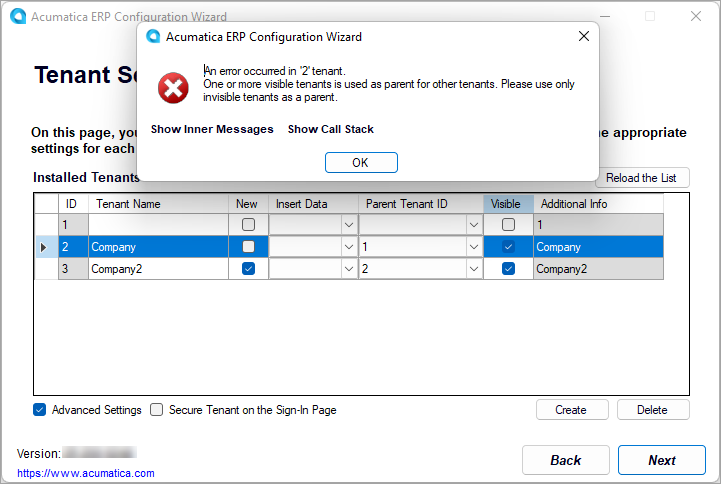

# Tenant Maintenance: To Explore Tenant Visibility {#_d9002856-91b6-4971-bcf6-b0df171b0632 .task}

The following activity will walk you through the process of exploring how tenant visibility affects the existing Acumatica ERP application instance.

## Story { .section}

Suppose that you are the system administrator of your company, and you have been asked to add a new tenant to the existing Acumatica ERP application instance. You will explore how to use the visible tenant as a parent tenant. Additionally, you will verify the capability of having an instance where all tenants are invisible.

## Process Overview { .section}

In this activity, you will explore the visible capabilities of tenants.

## System Preparation { .section}

Before you begin performing the step of this activity, make sure that you have performed the following prerequisite activity: [Instance Deployment: To Deploy an Instance with Demo Data](INST_Deploying_Instances_Deploy_Tenant_With_Demodata_Activity.md).

## Step: Exploring the Capabilities of Tenant Visibility { .section}

To explore the capabilities of tenant visibility, do the following:

1.  On the Start menu, click **Acumatica ERP Configuration** to open the Acumatica ERP Configuration wizard.
2.  On the Welcome page, click **Perform Application Maintenance**.
3.  In the list of existing application instances, select the row with the Acumatica ERP instance and click the **Maintain Tenants** button. For more details about how to create the application instance, see [Instance Deployment: To Deploy an Out-of-the-Box Instance](INST_Deploying_Instances_Deploy_Tenant_Without_Demodata_Activity.md).
4.  In the SQL Server Authentication dialog box, leave the default settings, and click **OK**.

    This opens the Tenant Setup page, which shows the full list of tenants for the selected application instance.

5.  Select the **Advanced Settings** check box below the list of tenants.

    The system displays the default *System* tenant with an **ID** of *1* in the list of tenants.

    **Tip:** With the **Advanced Settings** check box selected, you can also select a new data template in the **Insert Data** column for an existing tenant. If you finish updating the tenant, the Acumatica ERP Configuration wizard replaces the tenant data with the data of the selected template.

6.  Clear the **Visible** check box in the row with the *Company* tenant, and click **Next**.

    The system displays a warning informing you that you cannot continue with all the instance's tenants being invisible.

7.  In the warning dialog box, click **OK**.
8.  On the Tenant Setup page, to which you return, do the following:

    1.  Click **Create** below the list of tenants to add one more tenant.
    2.  For the new tenant, select *2* in the **Parent Tenant ID** column.
    3.  Select the **Visible** check box in the row with the *Company* tenant.
    4.  Click **Next**.
    The system displays an error message informing you that you cannot continue because only an invisible tenant can be specified as a parent of another tenant, as shown in the following screenshot.

    

9.  In the dialog box, click **OK**.

    The system automatically clears the **Visible** check box in the row with the *Company* tenant.

10. On the Tenant Setup page, to which you return, do the following:
    1.  Make sure that the **Visible** check box is selected only in the row with the new tenant, and that *2* is selected as the **Parent Tenant ID** in this row.
    2.  Click **Next**.
11. On the Confirmation of Configuration page, review your changes, and click **Finish**.
12. Wait while the application instance settings are updated, and click **OK**.

**Parent topic:**[Maintaining Tenants](../UserGuide/INST_Maintaning_Tenants_Mapref.md)

