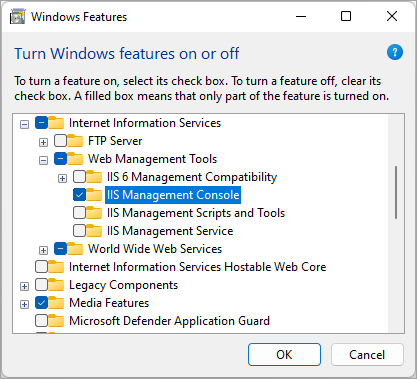
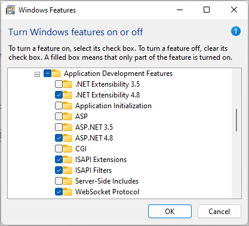
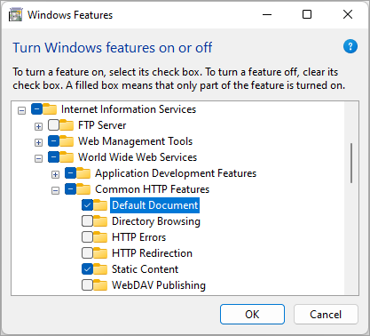
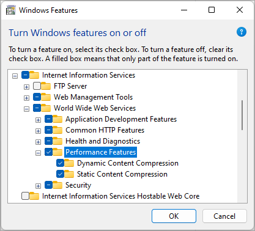
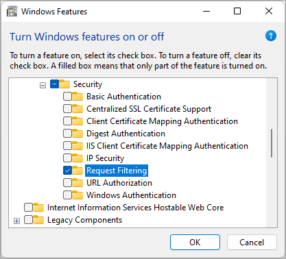
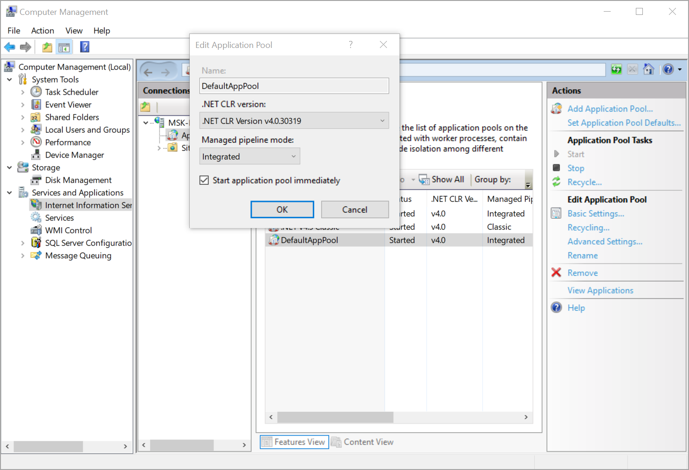
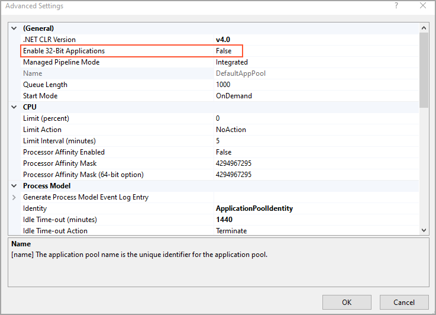

# Preparation for the Acumatica ERP Installation: Implementation Activity {#_3fc73ca9-0ddd-4cc4-b21f-6fb63f6db7e9 .task}

In this implementation activity, you will learn how to enable the required Internet Information Services \(IIS\) web server features and validate the configuration of IIS. This will prepare you to install the server component of Acumatica ERP.

**Attention:** For training and testing purposes, you can install the server part of Acumatica ERP on operating systems that are not server operating systems. The instructions in this activity demonstrate the verification of the IIS web server features and the application pool settings on a computer running Windows 11. If you are using other supported environments and have trouble finding the required features, refer to the corresponding documentation for instructions.

## Story { .section}

Suppose that you are the system administrator of the SweetLife Fruits &amp; Jams company, and you need to verify the system environment prior to installing Acumatica ERP.

## Process Overview { .section}

In this activity, you will do the following:

1.  Enable the required IIS web server features
2.  Verify the configuration of the IIS

## Step 1: Enabling the IIS Management Console Feature { .section}

To enable the IIS Management Console feature, do the following:

1.  On the taskbar, click Start to open the Start menu, which contains all your apps, settings, and files.
2.  On the Start menu, type `Windows Features`.
3.  Click **Turn Windows features on or off**. The **Windows Features** dialog box opens.
4.  Go to **Internet Information Services** &gt; **Web Management Tools**.
5.  Select the **IIS Management Console** check box.

    

## Step 2: Enabling World Wide Web Services Features { .section}

To enable various features that are included in the **World Wide Web Services** group of features, do the following:

1.  While you are still viewing the **Windows Features** dialog box, go to **Internet Information Services** &gt; **World Wide Web Services** &gt; **Application Development Features**.
2.  Select the following check boxes:

    -   **.NET Extensibility 4.8**
    -   **ASP.NET 4.8**
    -   **ISAPI Extensions**
    -   **ISAPI Filters**
    -   **WebSocket Protocol**
    

3.  Go to **Internet Information Services** &gt; **World Wide Web Services** &gt; **Common HTTP Features**.
4.  Select the following check boxes:

    -   **Default Document**
    -   **Static Content**
    

5.  Go to **Internet Information Services** &gt; **World Wide Web Services** &gt; **Performance Features**.
6.  Select the following check boxes:

    -   **Dynamic Content Compression**
    -   **Static Content Compression**
    

7.  Go to **Internet Information Services** &gt; **World Wide Web Services** &gt; **Security**.
8.  Select the **Request Filtering** check box.

    

9.  Click **OK**.

    **Tip:** If you have turned on some features, Windows shows an informational message.

## Step 3: Configuring Internet Information Services { .section}

To configure Internet Information Services, do the following:

1.  On the taskbar, click Start to open the Start menu and click search for **Internet Information Services \(IIS\) Manager**.
2.  In the left **Connections** pane, click **Application Pools**.
3.  In the middle pane, in the list of available application pools on the server, right-click the **DefaultAppPool** application pool, which you will use on your website, and select **Basic Settings**.
4.  In the **Edit Application Pool** dialog box, which opens, make sure that the following settings are specified, as shown in the following screenshot:

    -   **.NET CLR version**: A version configured for .NET Version 4.8

        **Note:** The version number of the .NET Framework does not necessarily correspond to the version number of the CLR it includes. .NET Framework version 4.8 includes CLR Version 4.

    -   **Managed pipeline mode**: *Integrated*
    -   **Start application pool immediately**: Selected
    

    **Important:** We generally recommend that you use a separate application pool for the Acumatica ERP production instance.

5.  Click **OK** to close the dialog box.
6.  While the **DefaultAppPool** application pool is selected in the middle pane, in the right **Actions** pane, click **Advanced Settings**.
7.  In the **Advanced Settings** dialog box, which opens, make sure that *False* is selected as the value of the **Enable 32-Bit Applications** setting.

    

8.  Click **OK** to close the dialog box.

    You have verified the Internet Information Services \(IIS\) configuration and can proceed to installing Acumatica ERP.

**Parent topic:**[Preparing for Installing Acumatica ERP](../UserGuide/INST_Preparing_Installation_Mapref.md)

