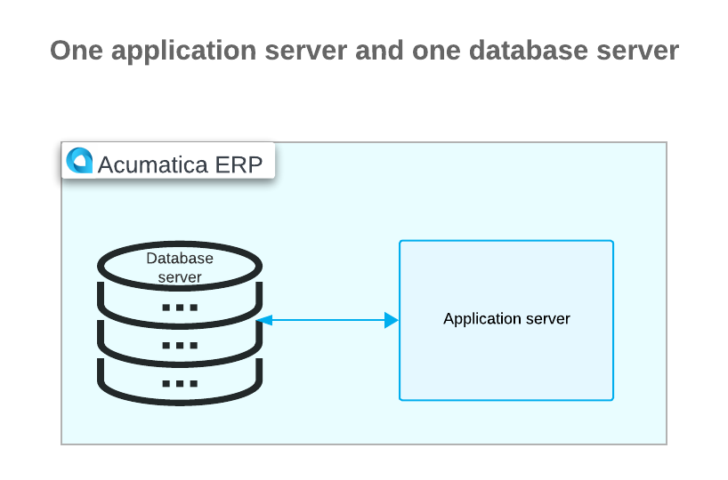
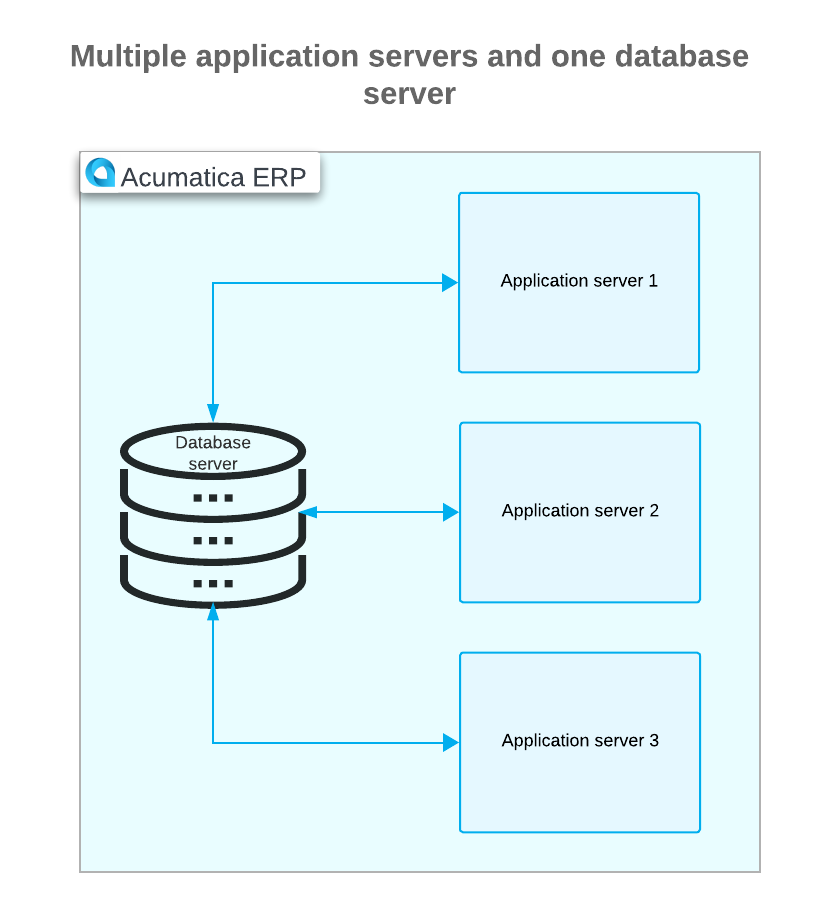
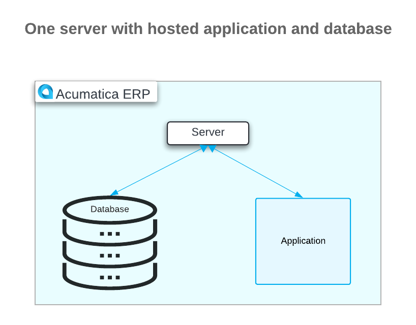

# Preparation for the Acumatica ERP Installation: General Information {#_a0ebf94e-830f-4c13-b9f5-6cfc75a5c042 .concept}

Acumatica ERP is a web application that users can access from any computer by using a web browser. This web application \(the website\) interacts with the application server and the database that stores all the data. Acumatica also provides a mobile app that gives users the ability to access Acumatica ERP from mobile devices running iOS and Android.

You can install Acumatica ERP if your system meets the minimal hardware and software requirements and the installation environment is set up properly.

This chapter provides an overview of the installation and deployment options, system requirements, and environment settings required for the Acumatica ERP installation.

## Learning Objectives { .section}

In this chapter, you will do the following:

-   Become familiar with the possible deployment configurations of Acumatica ERP
-   Recognize the minimum system requirements for installing Acumatica ERP
-   Review the settings of your system environment before the Acumatica ERP installation

## Applicable Scenarios { .section}

You may need to learn how to install Acumatica ERP if you are a new implementation consultant who needs to install Acumatica ERP for a customer and learn how to set up the system.

## Installation Options { .section}

Depending on the company's preferences and requirements, there are three primary options for deploying Acumatica ERP:

-   Local, on-premises installation: The company is responsible for the infrastructure \(hardware, system software, communication hardware, and software on user devices\) and the deployment of the application software \(implementation, support, and upgrading\).
-   Installation in a data center: The service provider manages all or most of the infrastructure that the company uses. If the service company provides the company with a web service where you can launch an operating system with Microsoft SQL Server available, the installation procedure will be the same as it is with a local installation.
-   Installation on the Windows Azure platform: The company is responsible for the infrastructure and the deployment of the application software. For details, see [Installing Acumatica ERP in a Data Center](INST_Installing_in_Data_Center_Mapref.md).

For more information about system requirements for deploying Acumatica ERP, see [System Requirements for the Acumatica ERP Installation](INST_Preparing_Installation_System_Requirements.md).

## Deployment Configurations { .section}

You can deploy Acumatica ERP in various configurations of application and database servers.

The following diagram shows the recommended configuration with application and database servers installed on separate virtual or physical machines.

The following diagram shows a scalable configuration with multiple application servers and one database server. This configuration is designed to handle increased workload demands.

The following diagram shows a configuration where one server hosts both the application and the database. This setup is commonly used for development, testing, and training purposes.

**Parent topic:**[Preparing for Installing Acumatica ERP](../UserGuide/INST_Preparing_Installation_Mapref.md)

