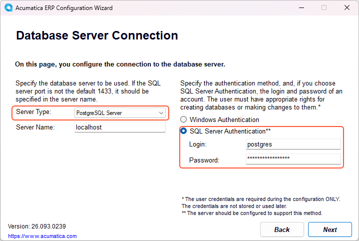

# Preparation for the Acumatica ERP Installation: System Environment {#_4dc90b83-c6fd-4eb0-85ea-c5aa33a71897 .concept}

Before proceeding with the installation of Acumatica ERP, make sure that the environment configuration on the computer where you plan to install the server software part of Acumatica ERP is properly set up.

This topic provides an overview of the configuration of Internet Information Services \(IIS\) web server features, the specification of HTTPS settings, and the installation of semantic search for Microsoft SQL Server.

## Configuration of IIS Web Server Features {#_8be3ff2c-3e69-4e41-874f-93bcb9b1d606 .section}

You need to ensure that the system configuration is suitable for installing the Acumatica ERP server part and that the following features are enabled on the IIS web server:

-   **Internet Information Services** &gt; **Web Management Tools** &gt; **IIS Management Console**
-   **Internet Information Services** &gt; **World Wide Web Services** &gt; **Application Development Features**:
    -   **.NET Extensibility 4.8**
    -   **ASP.NET 4.8**
    -   **ISAPI Extensions**
    -   **ISAPI Filters**
    -   **WebSocket Protocol**
-   **Internet Information Services** &gt; **World Wide Web Services** &gt; **Common HTTP Features**:
    -   **Default Document**
    -   **Static Content**
-   **Internet Information Services** &gt; **World Wide Web Services** &gt; **Performance Features**:
    -   **Dynamic Content Compression**
    -   **Static Content Compression**
-   **Internet Information Services** &gt; **World Wide Web Services** &gt; **Security** &gt; **Request Filtering**

**Attention:** Make sure that for each application pool you are planning to use with Acumatica ERP, the **Enable 32-bit Applications** parameter is set to *False* \(the setting is located on the **IIS Manager** &gt; **Application Pools** &gt; **Edit Application Pool** &gt; **Advanced Settings** menu\).

## Setting Up HTTPS in an IIS Web Server { .section}

When configuring your computer's environment, you need to ensure that HTTPS is being used. HTTPS is a secure communication protocol that encrypts the data exchanged between a client computer and a server, ensuring its security during transmission. This secure connection is essential for various functionality within your system.

The use of HTTPS makes it possible for users to export data from Acumatica ERP to Microsoft Excel spreadsheets, facilitating automatic updates of the data. Additionally, HTTPS is required for the implementation of single sign-on \(SSO\) to Acumatica ERP, which provides users with the ability to access the system seamlessly with their Google or Microsoft accounts.

You need to enable the TLS protocol to establish HTTPS connections in the IIS web server. To do this, you obtain a certificate from a certification authority and then register it with the IIS web server. This certificate is used to encrypt and decrypt the information transferred over the network, ensuring secure communication between the client and the server. For details on enabling the TLS protocol, refer to the IIS documentation.

**Important:** Acumatica ERP does not support self-signed certificates.

## Enabling Semantic Search for Microsoft SQL Server { .section}

Acumatica ERP provides the full-text search functionality with the following capabilities within your instances:

-   Performing semantic searches within SQL databases
-   Identifying key phrases in text or documents
-   Uncovering similar or related documents
-   Offering insights into document similarities or relations

You can use this functionality if semantic search is enabled in Microsoft SQL Server.

**Important:** Semantic search is not enabled by default in Microsoft SQL Server, while in MySQL Server, the semantic search functionality is enabled by default.

If semantic search is not already installed, you can easily add it by installing an update and selecting this feature under **Database Engine Services**. To install semantic search, go to the **Features to Install** page during Microsoft SQL Server setup and select **Full-Text and Semantic Extractions for Search**. For details, see the documentation for Microsoft SQL Server.

## Testing of Acumatica ERP with PostgreSQL {#section_lcz_bpk_m3c .section}

You can now test Acumatica ERP with PostgreSQL to assess how PostgreSQL’s performance, scalability, and tooling may benefit your environment.

**Attention:** The 2026 R1 version provides a preview of this functionality, which will be further enhanced in future releases. It is not yet recommended for production environments.

To prepare for testing, perform these steps:

1.  **Deploy a PostgreSQL server that’s locally installed or running in a Docker container.**

    To start a PostgreSQL Docker container, use the following command.

    ``` {#codeblock_i4w_vbl_c3c}
    podman run --name postgres
    -e POSTGRES_PASSWORD=Postgres_Password
    -p 5432:5432
    -d postgres:18
    
    ```

2.  **Deploy an Acumatica ERP instance.**

    To start this process, launch the Acumatica ERP Configuration wizard. On the **Database Server Connection** page, select *PostgreSQL Server* in the **Server Type** box and enter the server credentials in the **SQL Server Authentication** section, as shown below.

    

    Alternatively, you can use the Acumatica ERP command-line tool to create and configure the database, as shown in the following example.

    ``` {#codeblock_emd_bdl_c3c}
    ac.exe -cm "DBMaint" -t "PgSql" -s "localhost" 
    -dbsrvuser "postgres" -dbsrvpass "Postgres_Password" -sw "False" -d "database name" 
    -i "AcumaticaERP" -ipath:"instance directory" 
    -c "ci=1;ct=;cp=;cd=;cv=False;cn=;" -c "ci=2;ct=SalesDemo;cp=1;cd=;cv=True;cn=Company;"
    
    ```

3.  **Modify the `web.config` file.**

    Open the `web.config` file for the site instance. This file is typically located at **%Program Files%\\Acumatica ERP\\&lt;instance name&gt;**, where *&lt;instance name&gt;* is the name of the application instance website.

    Modify the `connectionStrings` section as follows.

    ``` {#codeblock_ldk_1ml_c3c}
    <connectionStrings>
    <remove name="ProjectX" />
    <add name="ProjectX_PgSql" providerName="System.Data.SqlClient"
         connectionString="Host=localhost;Database=database name;User ID=postgres;Password=Postgres_Password;Integrated Security=False;" />
    </connectionStrings> 
    
    ```

    Modify the `providers` section as follows.

    ``` {#codeblock_ygp_1ml_c3c}
    <providers>
    <add name="PXSqlDatabaseProvider" type="PX.Data.PXSqlDatabaseProvider, PX.Data" connectionStringName="ProjectX" companyID="" secureCompanyID="False" />
    <add name="PXSqlDatabaseProvider" type="PX.PgSql.PgSqlDatabaseProvider, PX.PgSql" connectionStringName="ProjectX_PgSql" companyID="" secureCompanyID="false" />
    </providers>
    
    ```

4.  **Save the `web.config` file.** This automatically restarts the site instance.

**Parent topic:**[Preparing for Installing Acumatica ERP](../UserGuide/INST_Preparing_Installation_Mapref.md)

