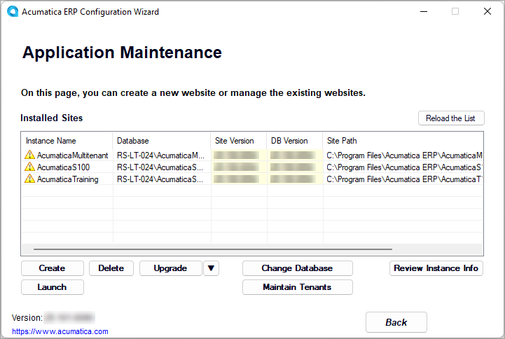

# Upgrading of Acumatica ERP: To Update an Instance {#_f7567572-cb19-4823-b322-87ca2ddd9a9f .task}

The following activity will walk you through the process of updating the database and site of an Acumatica ERP application instance to the next minor version by using Acumatica ERP Configuration wizard.

## Story { .section}

Suppose that you are the system administrator of your company, and you need to update the existing Acumatica ERP application instance to the next minor version.

## Process Overview { .section}

In this activity, you will update the Acumatica ERP instance from the previous version to a newer version.

## System Preparation { .section}

Before you begin performing the steps of this activity, make sure that you have completed the [Instance Deployment: To Deploy an Instance with Demo Data](INST_Deploying_Instances_Deploy_Tenant_With_Demodata_Activity.md) prerequisite activity.

## Step 1: Obtaining an Installation Package with a Newer Version of Acumatica ERP { .section}

To download an installation package with a newer version of Acumatica ERP and install it, do the following:

1.  Open the [Acumatica Community](https://community.acumatica.com/) website.

    You will need your partner's username and password to access the site.

2.  On the **Product** menu at the top of the page, click **2026 R1**.

    The Acumatica ERP 2026 R1 Downloads and Release Notes page opens. On this page, you can find the latest release and prior releases of the selected version and read the release notes.

3.  To download the Acumatica 2026 R1 Update 1, click the *Show content* link in the **Prior Releases** section.
4.  Click the *Acumatica 2026 R1 Update 1 Build ХХ.ХХХ.ХХХХ* link.

    The page with the release opens.

5.  In the **Download Links** section, click the *Acumatica ERP 2026 R1 Update 1* link to download the `AcumaticaERPInstall.msi` Windows installer package.
6.  Install the newer version of the Acumatica ERP Configuration wizard, as described in [Acumatica ERP Installation On-Premises: To Install the Acumatica ERP Configuration Wizard](INST_Installing_Configuration_Wizard_Activity.md).

## Step 2: Updating an Instance { .section}

To update the Acumatica ERP instance from the previous version to one you have just installed, do the following:

1.  On the Start menu, click **Acumatica ERP Configuration** to open the Acumatica ERP Configuration wizard.
2.  On the Welcome page, click **Perform Application Maintenance**.

    On the Application Maintenance page, which opens, in the list of existing application instances, notice that all the instances have yellow triangles with exclamation points, as shown in the following screenshot.

    

3.  In the list of application instances, click the row with the Acumatica ERP instance you want to update, and click the **Upgrade** button.
4.  In the confirmation dialog box, click **Yes** to continue the update.
5.  In the **SQL Server Authentication** dialog box, which opens during the upgrade, leave the **Windows Authentication** option button \(which is selected by default\), and click **OK** to start the update.

    The time required for the update depends on the performance of your database server, the differences between the old and current versions of the database schema, the hardware configuration of the server, and the current system load.

    **Tip:** During the upgrade or update, the system may ask you to stop the application pool that is used for the instance. If it does, click **Yes** to proceed.

    When the update of the instance is finished, the Acumatica ERP Configuration wizard updates the list of instances and shows the appropriate check mark next to each instance. For details about the icons in the list of instances, see [Instance Maintenance: Possible Update Statuses of an Instance](INST_Maintaning_Instances_States_Instances.md).

**Parent topic:**[Upgrading Acumatica ERP](../UserGuide/INST_Upgrading_Mapref.md)

