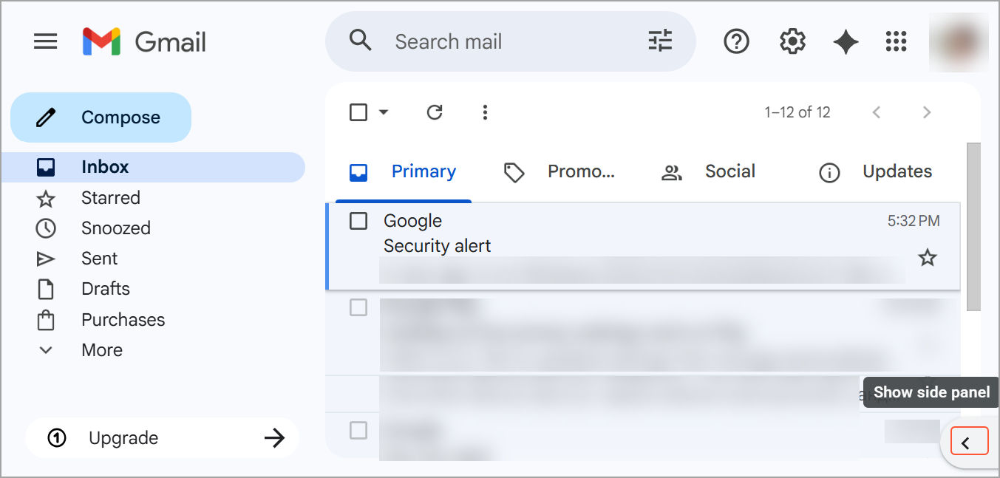
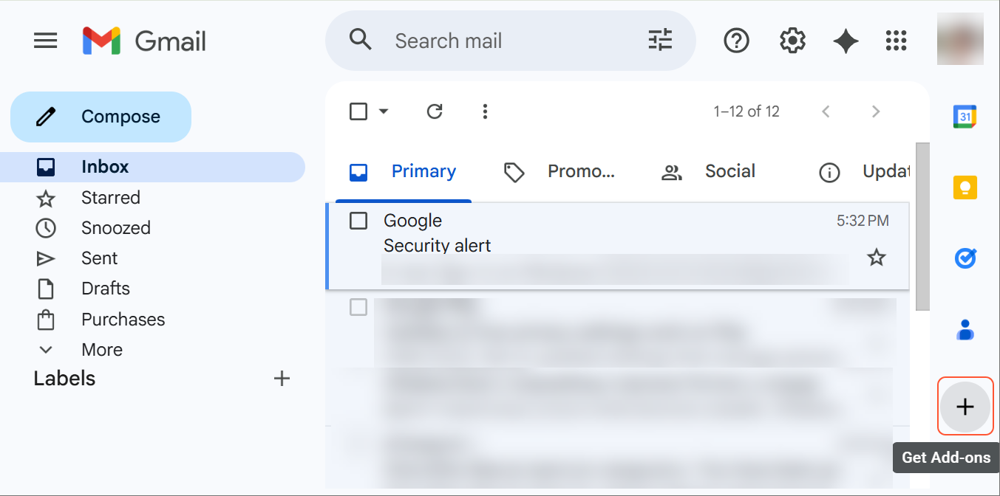
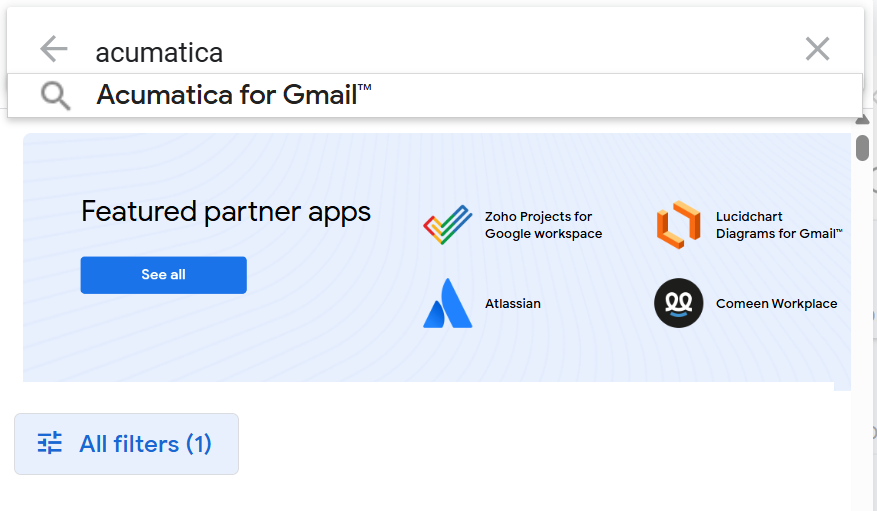
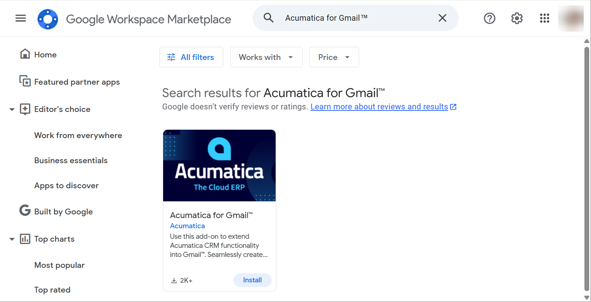
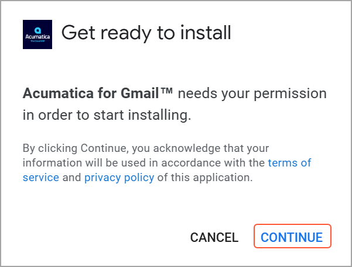
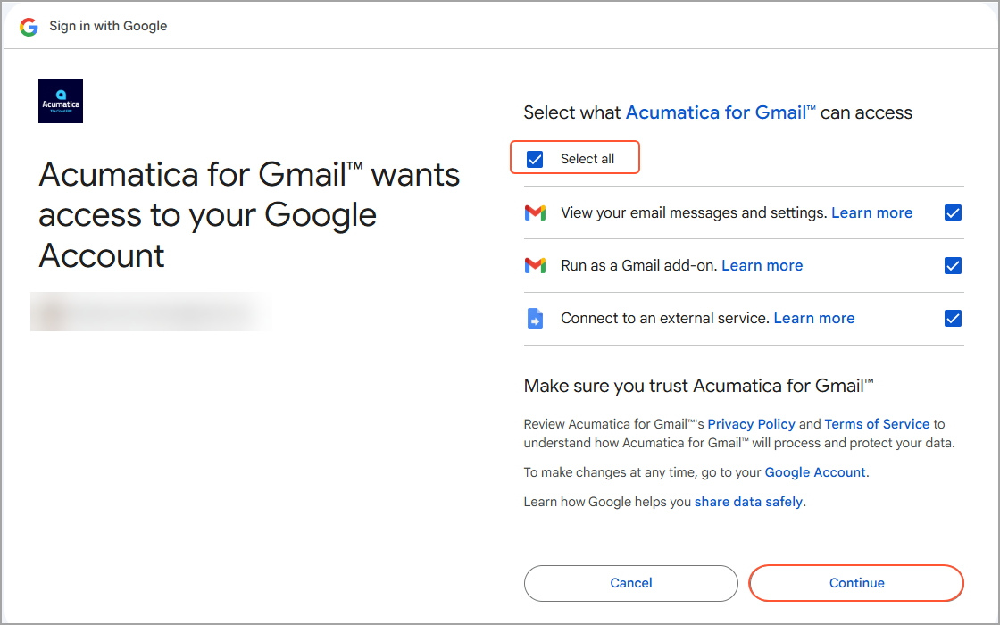
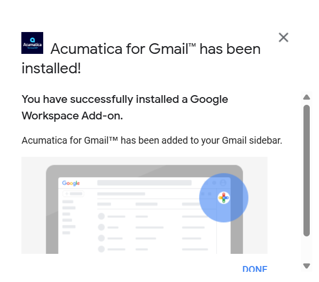
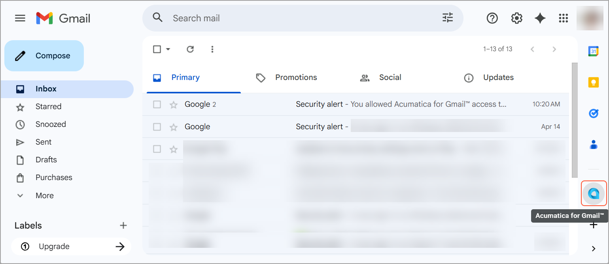

# Acumatica ERP Integration with Gmail: Add-on Installation {#_63a78bf7-e976-4311-90cb-ba9d0fda0a68 .concept}

The Gmail integration is available through a Gmail add-on. With the Acumatica for Gmail add-on, you can view existing records or create new ones, such as contacts, cases, or opportunities, based on the selected email message in your Gmail mailbox.

**Tip:** Before installing the Acumatica for Gmail add-on, make sure you have a Gmail account.

## Installing the Acumatica for Gmail Add-on { .section}

Before you begin, sign in to your Gmail account and open your mailbox. If the side panel is hidden, click the arrow to display it, as shown below, and then do the following:

1.  On the side panel of your Gmail mailbox, click **Get Add-ons**.

    

2.  In the Search box of the Goggle Workspace Marketplace, enter `Acumatica`.

    

3.  Select *Acumatica for Gmail* from the search results.

    

4.  In the Acumatica for Gmail add-on tile, click **Install**.
5.  In the **Get ready to install** dialog box, click **Continue**.

    

6.  In the **Sign in with Google** dialog box, select the **Select all** check box and click **Continue**.

    

7.  When the installation is complete, click **Done** in the confirmation dialog box.

    

    The dialog box closes, and the **Acumatica for Gmail** icon appears on the side panel of your Gmail mailbox.

    

**Parent topic:**[Integrating Acumatica ERP with Gmail](../UserGuide/INT_Gmail_Mapref.md)

