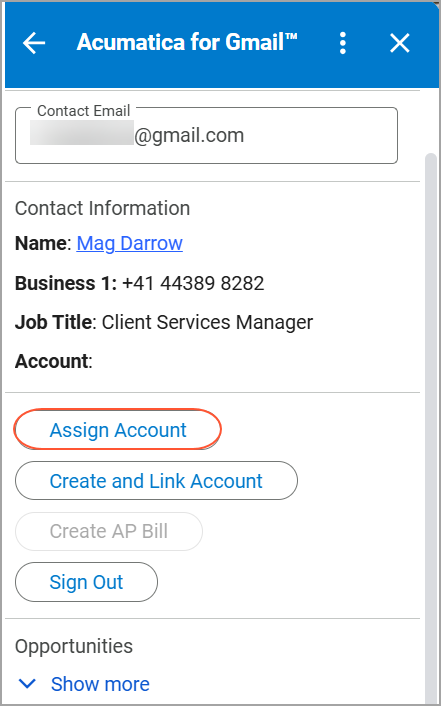
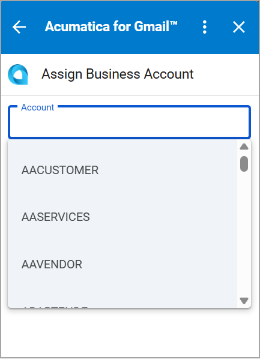
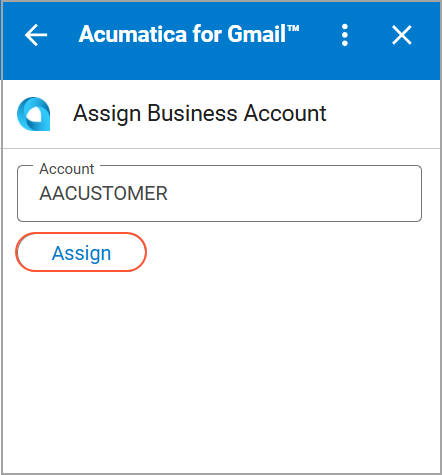
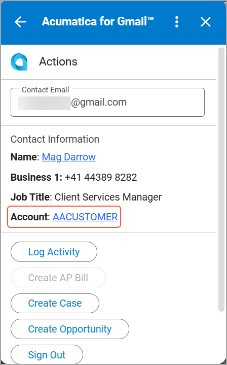
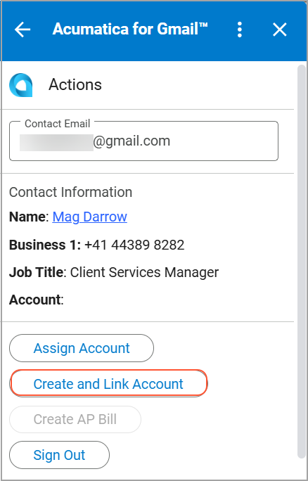
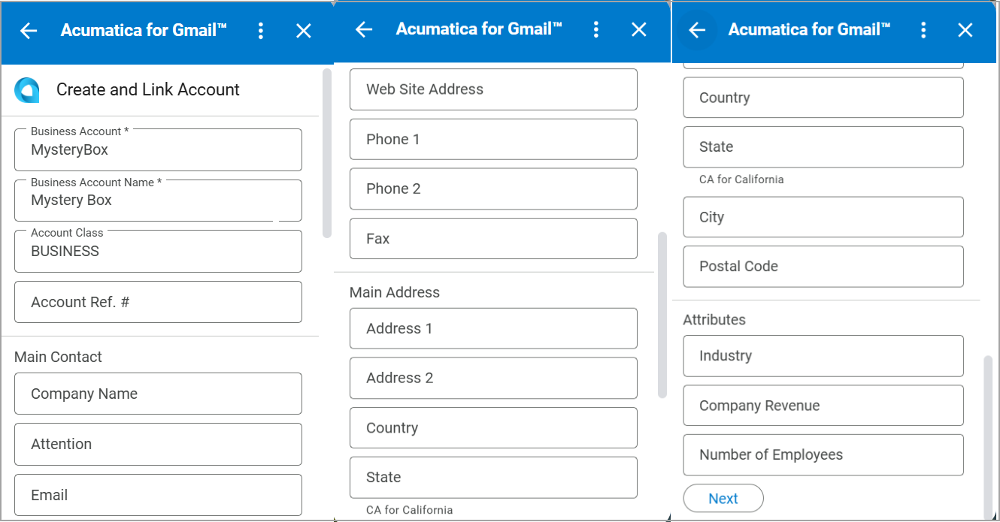
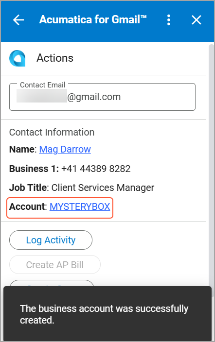

# Acumatica ERP Integration with Gmail: Business Account Management {#_d154d72d-a75e-4fc2-bbe4-8792c0ca386e .concept}

By using the Acumatica for Gmail add-on, you can assign a contact to an existing business account or create a new business account and link it to the contact.

## Assigning an Existing Business Account to the Contact { .section}

If the contact belongs to a company that already exists in the system, you can link the contact to that business account to keep your data consistent. To assign an existing business account to the contact, do the following:

1.  On the **Actions** page, click **Assign Account**.

    

2.  On the **Assign Business Account** page, select a business account in the **Account** box.

    **Tip:** You can select a business account from the list or enter its name manually.

    

3.  Click **Assign**.

    

    The business account is assigned to the contact, and you are returned to the **Actions** page.

    

## Linking the Contact to a New Business Account { .section}

If the contact is associated with a company that is not yet in your system, you can create a new business account and link it to the contact to keep your records organized. To link the contact to a new business account, do the following:

1.  On the **Actions** page, click **Create and Link Account**.

    

2.  On the **Create and Link Account** page, enter the business account details.

    

3.  Click **Next**.

    The business account is created and linked to the contact.

    

**Parent topic:**[Integrating Acumatica ERP with Gmail](../UserGuide/INT_Gmail_Mapref.md)

