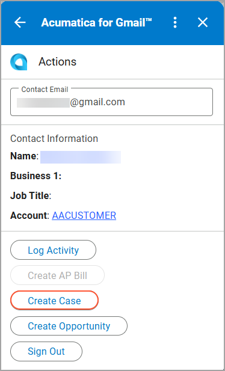
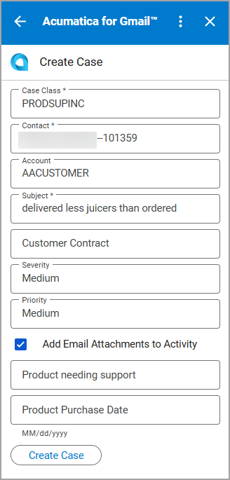
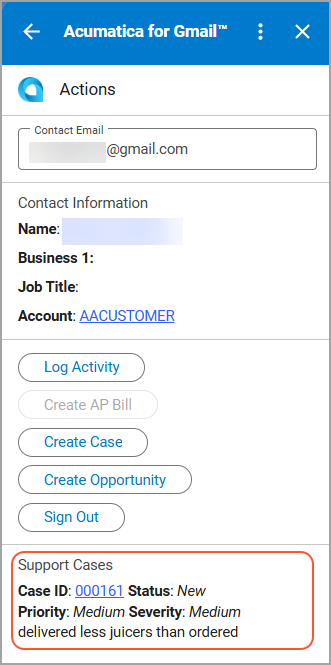

# Acumatica ERP Integration with Gmail: Case Management {#_41081a33-7249-4676-a278-985c2ce512e7 .concept}

When you receive customer requests in Gmail, you can quickly turn these emails into support cases by using the Acumatica for Gmail add-on.

You can create a case if all the following conditions are met:

-   The contact exists for the email address specified in the **Contact Email** box.
-   A business account is assigned to this contact.

## Creating a Case { .section}

To create a case, do the following:

1.  On the **Actions** page, click **Create Case**.

    

2.  On the **Create Case** page, enter the case details.

    

3.  Click **Create Case**.

    The case is created and you are returned to the **Actions** page. You can review the case in the **Support Cases** section of the page.

    

If you select the **Add Email Attachments to Activity** check box on the **Create Case** page, the system adds the email attachments to the case on the [Cases](CR_30_60_00.md) \(CR306000\) form, so you can access them later from the activity record.

**Parent topic:**[Integrating Acumatica ERP with Gmail](../UserGuide/INT_Gmail_Mapref.md)

