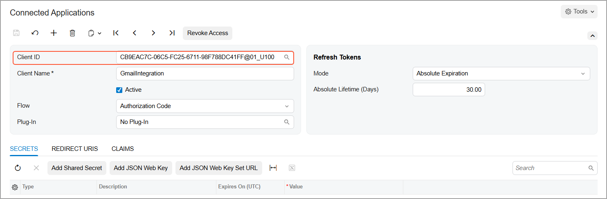
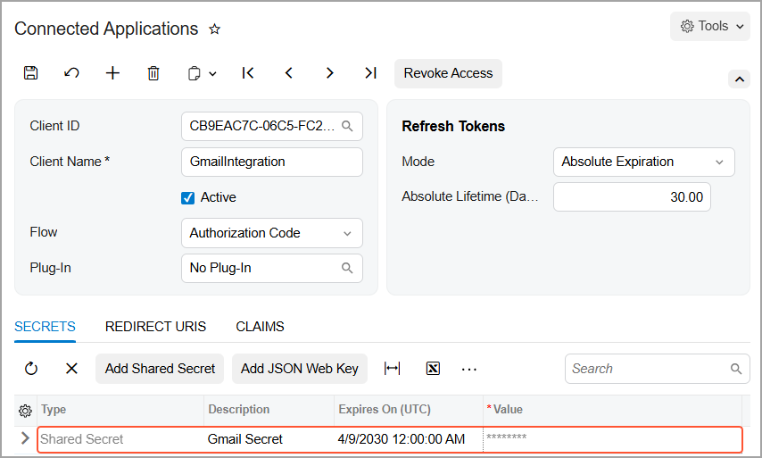
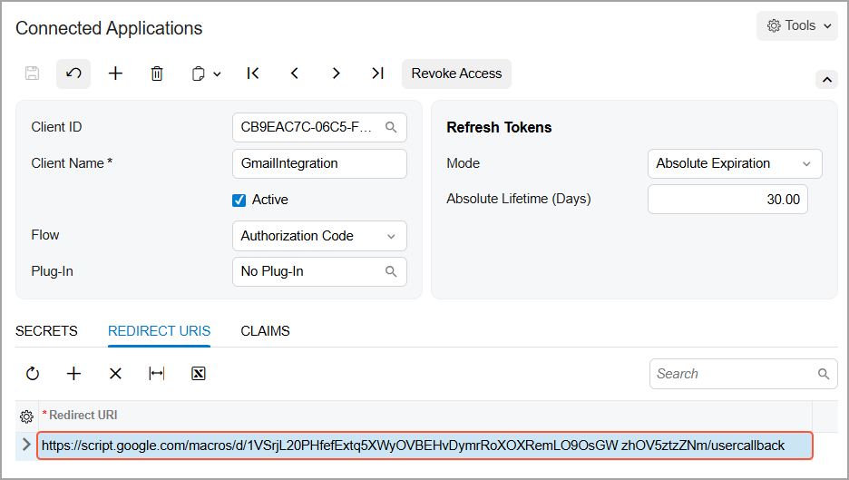

# Acumatica ERP Integration with Gmail: Configuration of the Connected Application {#_fb45f3c3-a917-4515-8a91-0767f4c92131 .concept}

To ensure secure data exchange with Gmail, you need to configure a connected application in Acumatica ERP. This configuration allows the Gmail add-on to securely access your Acumatica ERP data.

## Creating the Connected Application { .section}

On the [Connected Applications](SM_30_30_10.md) \(SM303010\) form, you create the connected application for Gmail integration and specify the following settings:

1.  **Client Name**: *GmailIntegration*
2.  **Active**: Selected
3.  **Flow**: *Authorization Code*
4.  Click **Save**

After you save the record, the system assigns the client ID to the connected application.

## Creating a Client Secret { .section}

The client secret, together with the client ID, is used to establish a connection between Acumatica ERP and the Gmail add-on. To create a client secret, do the following on the [Connected Applications](SM_30_30_10.md) \(SM303010\) form:

1.  On the **Secrets** tab, click **Add Shared Secret** on the table toolbar.
2.  In the **Add Shared Secret** dialog box, specify the following settings:
    1.  **Description**: *Gmail Secret*
    2.  **Expires On \(UTC\)**: Any future date
3.  Copy the **Value** from the dialog box and save it in a secure location so that you can retrieve it later.

    **Important:** Once the dialog box is closed, the client secret value cannot be retrieved. We recommend storing the client secret value in a plain text file \(for example, in Notepad\). Make sure there are no extra spaces or line breaks before or after the value.

4.  Click **OK**.

The system creates the client secret and adds it to the **Secrets** tab.

## Specifying the Redirect URL { .section}

The redirect URL is the publicly reachable address to which the user is redirected after authentication so that Acumatica ERP can complete the connection. To specify a redirect URL, do the following on the [Connected Applications](SM_30_30_10.md) \(SM303010\) form:

1.  On the **Redirect URLS** tab, add a new row.
2.  In the **Redirect URL** column, enter the following URL as a single line: `https://script.google.com/macros/d/1VSrjL20PHfefExtq5XWyOVBEHvDymrRoXOXRemLO9OsGWzhOV5ztzZNm/usercallback`

    

3.  Click **Save**.

**Parent topic:**[Integrating Acumatica ERP with Gmail](../UserGuide/INT_Gmail_Mapref.md)

