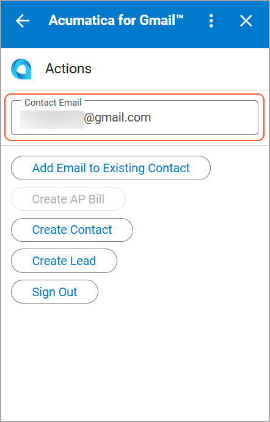
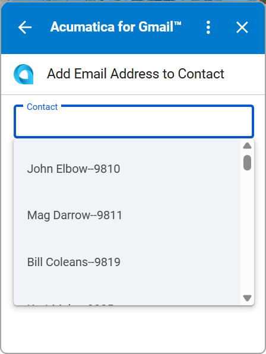
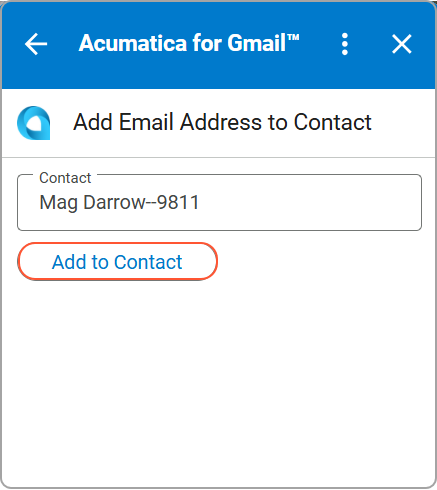
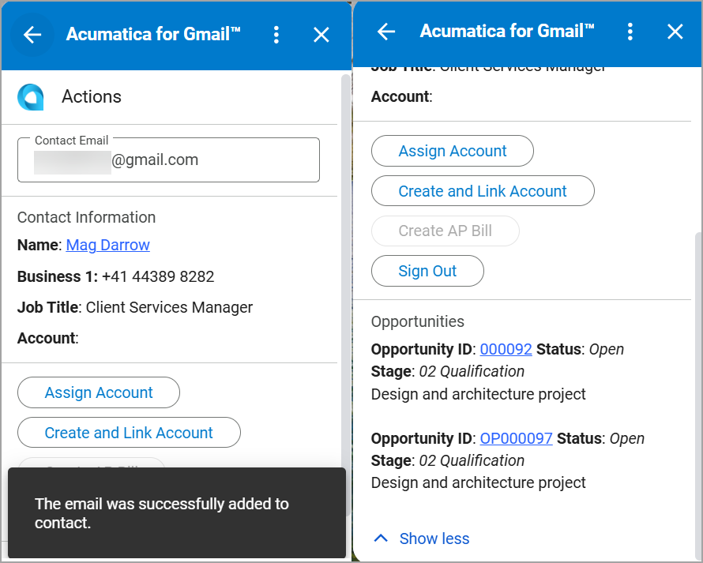
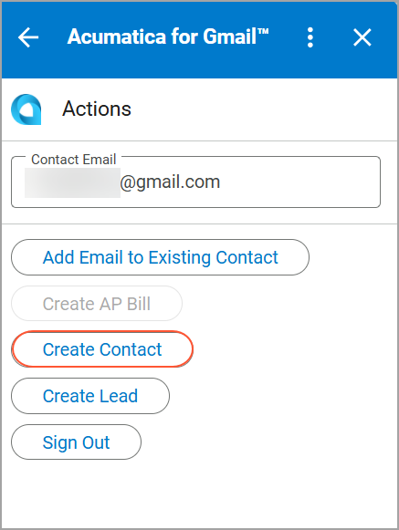
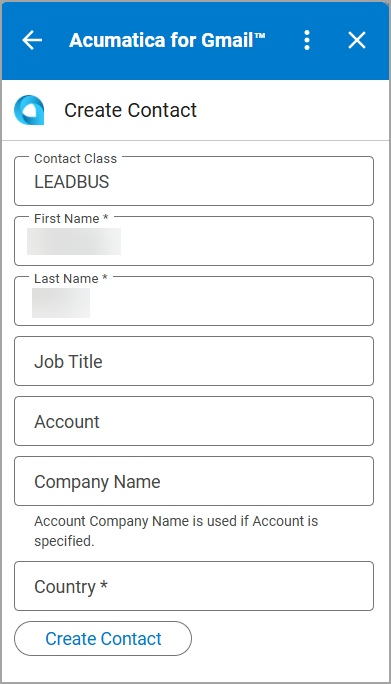
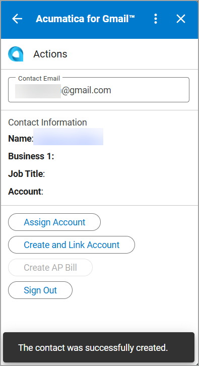

# Acumatica ERP Integration with Gmail: Contact Management {#_d4a1f4c2-4b8a-4a6f-ad96-897a5f61f72f .concept}

With the Acumatica for Gmail add-on, you can add a sender's email address from an open email to an existing contact in Acumatica ERP or create a new contact. With this, you can:

-   Link emails to the correct contact in the system
-   Create related records, such as leads or opportunities, in Acumatica ERP without leaving Gmail

When you open the Acumatica for Gmail add-on for an email message, the email address appears in the **Contact Email** box on the **Actions** page.

## Adding the Email Address to an Existing Contact { .section}

If the sender already exists in the system but their email address hasn't been added, you can add it to the contact to keep communication history linked by doing the following:

1.  Open an email in Gmail mailbox and open the add-on.

    The add-on opens on the **Actions** page with the email address selected in the **Contact Email** box.

2.  Click **Add Email to Existing Contact**.
3.  On the **Add Email Address to Contact** page, select a contact in the **Contact** box.

    **Tip:** You can select the contact from the list or enter the name manually.

    

4.  Click **Add to Contact**.

    

    After you add the email address to the contact, the contact details appear in the **Contact Information** section on the **Actions** page.

    

## Creating a Contact { .section}

If the email is from a new person who isn't yet in Acumatica ERP, you can create a contact directly from the email to start tracking communication. To create a new contact, do the following:

1.  Open an email message in your Gmail mailbox and run the add-on.

    The add-on opens on the **Actions** page with the email address selected in the **Contact Email** box.

2.  Click **Create Contact**.

    

3.  On the **Create Contact** page, enter the contact details.

    

4.  Click **Create Contact**. The contact is creates. and its details appear in the **Contact Information** section on the **Actions** page.

    

## Assigning Business Account to the Contact { .section}

If a contact is not yet associated with a company in Acumatica ERP, you can link it to an existing business account or create a new one to keep your data structured and consistent.

On the **Actions** page, you can do the following:

-   To assign an existing business account to the contact, click **Assign Account**
-   To create a business account and link it to the contact, click **Create and Link Account**

For details, see [Acumatica ERP Integration with Gmail: Business Account Management](INT_Gmail_Business_Account_Management.md).

**Parent topic:**[Integrating Acumatica ERP with Gmail](../UserGuide/INT_Gmail_Mapref.md)

