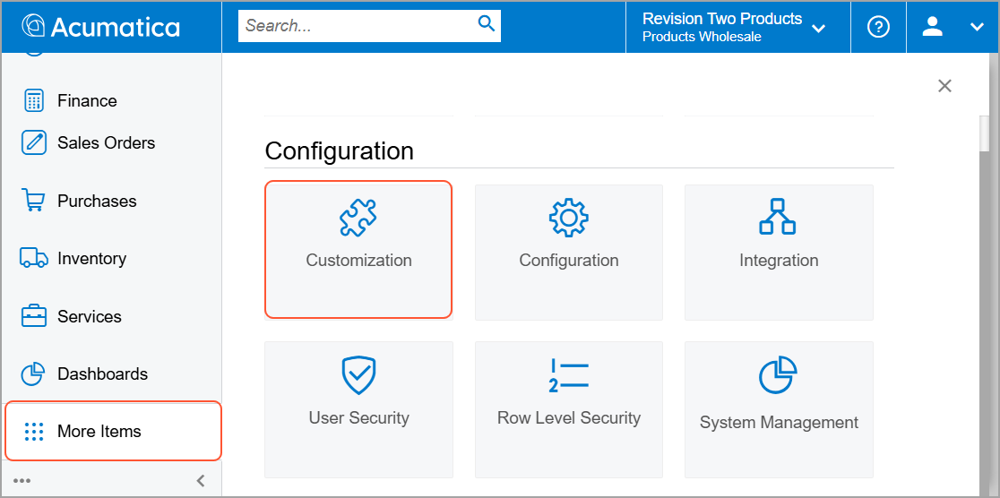
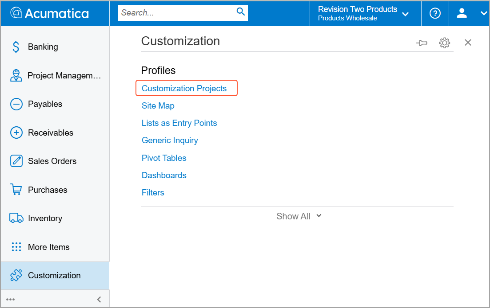
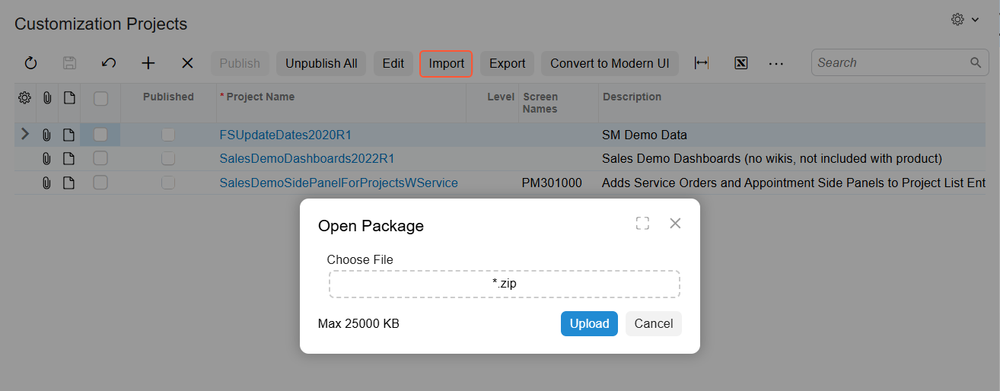
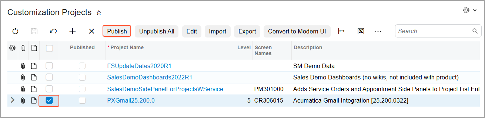
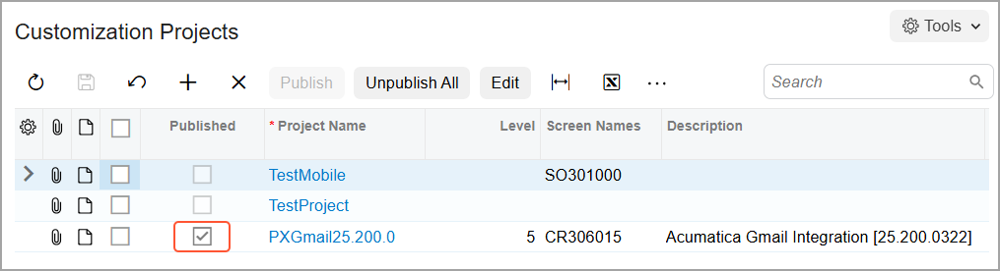

# Acumatica ERP Integration with Gmail: Installation of the Gmail Integration Customization Project {#_dd4076e7-a25f-46ea-b385-2f4a7411b1bb .concept}

Gmail integration in Acumatica ERP is provided as a customization project. After publishing, you need to enable the *Gmail Integration* feature on the [Enable/Disable Features](CS_10_00_00.md) \(CS100000\) form.

To download and publish the customization project in your Acumatica ERP instance, follow the steps described in the next sections.

## Downloading the Customization Project Package { .section}

You can find the customization project packages for Acumatica ERP versions 2022 R1 and later here: [Acumatica Community Gmail Integration](https://community.acumatica.com/add-ons-and-integrations-66/gmail-integration-4356).

In the *Installation* section, select the appropriate Acumatica ERP version and click **download** in the **Download Link** column. The customization project package is downloaded to your device.

You can verify the version of the customization project by its file name, which has the following format: `PXGmail<xx.xxx.xx>.zip`, where `<xx.xxx.xx>` is the Acumatica ERP version.

## Publishing the Customization Project { .section}

To publish the customization project in your Acumatica ERP instance, do the following:

1.  Sign in to Acumatica ERP.
2.  On the Main menu, click **More Items** and select the **Customization** workspace.

    

3.  In the **Customization** workspace, click **Customization Projects**.

    

4.  On the [Customization Projects](SM_20_45_05.md) \(SM204505\) form, click **Import** on the form toolbar and select the customization project package that you downloaded earlier.

    

5.  Select the uploaded customization project and click **Publish** on the form toolbar.

    

    Wait until the publishing is complete.

    

6.  On the [Enable/Disable Features](CS_10_00_00.md) \(CS100000\) form, enable the *Gmail Integration* feature in the *Third-Party Integrations* group of features.

You can now install the Gmail add-on.

**Parent topic:**[Integrating Acumatica ERP with Gmail](../UserGuide/INT_Gmail_Mapref.md)

