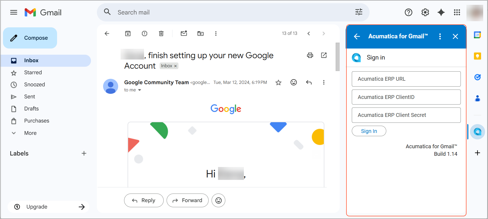
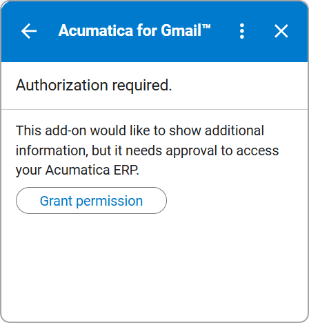
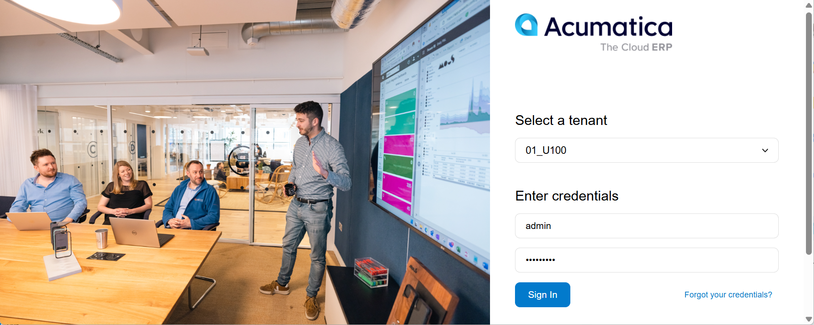
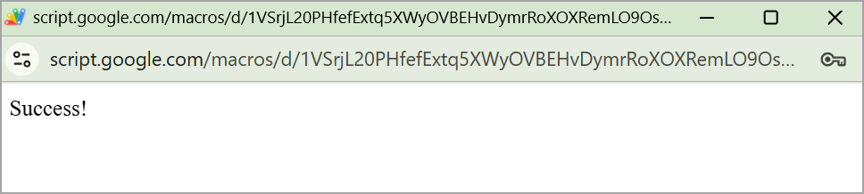
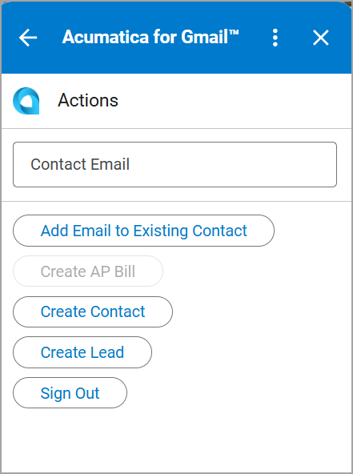

# Acumatica ERP Integration with Gmail: Getting Started with the Add-On {#_2a68b7cf-d8fe-4838-87d9-10ebb9eea15d .concept}

The Acumatica for Gmail add-on lets you access and manage Acumatica ERP records directly from Gmail. To start using the add-on, open an email or conversation in Gmail. Then click the Acumatica for Gmail icon in the side panel. The Acumatica for Gmail panel opens on the right side of the screen and displays the **Sign In** page.

## Signing In { .section}

To connect the add-on to your Acumatica instance, make sure you have already created a connected application on the [Connected Applications](SM_30_30_10.md) \(SM303010\) form. Then enter the following information on the **Sign In** page:

-   The URL of your Acumatica ERP site \(HTTPS\)
-   The client ID
-   The client secret

After you click **Sign In**, you are prompted to grant authorization.

Click **Grant permission**. You are then redirected to the Sign-In page of Acumatica ERP.

Sign in to your Acumatica ERP instance:

1.  In the **Select a tenant** box, select the company to which you want to sign in.

    **Tip:** This box is available only if multiple companies are registered in your Acumatica ERP instance.

2.  In the **Username** and **Password** boxes, enter your credentials.
3.  Click **Sign In**.

    

    After you sign in, a confirmation pop-up window opens. This means that the add-on is connected to your Acumatica ERP instance and ready to use.

    

4.  Close the pop-up window and return to your Gmail mailbox.

You can now manage the email on the Acumatica for Gmail panel.

**Parent topic:**[Integrating Acumatica ERP with Gmail](../UserGuide/INT_Gmail_Mapref.md)

