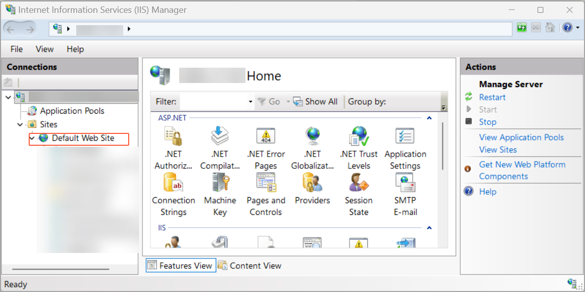
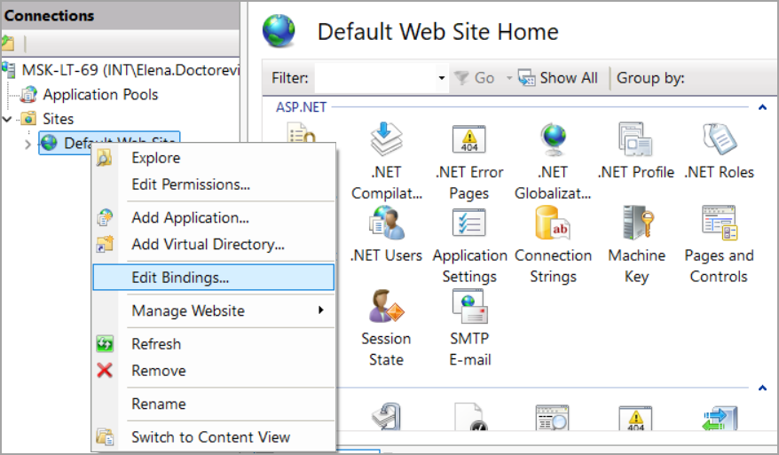
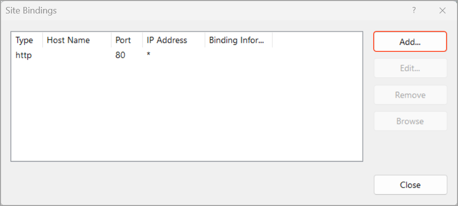
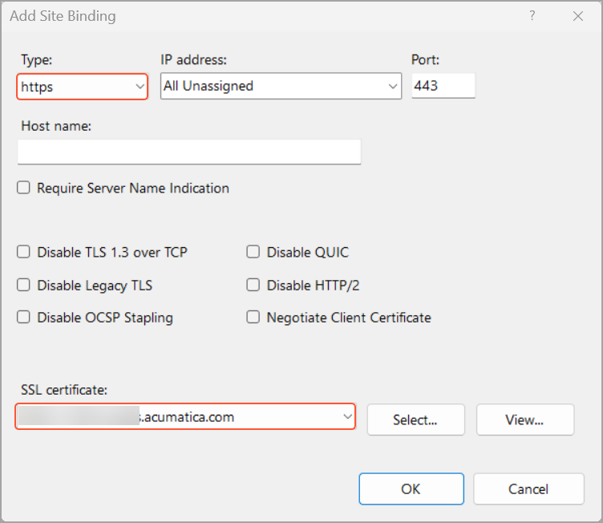
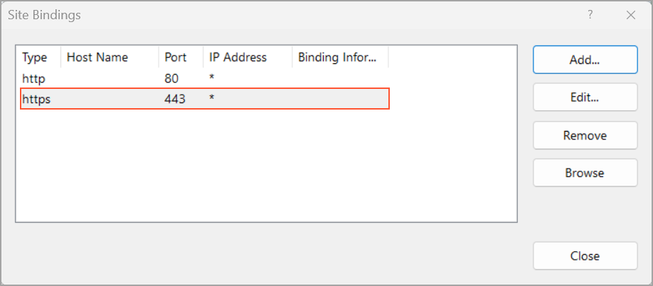
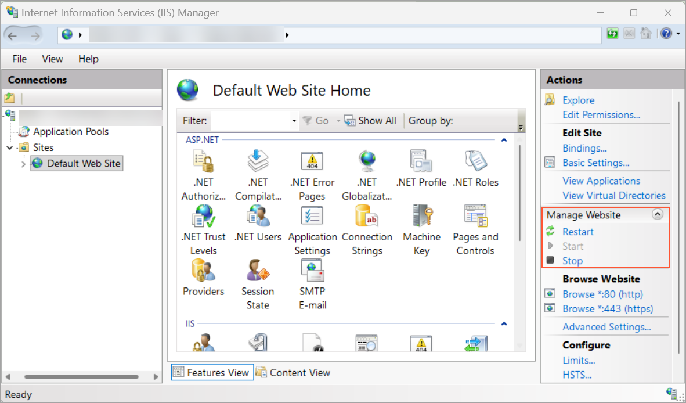

# Acumatica ERP Integration with Gmail: Using a Local Acumatica ERP Site for Gmail Integration {#_85b7dc57-a2d5-43f8-a400-ea456569ce39 .concept}

The Gmail integration is designed to work with live Acumatica ERP sites hosted over HTTPS. To use this integration with a local Acumatica ERP instance, you need to configure the site to use HTTPS with a valid SSL certificate. This is required because Gmail integration uses secure OAuth authentication.

## Preparing the System Environment { .section}

1.  Open the **Internet Information Services \(IIS\) Manager**.
2.  On the **Connections** panel, expand the **Sites** node and locate your Acumatica ERP instance where the Gmail integration customization project is installed. This site may be **Default Web Site**, as shown below.

    

3.  Right-click the site and select **Edit Bindings**.

    

4.  In the **Site Binding** dialog box, click **Add**.

    

5.  In the **Add Site Binding** dialog box, specify the following settings, and then click **OK**:

    1.  **Type**: *https*
    2.  **SSL certificate**: Your computer name
    

    A new HTTPS binding is added.

    

6.  Close the dialog box.
7.  In the **Actions** pane, restart the site by doing one of the following:

    -   Click **Stop**, and then click **Start**
    -   Click **Restart**
    

## Launching the Local Instance { .section}

You can now launch your local Acumatica ERP instance to proceed with the Gmail integration in one of the following ways:

-   By using the Acumatica ERP Configuration wizard
-   By entering the HTTPS localhost address of your instance in a browser

    **Tip:** You may see the *Your connection is not private* message. In this case, click **Advanced** and then **Proceed to &lt;name of website&gt;**.

**Parent topic:**[Integrating Acumatica ERP with Gmail](../UserGuide/INT_Gmail_Mapref.md)

