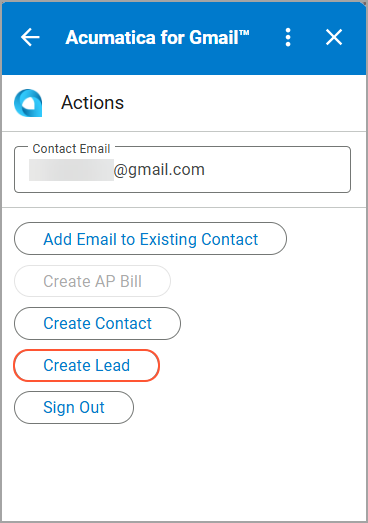
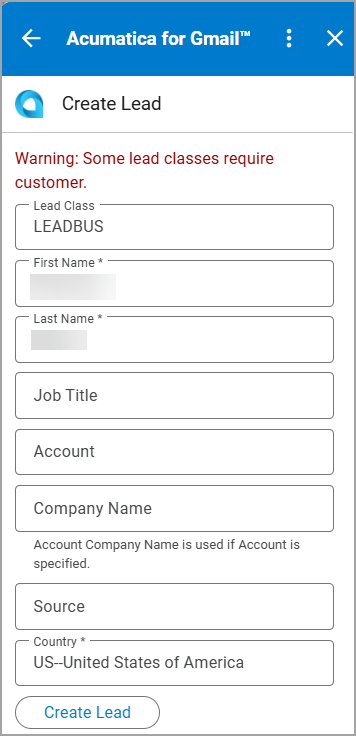
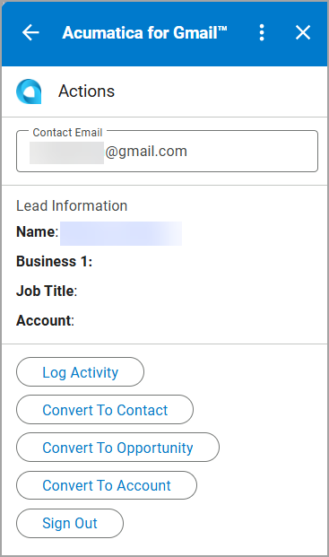
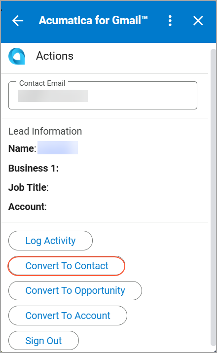
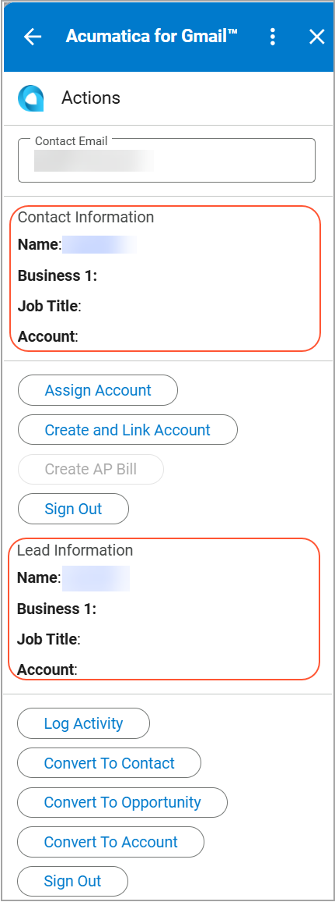
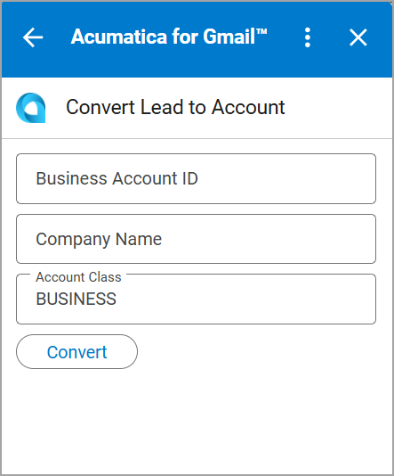

# Acumatica ERP Integration with Gmail: Lead Management {#_8c7d9c17-dc8b-42db-ab18-41d9a1c398a5 .concept}

With the Acumatica for Gmail add-on, you can convert an email from a potential customer into a lead directly from your inbox, so you can start tracking the interaction without leaving Gmail. You can then convert the lead to a contact, business account, or opportunity.

## Creating a Lead { .section}

If the email address used in the message is not associated with any existing record in Acumatica ERP, you can create a lead directly from the email to start tracking the interaction.

When you open an email message, the Acumatica for Gmail add-on opens the **Actions** page with the email address shown in the **Contact Email** box. To create a lead with this email address, do the following:

1.  On the **Actions** page, click **Create Lead**.

    

2.  On the **Create Lead** page, specify the lead settings.

    

3.  Click **Create Lead**.

    The system creates the lead and returns you to the **Actions** page. You can review the lead in the **Lead Information** section of the page.

    

## Converting the Lead to a Contact { .section}

After you have qualified a lead and want to store the person’s information as a contact in your system, you can convert the lead to a contact on the **Actions** page in one click:

1.  Under the **Lead Information** section, click **Convert to Contact**.

    

    The contact information appears in the **Contact Information** section of the page.

2.  Review the contact information. You can also review the lead information in the **Lead Information** section of the page.

    

## Converting the Lead to a Business Account { .section}

If the lead represents a company that you want to track as a customer or partner, you can convert the lead to a business account as follows:

1.  On the **Actions** page, click **Convert to Account**.
2.  On the **Convert Lead to Account** page, enter the business account details.

    

3.  Click **Convert**.

    The system returns you to the **Actions** page and adds the business account link to the **Lead Information** section.

## Converting the Lead to an Opportunity { .section}

When a lead is ready for further sales work, you can convert it to an opportunity to start managing the sales process as follows:

1.  On the **Actions** page, click **Convert to Opportunity**.
2.  On the **Convert Lead to Opportunity** page, fill in the required settings.
3.  Click **Convert**.

    The system returns you to the **Actions** page and adds the opportunity link and information to the **Opportunities** section.

**Parent topic:**[Integrating Acumatica ERP with Gmail](../UserGuide/INT_Gmail_Mapref.md)

