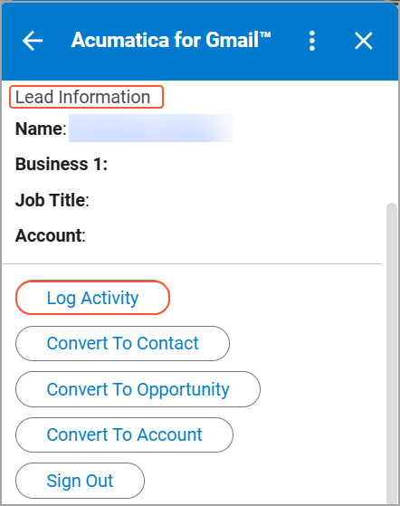
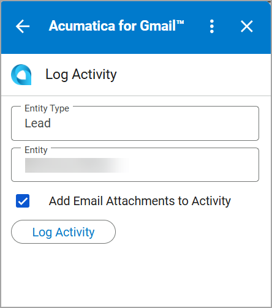

# Acumatica ERP Integration with Gmail: Email Activity Creation {#_51ccd1d3-cd1e-405d-81f5-beb2427e155b .concept}

When you receive an email in Gmail, you can save it as an email activity in Acumatica ERP and link it to a record, such as a contact or lead, by using the Acumatica for Gmail add-in.

## Creating an Email Activity { .section}

To create an email activity from an open email message, do the following:

1.  On the **Actions** page, in the section for the relevant entity \(for example, **Lead Information**\), click **Log Activity**.

    

2.  In the **Entity** box on the **Log Activity** page, select an entity \(for example, *Lead*\).
3.  Review the **Entity Type** and **Entity** values, and make changes if needed.

    

4.  Click **Log Activity**.

    The email activity is created and added to the **Activities** tab of the entity's data entry form.

If you select the **Add Email Attachments to Activity** check box on the **Log Activity** page, the system adds the email attachments to the email activity, so you can access them later from the activity record.

**Parent topic:**[Integrating Acumatica ERP with Gmail](../UserGuide/INT_Gmail_Mapref.md)

