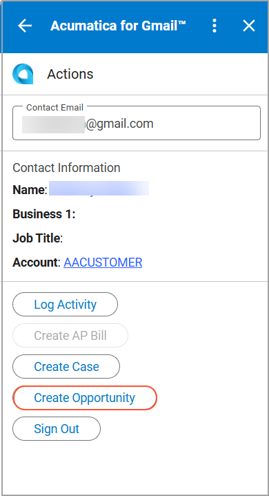
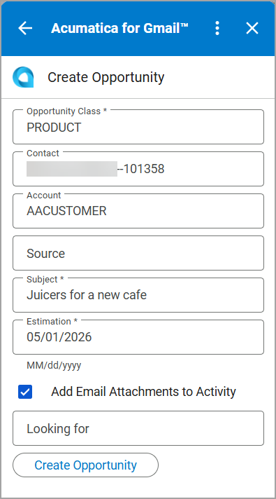
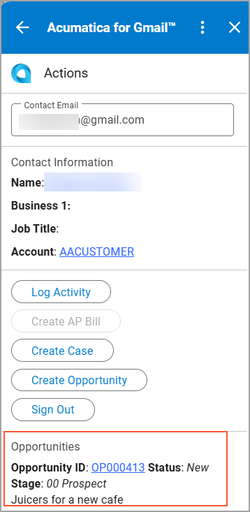

# Acumatica ERP Integration with Gmail: Opportunity Management {#_7c56731b-287e-4490-b761-1c89a647add8 .concept}

When you communicate with a potential or existing customer in Gmail and identify that an email could lead to a new deal, you can use the Acumatica for Gmail add-on to create an opportunity in Acumatica ERP.

You can create an opportunity if all the following conditions are met:

-   A contact exists for the email address specified in the **Contact Email** box.
-   A business account is assigned to this contact.

## Creating an Opportunity { .section}

To create an opportunity, do the following:

-   On the **Actions** page, click **Create Opportunity**.

    

-   On the **Create Opportunity** page, specify the opportunity details.

    

-   Click **Create Opportunity**.

The opportunity is created and you are returned to the **Actions** page. You can view the opportunity in the **Opportunities** section of the page.

If you select the **Add Email Attachments to Activity** check box on the **Create Opportunity** page, the system adds the email attachments to the opportunity on the [Opportunities](CR_30_40_00.md) \(CR304000\) form, so you can access them later from the activity record.

**Parent topic:**[Integrating Acumatica ERP with Gmail](../UserGuide/INT_Gmail_Mapref.md)

