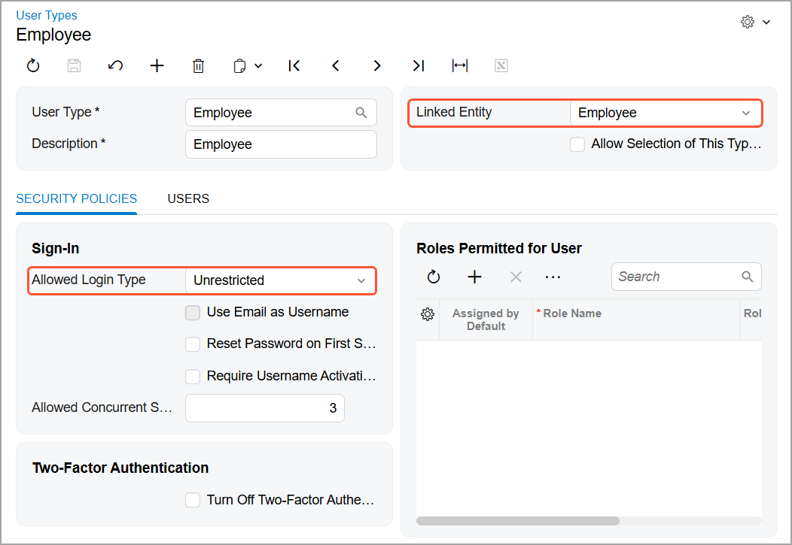

# Acumatica ERP Integration with Gmail: System Requirements {#_82e7cbbc-3677-4aba-9c41-9566d39b59e8 .concept}

Before you set up the integration with Gmail, make sure that your system environment meets the requirements described in this topic.

## System Requirements { .section}

You can use the Acumatica for Gmail add-on if your Acumatica ERP instance version is 2020 R2 or later.

The Acumatica ERP instance should be a live website hosted over HTTPS. If you want to install the Gmail integration on a local Acumatica ERP site, follow the steps to set up your system environment described in [Acumatica ERP Integration with Gmail: Using a Local Acumatica ERP Site for Gmail Integration](INT_Gmail_Install_on_Local_Host.md).

The user account on the [Users](SM_20_10_10.md) \(SM201010\) form must have a user type with the following settings specified on the [User Types](EP_20_25_00.md) \(EP202500\) form:

-   **Linked Entity**: *Employee*
-   **Allowed Login Type**: *Unrestricted*

## Access Rights { .section}

To work with records in Acumatica ERP by using the Gmail add-on, the user must have sufficient access rights to view existing records and create new records.

At least the *View Only* access right is required for the following forms:

-   [Attributes](CS_20_50_00.md) \(CS205000\)
-   [Business Account Classes](CR_20_80_00.md) \(CR208000\)
-   [Case Classes](CR_20_60_00.md) \(CR206000\)
-   [Contact Classes](CR_20_50_00.md) \(CR205000\)
-   [Countries/States](CS_20_40_00.md) \(CS204000\)
-   [Customer Management Preferences](CR_10_10_00.md) \(CR101000\)
-   [Customer Contracts](CT_30_10_00.md) \(CT301000\)
-   [Enable/Disable Features](CS_10_00_00.md) \(CS100000\)
-   [Lead Classes](CR_20_70_00.md) \(CR207000\)
-   [Opportunity Classes](CR_20_90_00.md) \(CR209000\)

At least *Edit* access right is required for the following data entry forms:

-   [Business Accounts](CR_30_30_00.md) \(CR303000\)
-   [Cases](CR_30_60_00.md) \(CR306000\)
-   [Contacts](CR_30_20_00.md) \(CR302000\)
-   [Email Activity](CR_30_60_15.md) \(CR306015\)
-   [Leads](CR_30_10_00.md) \(CR301000\)
-   [Opportunities](CR_30_40_00.md) \(CR304000\)

You can assign the required access rights by using the following forms:

-   [Access Rights by Role](SM_20_10_25.md) \(SM201025\)
-   [Access Rights by Screen](SM_20_10_20.md) \(SM201020\)
-   [Access Rights by User](SM_20_10_55.md) \(SM201055\)

**Parent topic:**[Integrating Acumatica ERP with Gmail](../UserGuide/INT_Gmail_Mapref.md)

