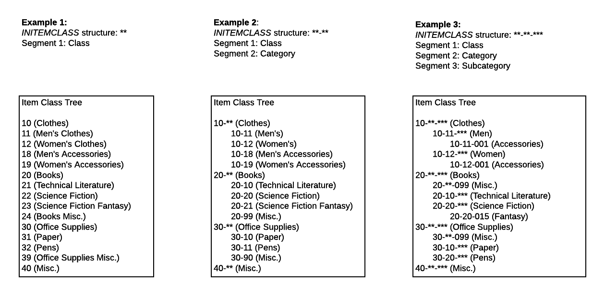

# Hierarchy of Item Classes {#_481303c4-470b-4dfa-a203-5fca29c4b47a .concept}

In Acumatica ERP, item classes are used to group stock or non-stock items with similar properties and to provide default settings for new items. On the [Item Classes](IN_20_10_00.md) \(IN201000\) form, you can create item classes for stock items as well as for non-stock items of each type that is used in your business. The item class is a required parameter of a stock item; the item class includes the settings that are used for availability calculation, replenishment, price management, and posting to the general ledger. A user specifies an item class when they define a new stock or non-stock item on the [Stock Items](IN_20_25_00.md) \(IN202500\) or [Non-Stock Items](IN_20_20_00.md) \(IN202000\) form respectively, and the system fills in many values, thus saving users time and increasing the accuracy of the entered data.

You can also use item classes for categorizing items. To do this, you can set the hierarchy of the item classes directly in the item class IDs. The sections below describe the specifics of configuring item classes and using them for categorizing inventory items.

## Planning the Item Class Hierarchy { .section}

The structure of item class IDs is defined by the *INITEMCLASS* segmented key, which you can review and modify on the [Segmented Keys](CS_20_20_00.md) \(CS202000\) form. This segmented key has a hierarchical structure—that is, each segment of the segmented key defines the hierarchical level. You can review the item class hierarchy in the **Item Class Tree** pane on the [Item Classes](IN_20_10_00.md) \(IN201000\) form. In this pane, each item class is represented as a tree node if it has child item classes, or as a leaf of a tree if it has no child item classes.

After you have defined the structure of the *INITEMCLASS* segmented key, the system shows the mask that corresponds to this structure in any box that requires the user to enter an item class ID. The characters in the mask that aren't yet specified are denoted with *\**; the segments are divided with the separator character specified in the **Delimiter** column on the [Segmented Keys](CS_20_20_00.md) form for *INITEMCLASS* \(*-* by default\). For example, if you have specified three segments of two symbols each, the mask shown in a box where an item class ID must be entered will be \*\*-\*\*-\*\*.

If the *INITEMCLASS* segmented key has one segment, the item classes will have a plain structure with no nested levels \(see Example 1 on the diagram below\). If you are going to use a plain structure of the item classes, you have to specify a sufficient length of the only segment so you can specify as many classes as you need.

If you specify two or more segments in the *INITEMCLASS* segmented key, each segment after the first segment defines a subsequent level of hierarchy. Item classes that have the second segment specified are displayed at the second level of hierarchy. An item class segment of the second level directly refers to the parent item class segment of the first level. That is, under different parent item classes, you can create child item classes with the same ID of the second segment but different settings; see *20-10 \(Technical Literature\)* and *30-10 \(Paper\)* in Example 2 on the diagram below.

By adding more segments to the segmented key, you can expand your ability to categorize items by item classes. For instance, you could add a third level \(see the hierarchy in Example 3 on the diagram below\) to make your inventory categorization even more comprehensive and flexible. By using the *INITEMCLASS* segmented key, you can specify as many levels as you need. You can append a new segment to the key at any time; however, we recommend that you carefully plan the structure of the segmented key before you start to create and use item classes.

## Specifying Default Item Classes { .section}

When you create an item class \(stock or non-stock\) that is the child of any other item class, the system suggests the default settings of the parent class. For the classes at the first level of the item class hierarchy, which have no parent classes that could provide default settings, you can specify the default item classes on the [Inventory Preferences](IN_10_10_00.md) \(IN101000\) form as follows:

-   In the **Default Stock Item Class** box, you can select the stock item class whose settings will be used by default for newly created stock item classes.
-   In the **Default Non-Stock Item Class** box, you can select the non-stock item class whose settings will be used by default for newly created non-stock item classes.

## Sequentially Selecting Child Segment Values { .section}

When you create a new item class or enter an item class ID in any appropriate box in the system, you have to specify the needed symbols according to the mask of the *INITEMCLASS* segmented key. If you skip any of the characters in any segment, the system shows \* instead of a blank symbol. When you enter an item class ID, you can either enter each segment value manually, or press F3 and select the segment value from the list. For the first segment, only the segment values of the first level of hierarchy are displayed in the selection box. For each subsequent segment, in the selection list, the system shows the child segment values that are appropriate based on the previous segment or segments selected.

**Note:** The way the system narrows the list of segment values based on previously selected values is defined by the *By Segments: Child Segment Values* option selected in the **Lookup Mode** box on the [Segmented Keys](CS_20_20_00.md) \(CS202000\) form; this option is the default for the *INITEMCLASS* segmented key. For the description of other lookup options, see the [Segmented Identifiers](CS__con_Identifier_Segmentation.md) topic.

## Mass-Updating Settings of Item Classes { .section}

Suppose that you have changed some settings of a parent item class. When you changed these settings, they will apply to all newly created item classes of this parent item class, but these changes do not influence the settings of the existing child item classes of this parent item class. So if you need to have these changed settings reflected in all child item classes, you need to update them as well.

To simplify the process of updating multiple child item classes, you can automatically apply the settings of the parent item class to all its child item classes. To do this, while viewing the parent class on the [Item Classes](IN_20_10_00.md) \(IN201000\) form, you click **Apply to Children** on the More menu. After you confirm the action, the system updates all the settings of the children of this item class on all levels of the hierarchy, so that all item classes of this tree node have identical settings.

## Deleting Item Classes with Children { .section}

You can delete only those item classes to which no inventory items have been assigned yet. To delete an item class, you open the class on the [Item Classes](IN_20_10_00.md) \(IN201000\) form and click **Delete** on the form toolbar. When you delete a parent item class, the system asks whether you want to keep the child item classes of this parent. The system proceeds as follows based on your response:

-   If you click **Yes** in the message box, the system deletes the parent item class and keeps all its the children in the hierarchy. The children item classes becomes the children of the item class at the level immediately above the deleted item class.
-   If you click **No** in the message box, the system deletes the entire tree node of the item class hierarchy \(that is, the parent item class along with all of its child item classes\).

## Moving Item Classes Within the Hierarchy { .section}

A change of one segment or multiple segments in an item class ID may influence the position of the item class in the tree. To change an item class ID, click **Change ID** on the More menu of the [Item Classes](IN_20_10_00.md) \(IN201000\) form, and specify the new ID in the dialog box that opens. When you confirm the action, the item class ID changes, and the system rebuilds the item class hierarchy.

## Reviewing the Items of the Item Class { .section}

You can review the inventory items that belong to a particular item class on the [Inventory by Item Class](IN_40_80_00.md) \(IN408000\) form. The left pane of this form shows the tree of item classes. When you click an item class in the tree, the right pane of the form shows the inventory items that belong to this class.

The **Show Items** option button specified on the right pane determines which inventory items are listed: By default, the **Related to Only the Current Item Class**option button is selected, which means that the table displays only the items that belong to the selected item class. To make the system show the inventory items that belong to the selected item class, along with inventory items that belong to all child item classes of the selected item class, select the **Related to the Current and Child Item Classes** option button.

Also, on the [Inventory by Item Class](IN_40_80_00.md) form, you can quickly review to which item class a particular item belongs and which other inventory items belong to this class. To do this, select the particular inventory item by its ID in the **Inventory ID** box. Once you do, the system selects the item class to which the item belongs in the tree of item classes and shows all inventory items of this class in the table.

## Moving Inventory Items to Another Item Class { .section}

For a single stock or non-stock inventory item, you can change the item class in the item's settings on the [Stock Items](IN_20_25_00.md) \(IN202500\) form or [Non-Stock Items](IN_20_20_00.md) \(IN202000\) form, respectively.

If you need to move multiple inventory items to another item class at a time, you can use the cut and paste functionality on the [Inventory by Item Class](IN_40_80_00.md) \(IN408000\) form. To do this, on this form, click the item class to which the needed items currently belong in the **Item Class Tree**, select the unlabeled check boxes in the rows with the needed inventory items in the table on the right pane, and click the **Cut Selected Records** button on the table toolbar of the right pane. The system copies the selected rows to the clipboard. Then, in the **Item Class Tree**, click the destination item class \(the class into which you want to move the selected items\), and on the table toolbar of the right pane, click the **Paste Records** button. The system asks whether you want to keep the settings of the moved items:

-   If you click **Yes** in the message box, the system updates the settings of the moved items to the settings of the destination item class.
-   If you click **No** in the message box, the system keeps the settings of the moved items unchanged.

**Parent topic:**[Managing Hierarchical Item Classes](../UserGuide/IN__mng_Managing_Hierarchical_Item_Classes.md)

