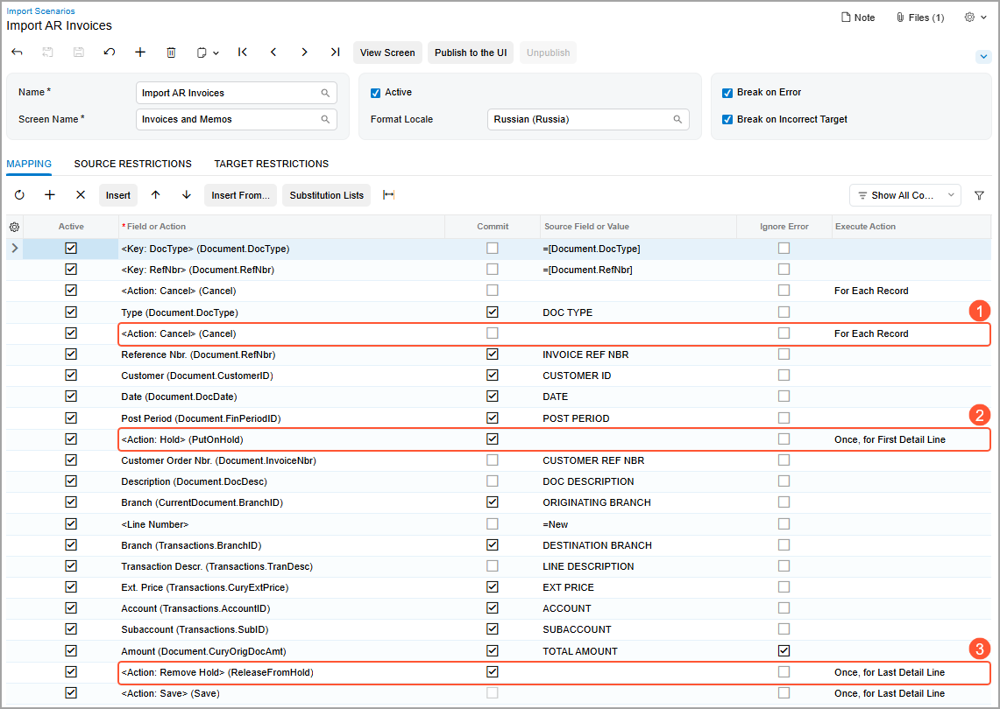

# Actions in Import Scenarios {#_7a8cb982-bcf7-4260-9e3f-0bb934509a07 .concept}

When you need to reflect a button or a menu command being clicked on a form, you map the corresponding action. Actions are available for all buttons on a form, as well as for all commands on the More menu or any other menu.

To add an action to the import scenario mapping, you use the **Actions** node of the **Select - Field or Action** lookup table, which appears when you click the magnifier button in the **Field or Action** column. You can find the needed action by typing its name in the Search box. Action names have the `Action:` prefix and are enclosed in angle brackets—for example, `<Action: Save>` or `<Action: Delete>`.

**Tip:** All actions use the Summary object as the target object.

For an action, you do not select any external field in the **Source Field or Value** column of the **Mapping** tab of the [Import Scenarios](SM_20_60_25.md) \(SM206025\) form.

## Mapping of Actions with Dialog Boxes { .section}

If an action displays a dialog box, you may need to specify certain values for the fields whose elements are shown in this dialog box. In an import scenario, you map each field whose default value you want to change, and then you add a row that maps the action itself. You map a field by doing the following:

1.  Selecting the name of the field as the **Field or Action**
2.  Specifying the needed value of the field as the **Source Field or Value**

You map the check boxes in the same way. Suppose that you are importing invoices to the [Invoices and Memos](AR_30_10_00.md) \(AR301000\) form. Further suppose that in the **Recalculate Prices** dialog box, you need to select the **Override Manual Prices** check box and clear the **Recalculate Discounts** check box. To reflect these actions, you add the following rows to the scenario mapping.

|Field or Action|Node \(Target Object\)|Commit|Source Field or Value|Execute Action|
|---------------|----------------------|------|---------------------|--------------|
|*OverrideManualPrices*|*Recalculate Prices*|Selected|`='True'`| |
|*RecalcDiscounts*|*Recalculate Prices*|Selected|`='False'`| |
|*&lt;Action: Recalculate Prices&gt;*|*Actions*|Cleared| |*Once, for Last Detail Line*|

Notice that the row that maps the **Recalculate Prices** action is added after the rows that map the selection and clearing of check boxes in the **Recalculate Prices** dialog box.

## Importing of Documents with Detail Lines {#section_ymy_w4c_qyb .section}

When you import documents \(such as invoice and shipments\) with detail lines, by default, the system executes all instructions in the mapping of the scenario, including actions, for each detail line of each document. In most cases, certain actions should be executed only once for a document.

To ensure that the documents are processed correctly during import, you can specify how the system should execute a particular action by using the **Execute Action** column on the **Mapping** tab of the [Import Scenarios](SM_20_60_25.md) \(SM206025\) form. The following options are available:

-   *For Each Record*
-   *Once, for First Detail Line*
-   *Once, for Last Detail Line*

Suppose that you want to update existing invoices by importing prices from a file. During the import, for each of the invoices, the system should put the invoice on hold, update its detail lines by using the data from the file, and then remove the invoice from hold. The screenshot below shows the mapping of a scenario on the [Import Scenarios](SM_20_60_25.md) form that imports accounts receivable invoices. The instructions in the mapping indicate that the system should perform the actions as follows:

-   *&lt;Action: Cancel&gt;* \(system action\): For every row in the file—that is, for each detail line of each invoice \(see Item 1 in the screenshot\).

    This is a service command that the system adds for the key fields.

    **Tip:** You do not need to add this command manually or edit it in any of the import scenarios.

-   *&lt;Action: Hold&gt; \(PutOnHold\)*: For only the first detail line of each invoice \(Item 2\).

    The system puts the invoice on hold \(once\).

-   *&lt;Action: Remove Hold&gt; \(ReleaseFromHold\)*: For only the last detail line of each invoice \(Item 3\).

    The system removes the invoice from hold after all its detail line have been updated \(also once\).

By default, for each row that contains an action, the value in the **Execute Action** column is *For Each Record*. For the &lt;Action: Save&gt; command, the default value in this column is *Once, for Last Detail Line*.

**Parent topic:**[Configuring Scenario Mapping](../UserGuide/IS__mng_Scenario_Mapping.md)

