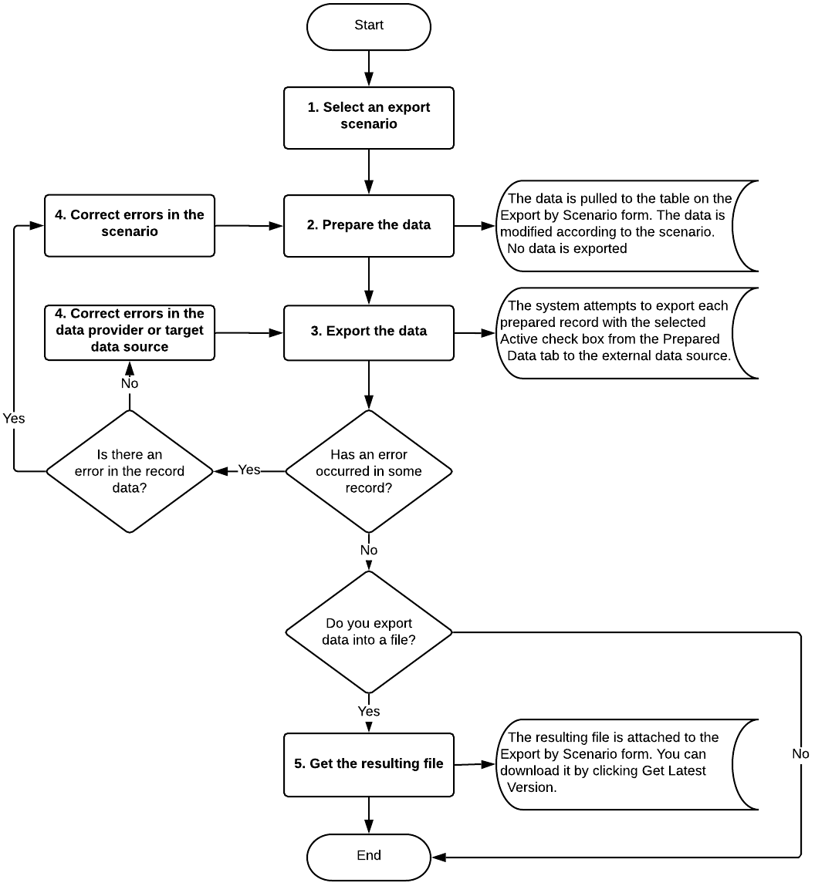

# Data Export {#_98db1579-7927-4f9d-824b-3fe855b20099 .concept}

You use the [Export by Scenario](SM_20_70_36.md) \(SM207036\) form for data export. To export data from Acumatica ERP to an external source, you perform the steps, which are described in this topic.

## Selection of an Export Scenario { .section}

On the [Export by Scenario](SM_20_70_36.md) form, you select the name of the scenario created for data export.

## Preparation of the Data for Export { .section}

You prepare records by uploading them on the [Export by Scenario](SM_20_70_36.md) form. The system performs all modifications defined by the scenario and uploads the modified data on the form. To prepare the data for export, you click the **Prepare** button on the form toolbar. You can view the data on the **Prepared Data** tab of this form.

## Export of Prepared Data { .section}

To run the export process, you should click **Export** on the form toolbar of the [Export by Scenario](SM_20_70_36.md) form. The system tries to export the records that have the **Active** check box selected.

**Attention:** The characters that are forbidden in XML are omitted during the data export to XML files.

## Correct of Errors { .section}

Make sure each record has the check box in the **Processed** column on the **Prepared Data** tab of the [Export by Scenario](SM_20_70_36.md) form selected, which means that this record has been successfully exported. The result of export may include errors, which are indicated by the icon on the form toolbar.

## Downloading of the Results of the Export { .section}

If you are exporting data to a file, during export, the system creates a new version of the file attached to the [Export by Scenario](SM_20_70_36.md) form. This file has the same structure as the file that was used for data provider creation. You can download the result of export by clicking the **Get Latest Version** button on the form toolbar.

Internal data is exported to the external data source in a table form. That means that the values of the fields of detail objects are translated to multiple rows of this table. The number of rows is equal to the number of detail lines of the source record. Each of these rows has the values of the fields of the summary object and related objects specified.

For example, suppose that on the [Invoices and Memos](AR_30_10_00.md) \(AR301000\) form, an AR invoice has three detail lines. If you export this AR invoice with the detail lines, the data prepared for export will include three records for this invoice—one record for each detail line. These records will include identical values of the fields of the invoice summary, such as type and reference number, and different values of the detail line fields.

## Summary of Data Export { .section}

The following diagram shows the process of exporting records from Acumatica ERP by using an export scenario.

**Parent topic:**[Importing and Exporting Records by Using Scenarios](../UserGuide/IS__mng_Importing_Exporting_Records.md)

