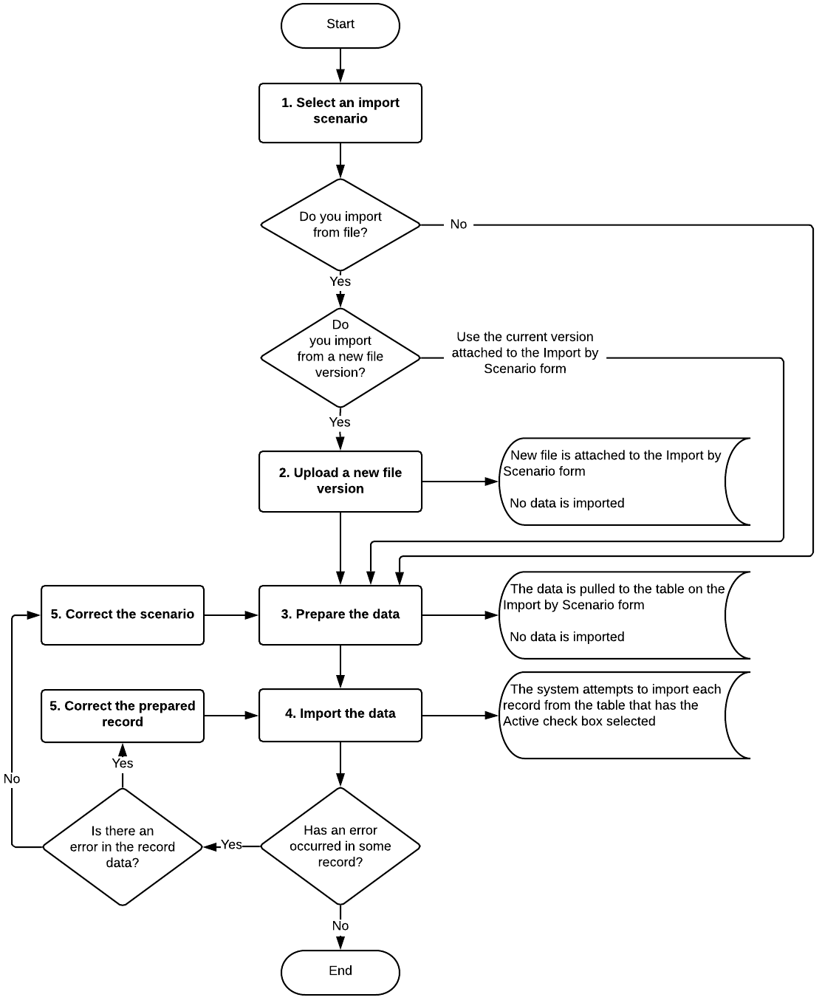

# Data Import {#_1deb1206-416a-4d8c-ac0d-09056aa65f0d .concept}

After you have created an import scenario, you should test it on one record. If the scenario is not working as you expected, the first way to troubleshoot the scenario is to reproduce the mapping instructions manually on the form to which you want to import the data. In most cases, this troubleshooting step helps you quickly identify the reason the scenario is not working, so that you can fix the scenario and continue.

After you have tested an import scenario, you can use it to import data on the [Import by Scenario](SM_20_60_36.md) \(SM206036\) form. To import external data to Acumatica ERP by using a scenario that has already been created, you should perform the steps that are described in this topic.

## Selection of an Import Scenario {#section_gq4_lnl_2s .section}

On the [Import by Scenario](SM_20_60_36.md) form, you first select the name of the scenario that has been created for data import.

You can select a scenario from only the scenarios that work with forms on which you can enter data. If you do not have the access rights to enter data on a particular form, you cannot use a scenario that imports data to this form either. If you do not have access rights to a particular form, you will not see any scenarios for this form listed among the other scenarios. You can view the access rights to particular forms on the [Access Rights by Screen](SM_20_10_20.md) \(SM201020\) form.

## Uploading of a New File Version {#section_dbx_lnl_2s .section}

If you are not using a file for importing data, skip this step.

If you are importing data from a file, decide whether you need to upload a new version of the file. The file that is used for data import is attached to the form; you can click **Files** on the title bar to view the file. This file is attached to each of the following forms: [Data Providers](SM_20_60_15.md) \(SM206015\), [Import Scenarios](SM_20_60_25.md) \(SM206025\), and [Import by Scenario](SM_20_60_36.md) \(SM206036\).

If you need to use a new version of the file when importing data, you can upload the new file to the [Import by Scenario](SM_20_60_36.md) form by clicking **Upload File Version** on the form toolbar. The schema of the uploaded file must match the schema defined in the data provider and used in the import scenario. If you have changed the file structure, you have to update the data provider and the import scenario; only then can you use the new file to import the data.

**Attention:** If there is no file attached to the [Import by Scenario](SM_20_60_36.md) form, you have to upload the file either by dragging the file to the form or by using the **Files** menu. Do not use the **Upload File Version** button to upload the file. After the file is uploaded to the form, you can update the version of the file by clicking **Upload File Version**.

## Preparation of the Data for Import {#section_vkh_mnl_2s .section}

You prepare records by uploading them on the [Import by Scenario](SM_20_60_36.md) \(SM206036\) form. To prepare the data for import, you click the **Prepare** button on the form toolbar. The data is displayed on the **Prepared Data** tab; no data is yet imported into the system.

## Import of the Prepared Data {#section_yqq_mnl_2s .section}

To import data to the system, you click the **Import** button on the form toolbar of the [Import by Scenario](SM_20_60_36.md) \(SM206036\) form. The system tries to import the records with the **Active** check box selected one by one. After a record has been successfully processed, the system selects the **Processed** check box for this record. If an error occurs during the processing of a record, the process stops on the record that caused the error.

## Correction of Errors {#section_w2y_mnl_2s .section}

If an error has occurred during the import process, you have to review the error. You then do one of the following: correct the record that caused the error, exclude the problematic record from import, or modify the import scenario. Then you have to run the import process again to process the remaining records.

You can correct the records directly on the **Prepare Data** tab. If you need to replace the values of particular fields with other values, you can click the **Replace** button on the form toolbar of the **Prepared Data** tab and specify the replacement value in the dialog box that opens. You can exclude any incorrect record by clearing the **Active** check box for it. After you have made all needed corrections, on the form toolbar, you click **Save** and click **Import** again.

If you need to correct a large number of records or all records and it is too difficult to make these modifications on the **Prepare Data** tab, you can correct the records in the source, upload a new file version if you are importing data from a file, and prepare and import the data again.

If you need to correct the import scenario itself, make changes to the scenario on the [Import Scenarios](SM_20_60_25.md) \(SM206025\) form, and prepare and import the data again on the [Import by Scenario](SM_20_60_36.md) \(SM206036\) form. You can clear both the prepared data and the history of scenario execution by clicking **Clear Data** on toolbar of the [Import by Scenario](SM_20_60_36.md) form. The **Clear Data** action doesn't reverse records that have already been imported.

## Summary of Data Import { .section}

After you have imported data, open the destination form and make sure that the imported records appear among the records.

The following diagram shows the process of importing records to Acumatica ERP by using an import scenario.

**Parent topic:**[Importing and Exporting Records by Using Scenarios](../UserGuide/IS__mng_Importing_Exporting_Records.md)

