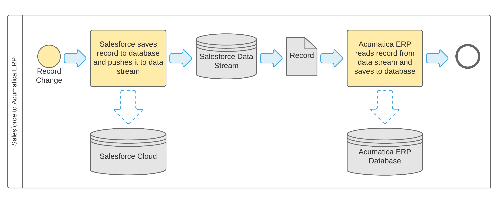
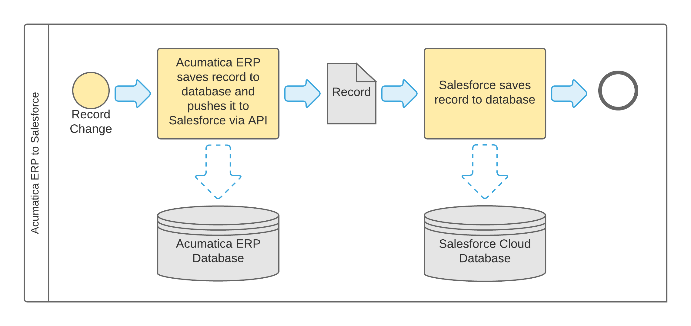

# Data Synchronization Process {#_aab25d9c-fc85-4e3d-8b19-3bb06c77f24b .concept}

This topic describes how you can prepare CRM-related data for real-time synchronization between Acumatica ERP and Salesforce and how you can initiate and maintain the synchronization process.

## Preparation for Real-Time Data Synchronization { .section}

If one of the systems, Salesforce or Acumatica ERP, is used in your company as the primary CRM system, the data should be initially synchronized between the systems, which the administrator can do by initiating the synchronization process on the [Salesforce Data Resync](SF_20_50_35.md) \(SF205035\) form with *Full Data Resync* selected in the **Sync to Start** box.

## Real-Time Synchronization of Data { .section}

You initiate the bi-directional real-time synchronization process on the [Salesforce Sync](SF_20_50_30.md) \(SF205030\) form. This process monitors data changes in both systems. If any change has been detected, it gets synchronized between the systems.

At the end of the synchronization process, each record is assigned a status that indicates whether the data has been synchronized. On the [Salesforce Sync State](SF_20_50_40.md) \(SF205040\) form, you can review the statuses of the processed records and any errors the system generated when processing failed for records.

If data synchronization fails for any record, the record is assigned the internal status *Modified*, which indicates that the record data is out of sync. An administrator or a user with access to the record can analyze the cause of the failure and eliminate it, and then another attempt to synchronize the record data can be made. To resynchronize the out-of-sync records, you can use the [Salesforce Data Resync](SF_20_50_35.md) \(SF205035\) form or the **Sync State** tabs on the applicable entry forms for the corresponding records.

You can stop bi-directional real-time synchronization of data between the systems by clearing the **Active** check box for the *Salesforce Sync* data provider on the [Data Providers](SM_20_60_15.md) \(SM206015\) form.

To stop real-time synchronization of records of particular types from Salesforce to Acumatica ERP, you need to open the [Salesforce Sync](SF_20_50_30.md) \(SF205030\) form, select unlabeled check boxes for the corresponding types of records, and then click **Stop** on the form toolbar. If you click **Stop All** on the form toolbar of that form, records of all listed types will stop being synchronized from Salesforce to Acumatica ERP.

To stop real-time synchronization of records of particular types from Acumatica ERP to Salesforce, you need to open the [Salesforce Sync Entities](SF_20_50_20.md) \(SF205020\) form and delete from the table the export scenarios for the needed types of records.

## Scheduled Jobs for Synchronization { .section}

In Acumatica ERP, the following recurrent jobs related to the synchronization process can be scheduled to run at any frequency.

-   *Salesforce Sync*: This job is used for the real-time synchronization of data from Salesforce to Acumatica ERP. You use the [Salesforce Sync](SF_20_50_30.md) \(SF205030\) form to configure this job.

    When this job starts, Acumatica ERP requests that Salesforce notify it about all changes of the data for the particular type of record \(for instance, business account\) for which the job has been started. Then the job starts a background process that monitors the data stream and receives notifications about changes for the object data in Salesforce. As soon as each notification is received, the job finds the changed record in the Acumatica ERP database by using the identifier of the corresponding Salesforce record and writes the changes according to the mapping rules specified in the relevant integration scenario. If no corresponding record is found in Acumatica ERP, then a new record is created.

    We recommend that you schedule an automatic restart of this job in case a network failure occurs or Acumatica ERP is taken down for maintenance.

-   *Failed &amp; Missed Data Resync*: This job is used to compensate for possible synchronization failures. You use the [Salesforce Data Resync](SF_20_50_35.md) \(SF205035\) form to configure this job.

    Normally, records are synchronized bi-directionally in real time. Occasionally, however, a record may not be submitted to a system for various reasons, such as a network connection failure or specific configuration of validation rules that prevent a record from being saved if validation fails. When this job is started, it selects records that previously failed to synchronize and tries to resubmit them. If an attempt is unsuccessful, on the next run of the job, the job selects the record again and makes another attempt to submit the record. The maximum number of times the system attempts to submit the record is determined by the solution configuration.

    We recommend that you schedule this job to run every five to ten minutes.

-   *Full Data Resync*: This job is used after a long system outage or a Salesforce system failure has occurred. It also can be used for initial data synchronization. You use the [Salesforce Data Resync](SF_20_50_35.md) form to configure this job.

    Salesforce keeps notifications about record data changes in the data stream for 24 hours, after which it discards them. It is unlikely \(although possible\) that the two systems would stay disconnected for more than 24 hours. It is also unlikely \(although possible\) that for some reason, a record modified in Salesforce would not be pushed to the data stream. When this job is started, it searches in both systems for any record that has been modified, created, or deleted since the last time the job was run. If any record is found, the job synchronizes its data.

    We recommend that you run this job once a day.

## Data Flow { .section}

The following diagrams provide a simplified illustration of synchronization data flow.

When a user modifies, creates, or deletes a record in Salesforce, the system pushes the record into the data stream. Acumatica ERP picks up the record from the data stream and searches for the same record in Acumatica ERP database by using the Salesforce record identifier. If a record is found, the synchronization solution updates the data or deletes the record. If no record is found, the synchronization solution creates a new record.

When a user modifies or deletes a record in Acumatica ERP, the system uses the API to search for the record in Salesforce by using the Salesforce record identifier. If a record has been found, the synchronization solution updates or deletes it. If a record has been modified in Acumatica ERP but no corresponding record has been found in Salesforce, the synchronization solution creates a new record. When a user creates a record in Acumatica ERP, the synchronization solution creates a record in Salesforce.

**Parent topic:**[Overview of Synchronization with Salesforce](../UserGuide/IS__con_Integration_with_Salesforce.md)

