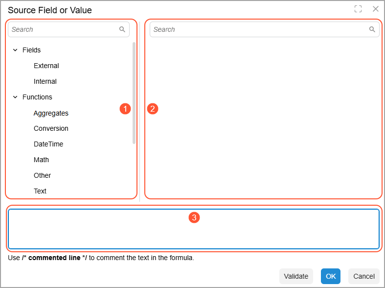

# The Use of Formulas {#_06fbe8fb-26e8-42e0-a3f0-557b63887dd2 .concept}

You can specify formulas on multiple forms. For example, to convert data into a different format during data import or export, you can map an internal field to a formula by using the [Import Scenarios](SM_20_60_25.md) \(SM206025\) or [Export Scenarios](SM_20_70_25.md) \(SM207025\) form.

## Components of a Formula { .section}

A formula can include the following components:

-   **Digital and text literals**: Literals are constants within the formula that you do not want to be modified:
    -   Type digital literals as they are, such as 2, 8.25, or 13.84.
    -   Enclose text literals within single quotation marks—for example, *'DEF\_CLASS'* and *'FOB'*.
-   **Operators**: The following types of operators are available:
    -   Arithmetic operators use numerical values and return a numerical value.
    -   Logical operators evaluate one or two Boolean expressions and return a Boolean result.
    -   Comparison operators compare two expressions and return a Boolean value that represents the result.
-   **Functions**: Functions, which perform specific tasks and return results, include the following types:
    -   Text functions perform operations on text strings.
    -   Math functions perform calculations.
    -   Conversion functions convert data from one type to another.
    -   Date and time functions perform operations related to the date, the time, or both.
-   **Fields**: External or internal fields \(elements\) can be used in a formula as operands or function arguments. The list of internal fields includes user-defined fields added to the source form.

## Assigning a Formula { .section}

To assign a formula to a field, do the following on the form with a formula box or column:

1.  Double-click in the formula box or column and then click the Edit button, which appears. This opens the Formula Editor dialog box, which you use to create the needed formula.

    **Tip:** The name of the dialog box corresponds to the name of the box or column from which you open it.

2.  Click any of the types in the Component Types pane \(see Item 1 below\) to open the list of related components in the Component Selection pane \(Item 2\).
3.  Double-click a component from the list of components. Note that all components are added to the right of the formula text.
4.  Repeat the two previous steps to add all the needed components.
5.  In the Formula Text pane \(Item 3\), manually edit the text to construct a correct formula: Move the function argument or arguments within a function's parentheses, correctly arrange operands and operations, and add any needed brackets to ensure the proper order of operations.
6.  Click **Validate** to check the syntax of the formula and make necessary corrections if required.
7.  Click **OK** to save the formula.

Once it is inserted, a formula is preceded by an equal sign \(`=`\).

See [Formula Editor Dialog Box](SM__ref_IS_Formula_Editor_Dialog.md) for details on using the dialog box, as well as descriptions of components.

## Formulas in Export Scenarios { .section}

When you map the data in Acumatica ERP to the external fields, you usually need field-to-field mapping. In some cases, however, you may need to transform or convert the data before export. This can involve adding values from multiple internal fields to one external field and extracting only a part of the internal field's value.

If you map an internal field to a formula instead of to an external field, the resulting value will be assigned back to the Acumatica ERP field. This functionality can be used, for example, to set criteria on inquiry forms to export only filtered data or to mark records as exported.

## Formulas in Import Scenarios { .section}

When you map Acumatica ERP fields to the external data, you usually need field-to-field mapping. In some cases, however, you may need to transform or convert the data before import. This can involve adding values from multiple external fields to one internal field and extracting a part of the external field's value.

During mapping, the system checks the functionality of the mapped field. If necessary, it adds a line that contains the system action required for this field, such as a refresh of the form or a commit to the database.

**Tip:** The formulas that contain locale-specific data are calculated according to the locale specified in the **Format Locale** box, which is located in the Summary area of the [Import Scenarios](SM_20_60_25.md) \(SM206025\) form for the import scenario. If no locale is specified, the default *English \(United States\)* locale is used.

## Formula Examples { .section}

The following examples illustrate how formulas work.

|Formula|Description|
|-------|-----------|
|`ClassID ='Imported Vendors'`|Assigns the `Imported Vendors` literal value to `ClassID`.|
|`VendorID = 'X'+[VendID]`|Sets `VendorID` to a concatenated string formed by `X` and the `VendID` value.|
|`IsAddressSameAsMain = true`|Sets the `IsAddressSameAsMain` check box to `true`.|
|`CountryID =iif(trim[Country]='','US',[Country])`|Assigns `US` to `CountryID` if the `Country` field is blank; otherwise, it assigns the `Country` value.

 You can use such a formula to make sure that a required internal field isn’t blank.

|
|`Customer ID = Left( trim(UCase([Name])),10)`|Generates the `Customer ID` by doing the following:

 1.  Trimming any leading or trailing spaces from the customer's name \(`Name`\) with the `Trim(arg)` function
2.  Converting the name to uppercase with the `UCase(arg)` function
3.  Truncating the name to a maximum of 10 characters with the `Left(arg)` function

 You can use this formula to generate new customer IDs if the values from the source can’t be used in your implementation. \(In the example, customer IDs are short versions of customer names converted to uppercase.\)

|

You can find more information on the operators and functions that can be used in formulas in the mapping in the following topics:

-   [Operators](IS__con_IS_Operators.md#)
-   [Functions](IS__con_IS_Functions.md#)

**Parent topic:**[Configuring Scenario Mapping](../UserGuide/IS__mng_Scenario_Mapping.md)

