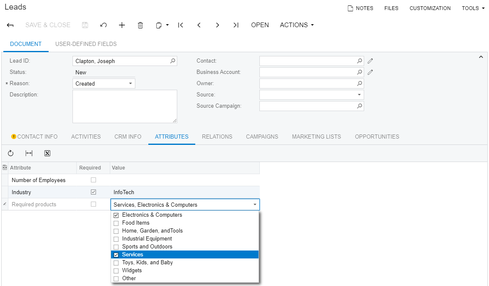
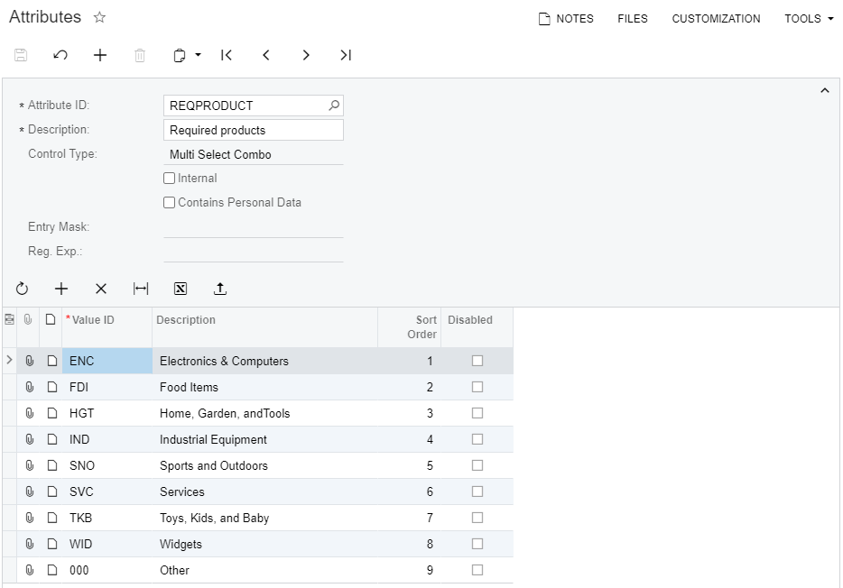
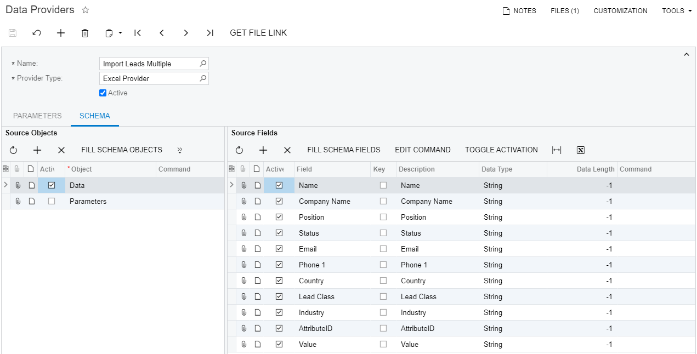
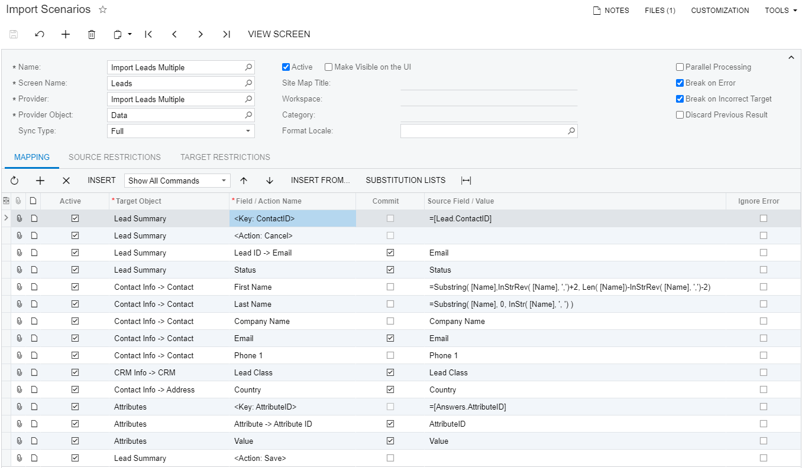
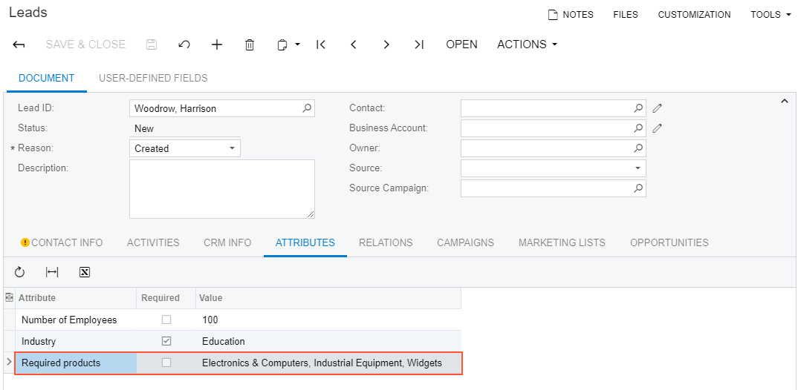

# Importing Records with Multiple-Value Attributes \(Leads\) {#_83eead08-6daa-4c47-8af6-5d44b46b1ad1 .concept}

This topic describes how to import records with an attribute for which a user can specify multiple values at the same time.

## Task Description { .section}

Suppose that you want to import information about the required products for certain leads. The **REQPROD** attribute, for which you want to import the data, is of the *Multi Select Combo* type, which means that multiple values can be selected for the attribute at the same time.

The information about the required products is available in the [IS\_\_Leads\_Multiple\_Attributes](Files/IS__Leads_Multiple_Attributes.xlsx) file. The *Attribute ID* column of the file contains the IDs of the attribute values as they are used by the system. The **Value** column contains the values that are displayed on the **Attributes** tab of the [Leads](CR_30_10_00.md) \(CR301000\) form for the attribute in the row, as the following screenshot shows.

The following screenshot shows the value IDs of the **REQPROD** attribute and their descriptions on the [Attributes](CS_20_50_00.md) \(CS205000\) form.

**Attention:** Notice in the Excel file that all the values of the **REQPROD** attribute for a lead are added to a single cell. The values are separated by commas and do not contain spaces after the commas.

## Implementation { .section}

To import leads with multi-value attributes, perform the following steps:

1.  [Creating a New Data Provider](#_e644bca5-4cf4-43fd-9e29-6c3062f15165)
2.  [Creating an Import Scenario](#_3cb0f7ec-9172-476a-a78c-dad83bfdf116)
3.  [Running the Scenario](#_d824237b-0d7b-4948-8752-4f7a5dec3b8d)
4.  [Reviewing the Imported Records](#_bdc70c44-f29d-46b0-9199-3b5c9ac940d4)

## 1. Creating a New Data Provider { .section}

On the [Data Providers](SM_20_60_15.md) \(SM206015\) form, create an Excel data provider for the `Leads Multiple Attributes.xlsx` file with the name *Import Leads Multiple*, as shown in the following screenshot.

## 2. Creating an Import Scenario { .section}

On the [Import Scenarios](SM_20_60_25.md) \(SM206025\) form, create an import scenario that uses the data provider you have created in the previous step. The mapping of the scenario is shown in the following screenshot.

## 3. Running the Scenario { .section}

On the [Import by Scenario](SM_20_60_36.md) \(SM206036\) form, select the *Import Leads Multiple* scenario in the Summary area, and click **Prepare &amp; Import** on the form toolbar. The records from the Excel file are imported into the system.

## 4. Reviewing the Imported Records { .section}

Review the results of the import on the [Leads](CR_30_10_00.md) \(CR301000\) form. Select *Woodrow, Harrison* in the Summary area; then on the **Attributes** tab, make sure the **Required products** attribute has multiple values selected, as the following screenshot shows.

## Summary { .section}

To import attributes that have multiple values, you use the Excel file, which contains the IDs of the attribute values \(not their descriptions\). The value IDs for a lead are added to a single cell and are separated by commas without spaces. In the scenario, you map the **Attribute ID** column of the source file to the **Attribute ID** field of the **Attributes** tab on the [Leads](CR_30_10_00.md)\(CR301000\) form. You do not need to specify each of the values from the **Value** column of the Excel file. The system parses the values automatically.

## Examples { .section}

For an example on how to import leads with attributes, see Lesson 2.6, Example 2.6.1 of the I100 Integration Scenarios Training Guide.

## Related Concepts { .section}

[Attributes](CS__con_Attributes.md)

[Types of Target Fields in Import Scenarios](IS__con_Mapping_Rules_for_Import.md)

[Key Fields and Search in Import Scenarios](IS__con_Key_Fields_and_Search_in_Import_Scenarios.md)

**Parent topic:**[Use Cases](../UserGuide/IS__con_Use_Cases.md)

