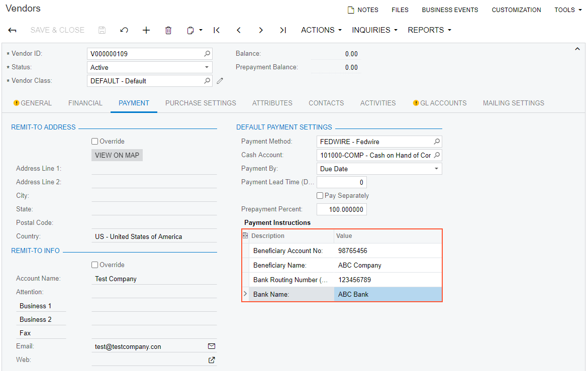
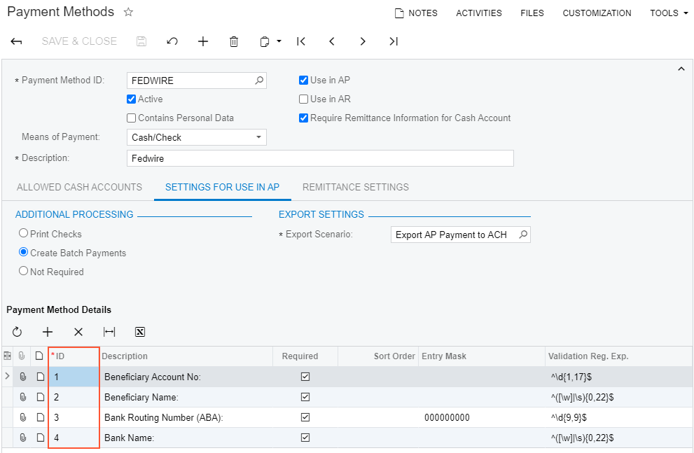
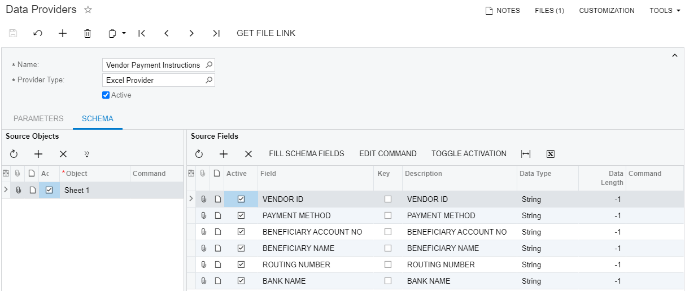
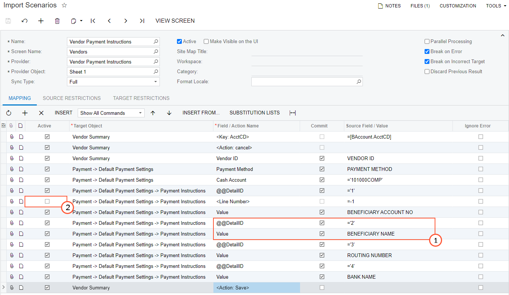
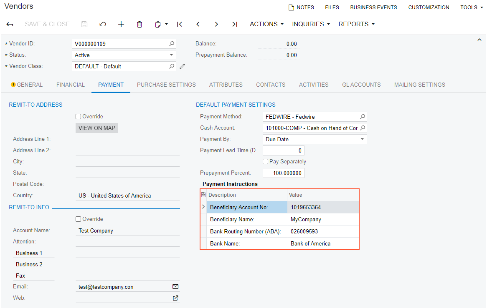

# Importing Payment Instructions \(Vendors\) {#_c6a08ccf-7f71-4b69-9508-fbfef5720a53 .concept}

This topic describes how to update payment instructions for a vendor.

## Task Description { .section}

Suppose that you want to update information about payment instructions for the vendor with the ID *V000000109* and import new data from an Excel file. You can see the payment instructions in the **Default Payment Settings** section on the **Payment** tab of the [Vendors](AP_30_30_00.md) \(AP303000\) form, as the following screenshot shows.

**Tip:** The instructions in this use case apply to the *FEDWIRE* payment method. For details on how to modify a payment method, see [Cash Management: To Modify a Payment Method](../ImplementationGuide/config_Basic_Company_Implem_Activity_Payment_Methods.md).

The data for the update is available in the [IS\_\_Vendor\_Payment\_Instructions.xlsx](Files/IS__Vendor_Payment_Instructions.xlsx) file. For the import scenario, you need the IDs of the payment method details, which you can find on the **Settings for Use in AP** tab of the [Payment Methods](CA_20_40_00.md) \(CA204000\) form, as shown in the screenshot below. You will map these IDs to the columns in the source file.

## Implementation { .section}

To import payment instructions, perform the following steps:

1.  [Creating a New Data Provider](#_25206a03-ad62-446f-8b0a-550b9fa9a798)
2.  [Creating an Import Scenario](#_f895f17b-1b1a-47f9-b3dd-356d797b368f)
3.  [Running the Scenario](#_ace69660-1b1f-46d5-98cd-2b2042304049)
4.  [Reviewing the Imported Records](#_f44c64fa-e31e-4387-9346-adc32f79eb5d)

## 1. Creating a New Data Provider { .section}

On the [Data Providers](SM_20_60_15.md) \(SM206015\) form, create an Excel data provider for the `Vendor Payment Instructions.xlsx` file with the name *Vendor Payment Instructions*, as the following screenshot shows.

## 2. Creating an Import Scenario { .section}

On the [Import Scenarios](SM_20_60_25.md) \(SM206025\) form, create an import scenario that uses the data provider you have created in the previous step. The mapping of the scenario is shown in the following screenshot.

In the mapping, you have specified the custom key `@@DetailID`, which refers to the detail line of the payment method, and you have specified the value for the key for each of the detail lines \(see item 1 in the screenshot above\). You have also selected the **Commit** check box for these commands.

You have deactivated the line with the `<Line Number>=-1` command \(item 2\). You need to update the existing detail records and do not need to insert new rows for them.

## 3. Running the Scenario { .section}

On the [Import by Scenario](SM_20_60_36.md) \(SM206036\) form, select the *Vendor Payment Instructions* scenario in the Summary area, and click **Prepare &amp; Import** on the form toolbar. The records from the Excel file are imported into the system.

## 4. Reviewing the Imported Records { .section}

Review the results of the import on the **Payment Settings** tab of [Vendors](AP_30_30_00.md) \(AP303000\) form. You can see that the payment instructions have been updated, as the following screenshot shows.

## Summary { .section}

To update payment instructions for a vendor, in the import scenario, you have specified `@@DetailID` as a custom key and mapped it to the ID of the payment method. Directly after this command, you have assigned the custom key the value that is displayed in the **Description** column of the **Payment Method Details** table. You did this for each of the four detail lines of the payment method.

## Related Concepts { .section}

[Payment Methods](CA_20_40_00.md)

[Vendors](AP_30_30_00.md)

[Types of Target Fields in Import Scenarios](IS__con_Mapping_Rules_for_Import.md)

[Key Fields and Search in Import Scenarios](IS__con_Key_Fields_and_Search_in_Import_Scenarios.md)

[Service Commands in Import and Export Scenarios](IS__con_Service_Commands.md)

**Parent topic:**[Use Cases](../UserGuide/IS__con_Use_Cases.md)

