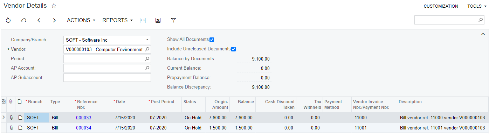
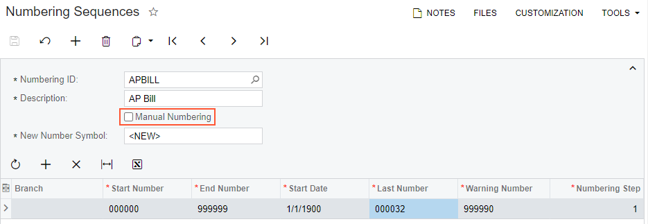
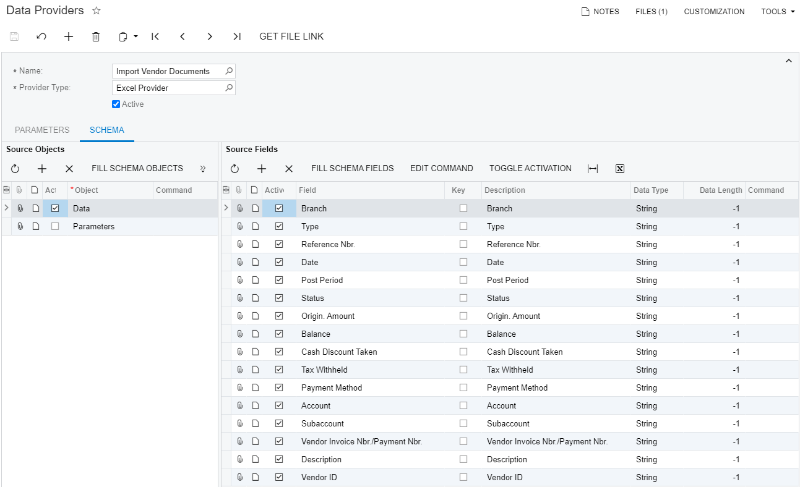
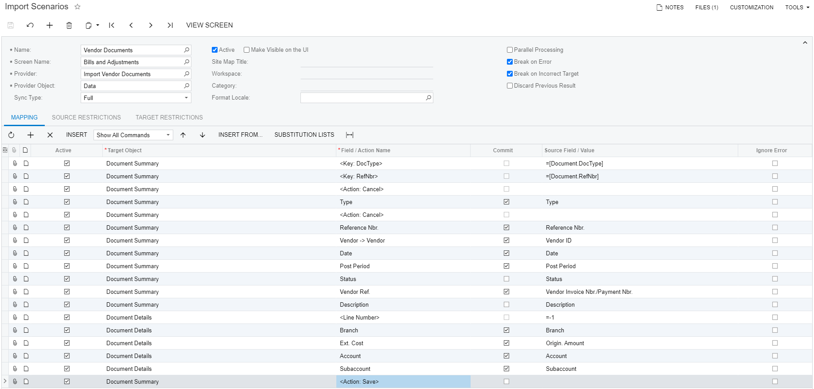
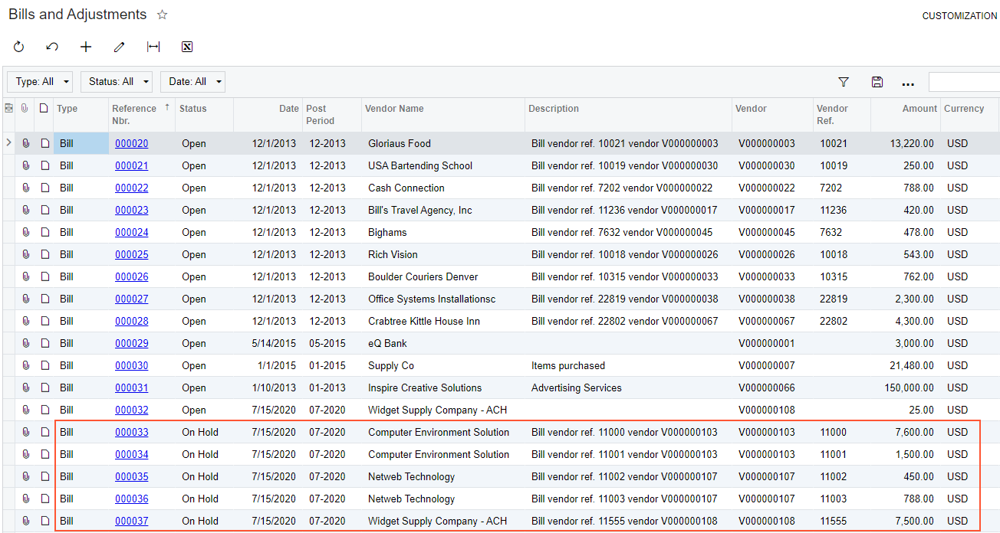

# Importing Documents \(Vendors\) {#_425c0131-0153-4b00-8586-22c581325811 .concept}

This topic describes how to import vendor documents \(bills, adjustments, or prepayments\).

## Task Description { .section}

Suppose that you want import vendor documents from the [IS\_\_Vendor\_Details.xlsx](Files/IS__Vendor_Details.xlsx) file. The file contains several bills for vendors with IDs *V000000103*, *V000000107*, and *V000000108*. The IDs of the documents in the *Reference Nbr.* column are the external IDs used by the vendor. The *Vendor Invoice Nbr./Payment Nbr.* column contains invoice IDs specified by the vendor. You will use values from the *Vendor ID* column to identify vendors in the system.

You can see the documents of a vendor on the [Vendor Details](AP_40_20_00.md) \(AP402000\) form, as the following screenshot shows.

To import documents for several vendors, you will use the [Bills and Adjustments](AP_30_10_00.md) \(AP301000\) form.

During import, Acumatica ERP automatically assigns each document an ID according to the numbering system currently used in the system.

**Tip:** If you want to use external numbering system, disable Auto-numbering for the bills and adjustments on the [Numbering Sequences](CS_20_10_10.md) \(CS201010\) form.

## Implementation { .section}

To import vendor documents, perform the following steps, which are described in detail below:

1.  [Configuring Auto-Numbering of Records in the System](#_2c895f49-a7ab-4f63-86db-e2ace0f0add8)
2.  [Creating a Data Provider](#_a774630b-8d9b-4e83-b555-675630fa7938)
3.  [Creating an Import Scenario](#_4672e439-8f71-454e-851f-1d897c5220f9)
4.  [Running the Scenario](#_77b718bf-83f7-4548-b54d-028c636c2603)
5.  [Reviewing the Imported Records](#_037d26be-6e95-4df5-9aec-44497b588739)

## 1. Configuring Auto-Numbering of Records in the System { .section}

On the [Numbering Sequences](CS_20_10_10.md) \(CS201010\) form, create the *APBILL* numbering sequence and clear the **Manual Numbering** field for it, as shown in the following screenshot.

## 2. Creating a Data Provider { .section}

On the [Data Providers](SM_20_60_15.md) \(SM206015\) form, create an Excel data provider for the `Vendor Details.xlsx` file with the name *Import Vendor Documents*, as the following screenshot shows.

## 3. Creating an Import Scenario { .section}

On the [Import Scenarios](SM_20_60_25.md) \(SM206025\) form, create an import scenario that uses the data provider you have created in the previous step. The mapping of the scenario is shown in the following screenshot.

## 4. Running the Scenario { .section}

On the [Import by Scenario](SM_20_60_36.md) \(SM206036\) form, select the *Vendor Documents* scenario in the Summary area, and click **Prepare &amp; Import** on the form toolbar. The records from the Excel file are imported into the system.

## 5. Reviewing the Imported Records { .section}

Review the result of the importing on the [Bills and Adjustments](AP_30_10_00.md) \(AP301000\) form. You can see that five records have been added to the system. They have been assigned IDs according to the numbering sequence used by the system, as shown in the screenshot below. Each record has been added for the appropriate vendor as specified in the source file. The status of the imported records has been changed to *On Hold*.

## Summary { .section}

To import vendor documents, you enable the auto-numbering of records to assign the documents the IDs according to the numbering sequence currently in use.

In the import scenario, you map the external reference number to the `Reference Nbr.` field on the [Bills and Adjustments](AP_30_10_00.md) \(AP301000\) form. You also map vendor ID from the source file to the `Vendor ID` field on this form.

## Related Concepts { .section}

[Vendors: Implementation Activity](Vendor_Implem_Activity.md)

**Parent topic:**[Use Cases](../UserGuide/IS__con_Use_Cases.md)

