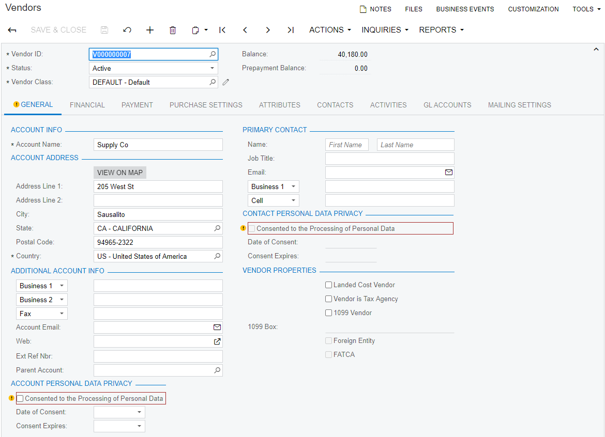
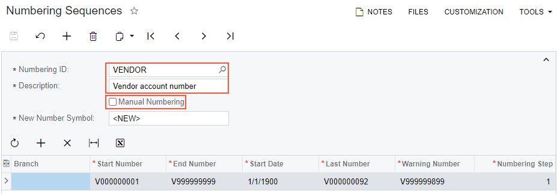
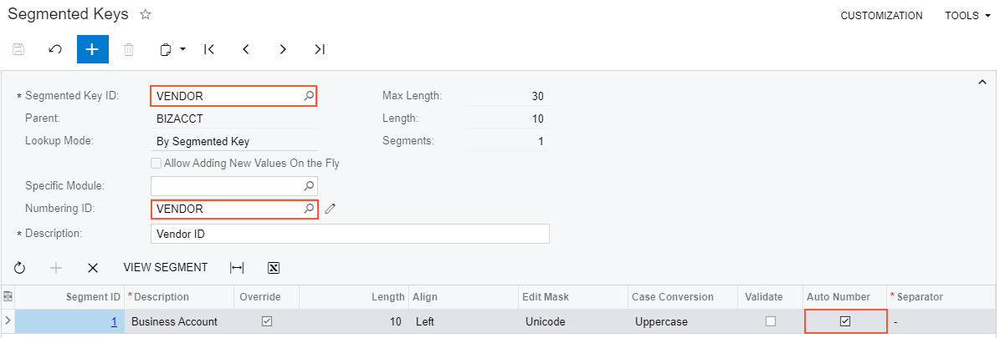
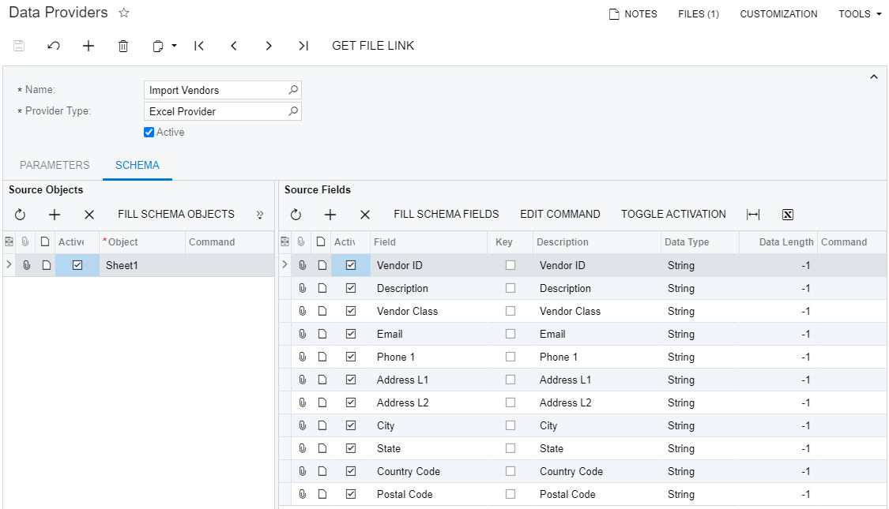
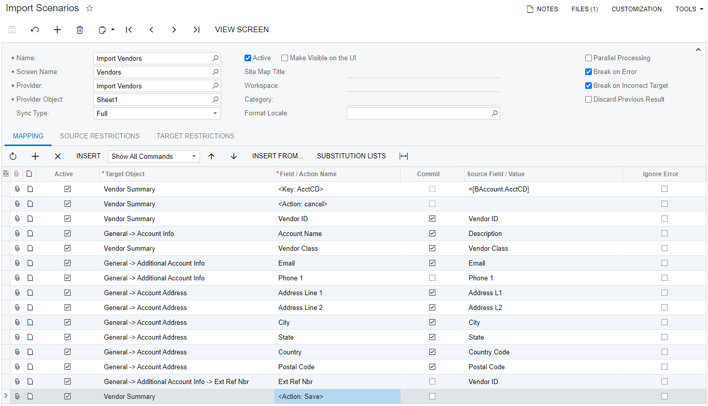
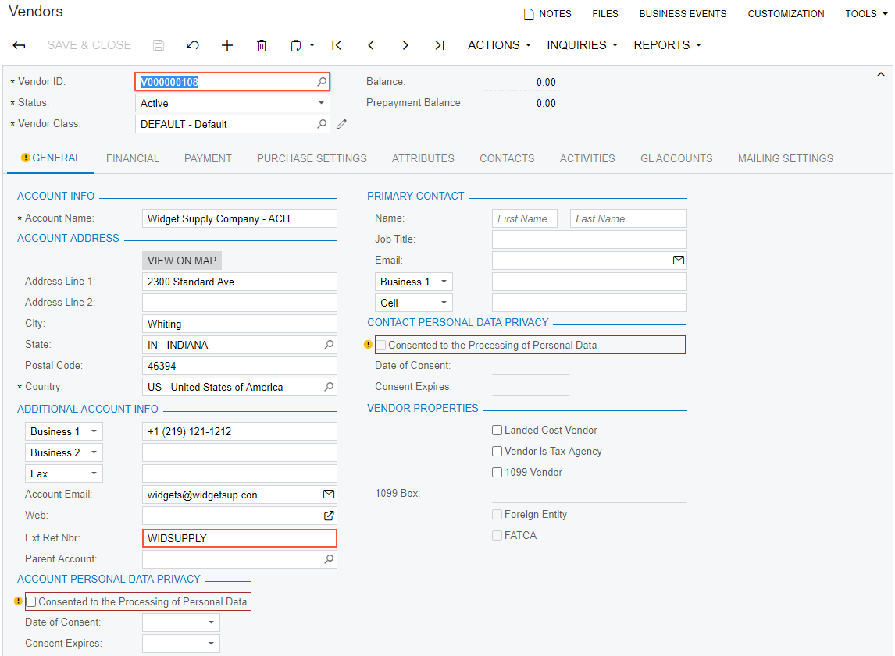

# Importing Records with Automatic Numbering \(Vendors\) {#_ca99d93e-43b3-47a5-898a-34b14a6f47c0 .concept}

This topic describes how to import new records and assign each record an ID according to the numbering system currently used by the system.

## Task Description { .section}

Suppose that you want to import into Acumatica ERP vendor records from the [IS\_\_Import\_Vendors.xlsx](Files/IS__Import_Vendors.xlsx) file. Vendor accounts in the system, which are created and maintained on the [Vendors](AP_30_30_00.md) \(AP303000\) form, have IDs that range from *V000000001* to *V000000092*. \(The vendor IDs are entered in the Vendor ID box.\) Vendor accounts in the Excel file have IDs that use a different naming system. You want to assign new IDs that start with *V000000093* to the records that you are importing.

In the import scenario, you will map the IDs from the *Vendor ID* column of the Excel file \(that is, the old IDs\) to the `Ext. Ref. Nbr.` field so that the applicable ID appears in the **Ext. Ref. Nbr.** box of the [Vendors](AP_30_30_00.md) form, which is shown in the following screenshot.

## Implementation { .section}

To import vendor accounts and assign them new IDs while maintaining the old IDs as external identifiers, perform the following steps, which are described in detail below:

1.  [Configuring Auto-Numbering of Records in the System](#_b05531a0-6417-4feb-a815-fce4bda9df77)
2.  [Creating a New Data Provider](#_e2cd3601-0f83-4bcb-9aa9-32787d21fcbe)
3.  [Creating an Import Scenario](#_a0e7b3d3-41e4-42f9-ad64-48e6a25264c6)
4.  [Running the Scenario](#_3582377e-80f2-4a11-b9cf-f54a8dcf7bf5)
5.  [Reviewing the Imported Records](#_c3395dc9-99aa-490b-b713-7a1ed1bc7958)

## 1. Configuring Auto-Numbering of Records in the System { .section}

Perform the following steps to configure the auto-numbering of records:

1.  On the [Numbering Sequences](CS_20_10_10.md) \(CS201010\) form, create the *VENDOR* numbering sequence and clear the **Manual Numbering** field for it, as shown in the following screenshot.

    

2.  Make sure that the settings on the [Segmented Keys](CS_20_20_00.md) \(CS202000\) form for the *VENDOR* segmented key are as shown in the following screenshot.

    

## 2. Creating a New Data Provider { .section}

On the [Data Providers](SM_20_60_15.md) \(SM206015\) form, create an Excel data provider for the `Import_Vendors.xlsx` file with the name *Import Vendors*, as the following screenshot shows.

## 3. Creating an Import Scenario { .section}

On the [Import Scenarios](SM_20_60_25.md) \(SM206025\) form, create an import scenario that uses the data provider you have created in the previous step. The mapping of the scenario is shown in the following screenshot.

## 4. Running the Scenario { .section}

On the [Import by Scenario](SM_20_60_36.md) \(SM206036\) form, select the *Import Vendors* scenario in the Summary area, and click **Prepare &amp; Import** on the form toolbar. The records from the Excel file are imported into the system.

## 5. Reviewing the Imported Records { .section}

Review the results of the import on the [Vendors](AP_30_30_00.md) \(AP303000\) form. You can see that the last vendor account now has the *V000000108* vendor ID. You can also see that the previous vendor ID is now displayed in the **Ext. Ref. Nbr.** field, as the following screenshot shows.

## Summary { .section}

To import new vendor accounts with external IDs, you have first configured the numbering system for vendors. Then in the import scenario, you have mapped the external vendor IDs to the `Ext. Ref. Nbr.` field.

## Related Concepts { .section}

[Vendors: Implementation Activity](Vendor_Implem_Activity.md)

[Types of Target Fields in Import Scenarios](IS__con_Mapping_Rules_for_Import.md)

[Key Fields and Search in Import Scenarios](IS__con_Key_Fields_and_Search_in_Import_Scenarios.md)

**Parent topic:**[Use Cases](../UserGuide/IS__con_Use_Cases.md)

