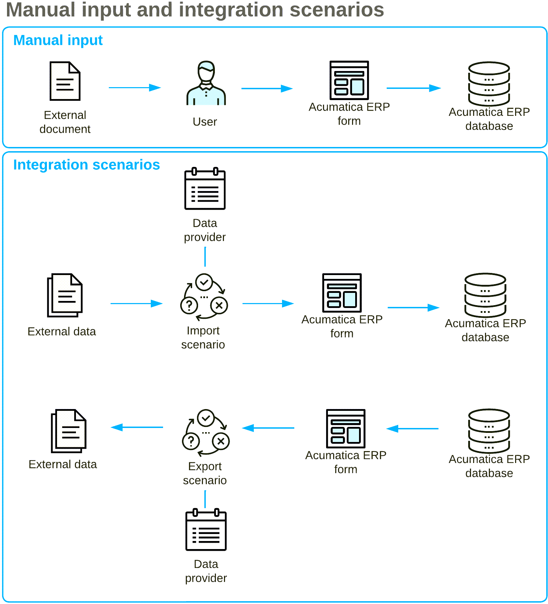

# Import and Export Scenarios {#_857321f7-0939-42ab-9421-fb85566b6d24 .concept}

To upload data to and from Acumatica ERP, you can use *import scenarios* and *export scenarios*, which define data import and data export instructions for the system. An import or export scenario is a sequence of actions to be executed for a data record as if the record is being manipulated by user through an Acumatica ERP form. When you enter data into the system manually, you perform a sequence of actions. You open the needed data entry form and start entering data. To add a new record, you use the UI elements one by one—that is, you type text, select values from combo boxes, clear or select check boxes, and click buttons. In the corresponding scenario, you compose exactly the same sequence of actions—you specify a command for each user action that would be performed on the form. Because you cannot perform multiple actions simultaneously on the form, the scenario executes commands successively. To construct the scenario, you reflect the actions you make on the form in the sequence of commands for the scenario.

In these scenarios, you either save data to an external system or file, or upload data from an external system or file to Acumatica ERP. Thus, you must define the format of the external system or file to the Acumatica ERP system. For this purpose, you set up a *data provider* in the system. A data provider is an entity that defines the structure of the external data source; Acumatica ERP then uses the data provider to transfer data from and to the external system or file.

Therefore, to use an integration scenario, you have to define the data provider and the needed import or export scenario, as illustrated in the following diagram. An integration scenario works as if the data is being manually processed on an Acumatica ERP form.

When you are creating an integration scenario, you first create the needed data provider, which defines the type and schema of the data source. For example, the type can be an Excel file, and the schema of an Excel data source consists of the names of spreadsheets that should be used for data import or export and the list of columns on the spreadsheets. If the external data source has changed \(for example, if a new column has been added to an Excel spreadsheet\), you have to update the data provider in Acumatica ERP to be able to use the new column in scenarios for which the data provider is specified.

After you have prepared the data provider, the second step is to define the scenario, including the scenario mapping. You can construct a scenario for any data entry form. In the scenario, you use internal fields, which are the fields of Acumatica ERP, and external fields, which are defined in the specified data provider. In the scenario, you map internal fields to external fields and specify commands. Integration scenarios are specific to the Acumatica ERP form and the external data schema.

After the scenario is ready, you can run the import or export for the scenario to get the result. You can also schedule scenarios to be run, so that you can import and export data on a regular basis.

You can find examples of integration scenarios in the I100 Integration Scenarios training course.

**Parent topic:**[Preparing Data for Import and Export by Using Scenarios](../UserGuide/IS__mng_Data_Providers.md)

