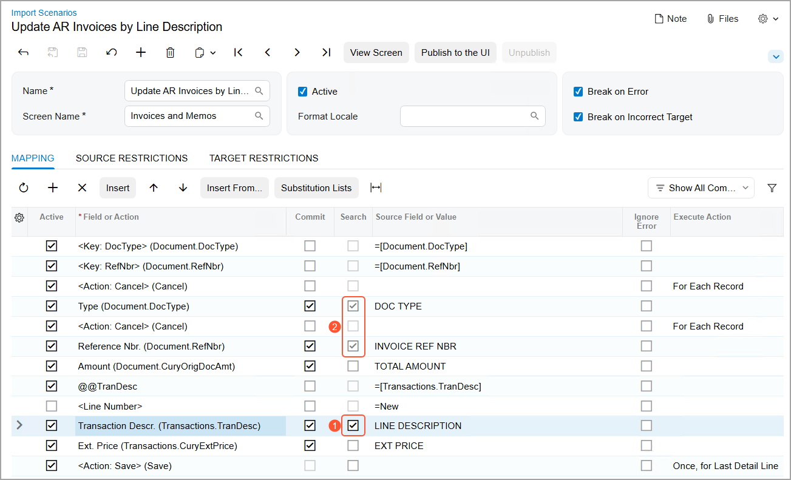
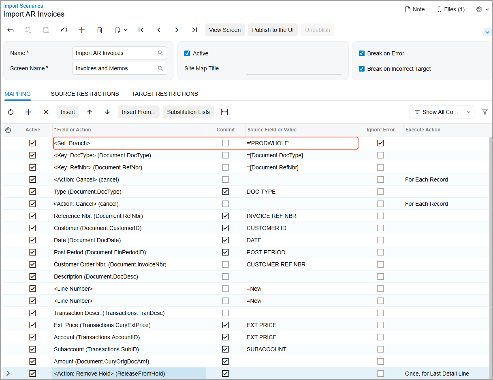

# Key Fields and Search in Import Scenarios {#_273477d4-be8c-41f9-b7d1-48b020a3ef22 .concept}

In the mapping of an import scenario, you have to map the key fields first, mapping the target key fields in the system to the source key fields. \(Key fields are the fields whose values uniquely identify a particular record and are used to find the record within the database.\) The system uses the following keys: **Customer ID** for customers on the [Customers](AR_30_30_00.md) \(AR303000\) form, and **Type** and **Reference Nbr.** for documents on multiple forms, such as the [Invoices and Memos](AR_30_10_00.md) \(AR301000\) form. The order of key fields is important for mapping, so you should follow the order of key fields as they are displayed on Acumatica ERP forms. In particular, for documents, you have to assign first the **Type** field and then the **Reference Nbr.** field.

## Auto-Numbering of Records { .section}

You can import records with their key values from the source, and the records will have the same key values in the system and the source. For example, suppose you are importing records to the [Customers](AR_30_30_00.md) form. If you have the customer *CUST000001* in the Excel file, you can import this customer to the system so that the customer record will have the same ID: *CUST000001*. Later, you can update customer records by mapping the Excel column with the ID to the **Customer ID** field in the system.

As an alternative to importing records with their key values from the source, you can import records and have the system automatically assign IDs. For example, you can import the customer records so that after the import, the customer will have an automatically assigned ID in the system that was not in the Excel file, such as *C000000001*. You can import master records with automatically assigned IDs in one of the following ways:

-   You can enable auto-numbering of records in the system and map the key fields to unique identifiers of records in the source.
-   If there is just one line for each unique record in the data source, you can enable auto-numbering of records in the system and import each line from the source file as an unique record in the system with an automatically assigned ID. With this way of mapping, you do not map key fields in the import scenario and add the &lt;Action: Insert&gt; instruction at the beginning of the mapping.
-   You can map the key field to a formula that produces unique identifiers for each imported record in the needed format. For details on creating formulas, see [The Use of Formulas](IS__con_Formulas_in_Mapping.md#).

Auto-numbering of master records is configured in the corresponding segmented keys on the [Segmented Keys](CS_20_20_00.md) \(CS202000\) form. Documents are usually automatically assigned a reference number in the system. During the initial implementation, you can disable auto-numbering of documents in the system, import the documents with their IDs, and then turn on auto-numbering starting from the last imported ID. Auto-numbering of documents is configured in the numbering sequences that are specified for the corresponding document types on the preferences form of a functional area. For example, the *ARINVOICE* sequence is specified for the auto-numbering of invoices on the [Accounts Receivable Preferences](AR_10_10_00.md) \(AR101000\) form.

You can update records imported with automatically generated IDs by searching for them in the system by using their unique fields available in the source. For example, you can identify customers by email addresses or phone numbers in the Excel file. To search for a record, you have to declare a custom key or use a column of a lookup table. Both of these methods are described in the following sections.

## Custom Key { .section}

You specify a custom key on the **Mapping** tab of the [Import Scenarios](SM_20_60_25.md) \(SM206025\) form. For the field, you select the check box in the **Search** column \(which is hidden by default\). The selection of this check box indicates that the field will be used as a custom key.

Below you can see the mapping of an import scenario that updates accounts receivable invoices. To add a custom key to the mapping, you do the following:

1.  Add the field to be used as a custom key on the **Mapping** tab of the [Import Scenarios](SM_20_60_25.md) \(SM206025\) form.
2.  Open the Column Configuration dialog box for the table, and select the check box for the **Search** column to make it visible.
3.  Select the **Search** check box for the added field \(Item 1 below\). Notice that the system selected the **Commit** check box for it.

    Also notice that the system has automatically selected the **Search** check box for the *Type* and *Reference Nbr.* key fields \(Item 2\). For key fields, this check box is always selected and read-only. The system also selects the **Commit** check box for these key fields. \(You can clear this check box.\)

    

You select the **Search** check box for any field that you want to designate as a custom key. You can use the fields of the Summary object or the unique fields of the detail objects.

You can specify custom keys to search for a record or a detail line. You can use the fields of the Summary object and the detail objects as custom key fields, but you cannot use the fields of related objects. For example, you can find the needed customer record in the system by using the **Customer Name** field of the [Customers](AR_30_30_00.md) form as the custom key, but you cannot find the record by using the **Email** field of the **Main Contact** group of the **General Info** tab as the custom key.

**Tip:** If you select the **Search** check box for a field in a detail line, the system removes the line’s *&lt;Line Number&gt;=-1* service command from the mapping. If you then clear the check box, the system adds this command back.

## Lookup Table { .section}

Lookup tables on an Acumatica ERP form appear when a user clicks the magnifier button of a key field of the form to open the **Select** dialog box. When you are creating a mapping for an import scenario, you can use any columns of a lookup table that are available on the form for the key field. To use a column of a lookup table for a search in an import scenario, you have to map this column to the matching external field. Column names start with the key field name, followed by `->` and then the name of the column on the form, such as `Customer ID -> Email`.

The following table shows the instruction that maps the **Email** column of the lookup table of the **Customer ID** field on the [Customers](AR_30_30_00.md) \(AR303000\) form to the EMAIL field available in the source.

|Field or Action|Node \(Target Object\)|Source Field or Value|
|---------------|----------------------|---------------------|
|*Customer ID -&gt; Email*|*Customer Summary*|*EMAIL*|

Certain records in the system are visible in a lookup table of a box on a form only if a particular branch or company is selected on the Company and Branch Selection menu. To make these records available for selection during import, you need to ensure that the mapping of the import scenario includes the selection of the needed branch or company on this menu.

You can do this by adding a row with the *&lt;Set: Branch&gt;* command to the import scenario on the [Import Scenarios](SM_20_60_25.md) \(SM206025\) form. In the row, you specify the settings as shown in the following table.

|Field or Action|Node \(Target Object\)|Source Field or Value|
|---------------|----------------------|---------------------|
|*&lt;Set: Branch&gt;*|The Summary object of the record|The name of the branch or company, or a formula that calculates the branch or company to be used|

**Attention:** The row with the *&lt;Set: Branch&gt;* command must be the first row in the mapping.

The following screenshot shows the use of this command in a scenario that imports AR invoices. If customer visibility is restricted to a specific branch or company group, the branch determines whether customers are shown in the lookup table of the **Customer** box and which set of customers is shown. As a result, you must select an appropriate branch when importing records by using the scenario.

**Attention:** The user who runs the import scenario must have access to the branch or company specified in the mapping.

**Parent topic:**[Configuring Scenario Mapping](../UserGuide/IS__mng_Scenario_Mapping.md)

