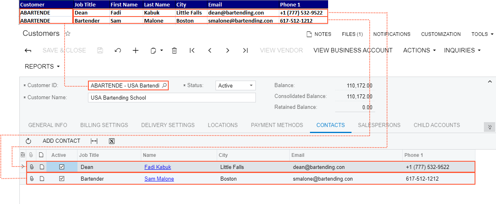

# Source Fields in Import Scenarios {#_b9a8044c-1d66-491f-aed7-c267fc2faf5c .concept}

When you are performing mapping on the **Mapping** tab of the [Import Scenarios](SM_20_60_25.md) \(SM206025\) form, you have to select in the **Source Field or Value** column the source field from which the system takes the value to be inserted into the target field. You can use the following as source fields:

-   The fields defined in the data provider
-   The fields of an Acumatica ERP form, from which we can take the value that already exists in the system or the default value
-   Any combination of the fields defined in the data provider, the fields of an Acumatica ERP form, constants, and functions

## Relationships Between Source Fields and Target Objects and Fields { .section}

Source data includes a set of master records, such as customer account records. Each master record has a set of fields that are mapped to the fields of the summary object and related objects. For customer accounts, these fields can include **Customer ID** and **Email**. There may be only one value of such field for each summary object or related object.

A master record can have a set of detail lines that are mapped to the fields of detail objects. For example, a customer account can have multiple contact details. There may be many detail lines for each detail object. Therefore, for these detail lines to be imported to Acumatica ERP, external data should include the identifier of the master record for each detail line. That is, each detail line should have the key fields of the summary object specified.

For example, suppose that you have a customer account with two contact details. In this case, the external data that you are going to import to Acumatica ERP should include two records—one record with the customer ID and contact information for each contact detail. Such records should include a key field that the system uses to distinguish lines that belong to different records. The relationships between the external data and Acumatica ERP objects on the [Customers](AR_30_30_00.md) \(AR303000\) form are shown in the following screenshot.

**Parent topic:**[Configuring Import Scenarios](../UserGuide/IS__mng_Configuring_Import_Scenarios.md)

