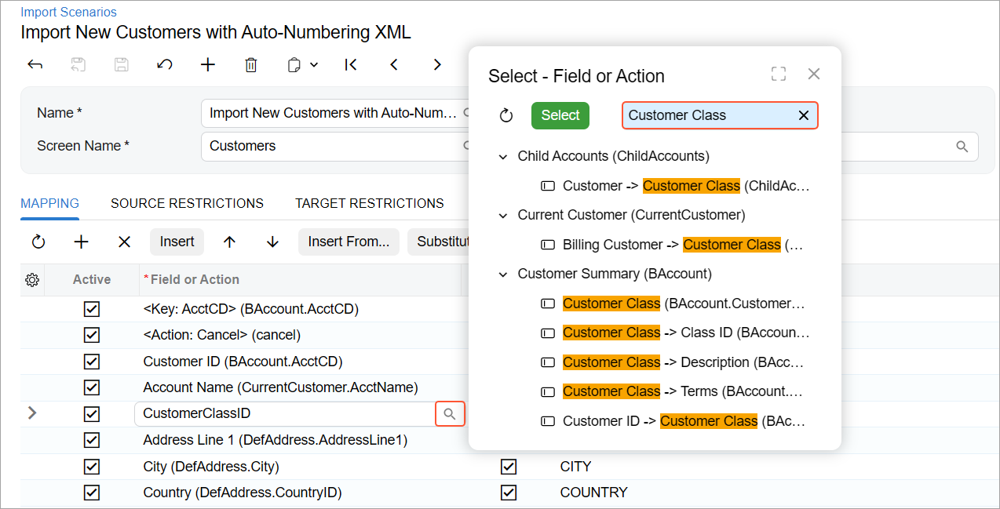
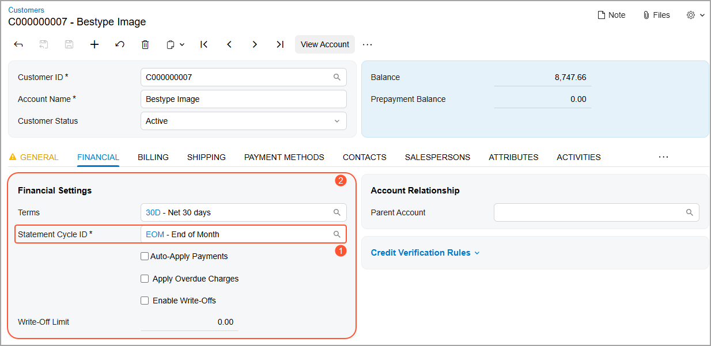
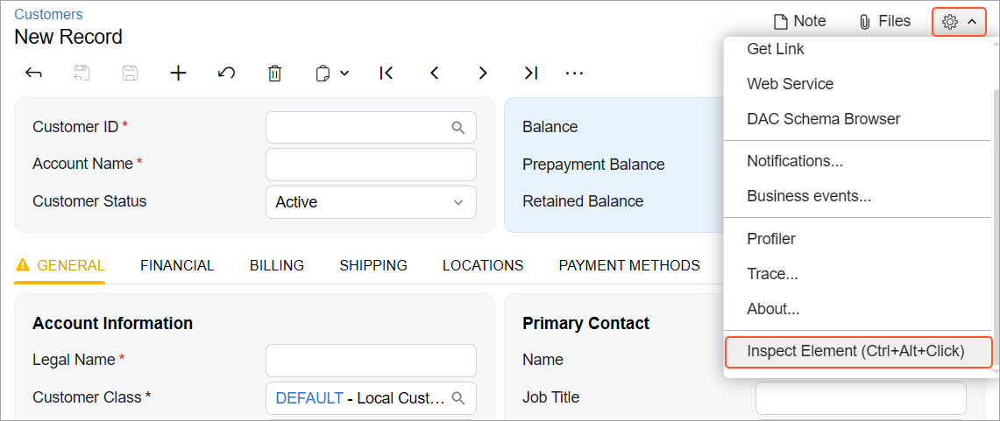
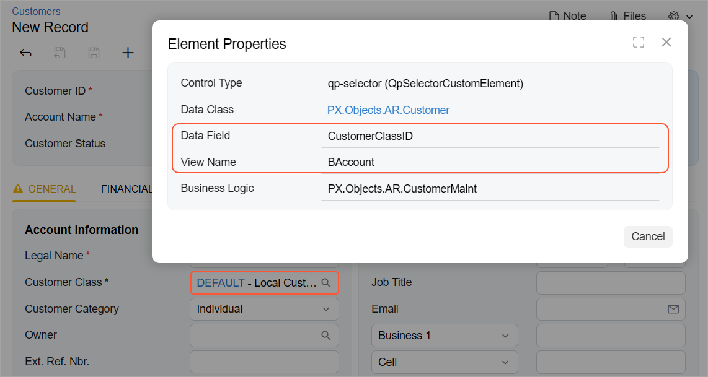
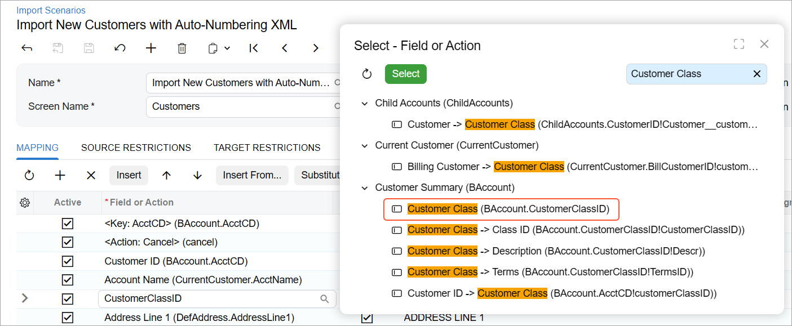
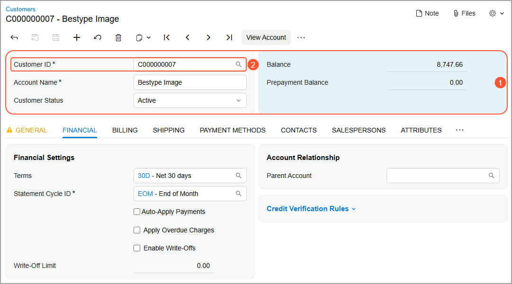
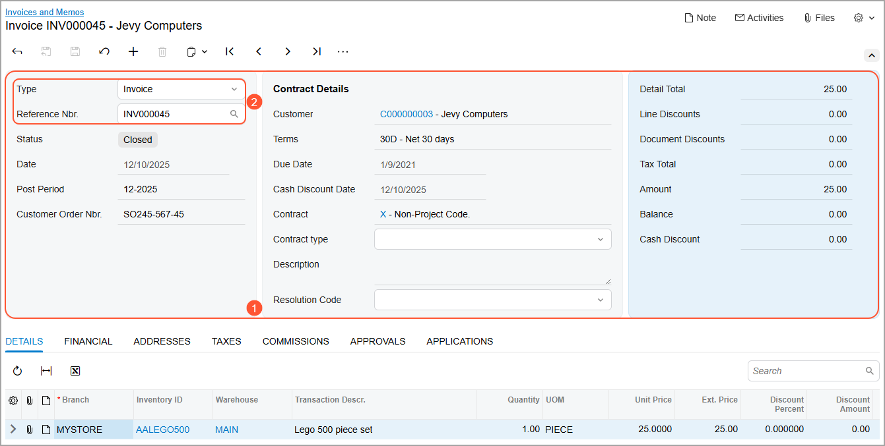
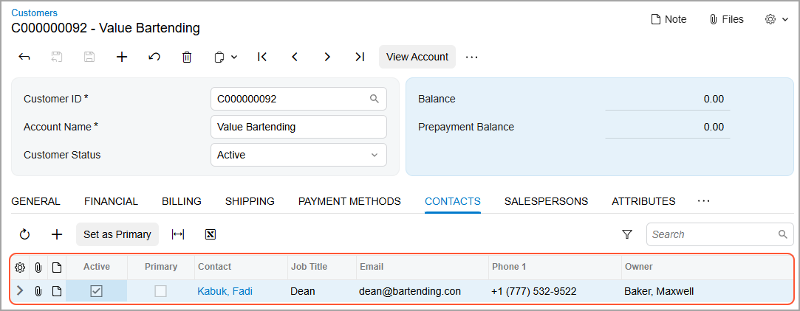
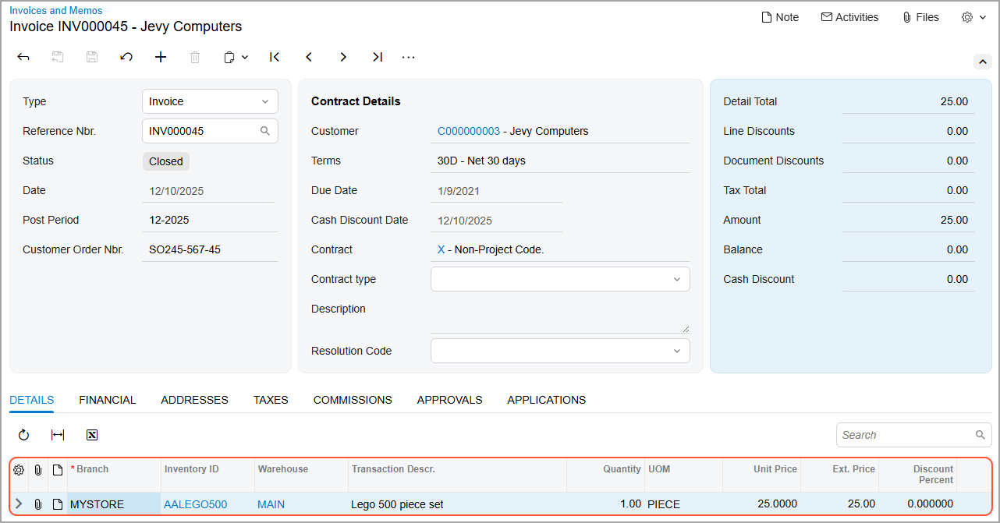
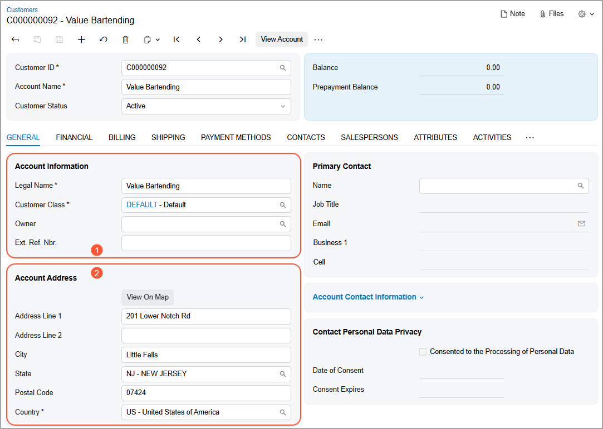

# Target Objects and Fields in Import Scenarios {#_dca226e4-e566-4066-bf45-5930d06b3e5f .concept}

When you are performing mapping on the **Mapping** tab of the [Import Scenarios](SM_20_60_25.md) \(SM206025\) form, you need to select the target object and field.

## Target Objects and Fields { .section}

In the scenario mapping, you need to select the object of the Acumatica ERP form into which you want to insert the value. You do this by clicking the magnifier button in the **Field or Action** column. In the **Select - Field or Action** lookup table, which opens, target objects are represented as expandable nodes that contain fields and actions. In the Search box of this dialog box, you type the name of the needed UI element \(see below\)—that is, the field or action. You’ll see all the matching elements, grouped by their location on the form. You then double-click the needed element to select it for mapping.

For example, the **Statement Cycle ID** box \(Item 1 below\) is located on the **Financial** tab \(**Financial Settings** section—Item 2\) of the [Customers](AR_30_30_00.md) \(AR303000\) form. To select its field in the mapping, you need to locate the `Financial Settings` element of the `Financial` node.

Each field or action on an Acumatica ERP form is associated with a particular target object. The field usually has the same name as the corresponding box on the form, such as `Statement Cycle ID`, as shown below. Custom UI elements that you add to the system through customization are also available for mapping in the same way as the original elements.

Multiple objects support the functionality of each Acumatica ERP form: a Summary object, detail objects, and related objects. These types of objects are described in the following sections.

## Verifying the Element with the Element Inspector {#section_qdy_kxj_cgc .section}

If you have doubts about which element to select in the mapping on the [Import Scenarios](SM_20_60_25.md) \(SM206025\) or [Import by Scenario](SM_20_60_36.md) \(SM206036\) form, you can use the [Element Inspector](AU_ElementInspector.md) tool to verify the element.

Suppose that you want to create an import scenario for the [Customers](AR_30_30_00.md) \(AR303000\) form. You need to map the imported customer class to the **Customer Class** box. To verify which element you’ll select for this box in the scenario, you do the following on the [Customers](AR_30_30_00.md) \(AR303000\) form:

1.  Click the Settings button on the form title bar and click **Inspect Element** \(see below\).

    

2.  Click the **Customer Class** box on the form.
3.  In the **Element Properties** dialog box, notice the data field and view name: *CustomerClassID* and *BAccount* \(see below\).

    

Now on the [Import Scenarios](SM_20_60_25.md) form, you search for `Customer Class` in the **Select - Field or Action** lookup table and select the item with the *CustomerClassID* data field and the *BAccount* view name \(shown below\).

**Tip:** You can use the [Element Inspector](AU_ElementInspector.md) tool if you have one of the following:

-   The *Customizer*, *Administrator*, or *ReportDesigner* role
-   At least *View Only* access to the [Generic Inquiry](SM_20_80_00.md) \(SM208000\) or [Import Scenarios](SM_20_60_25.md) form

## Summary Object { .section}

The Summary object is the main object on the form; it contains the keys that identify the record in the system.

You can use the fields of the Summary object to do the following:

-   Set the values of the corresponding fields on the form.
-   Search for a record in the system.

    That is, you can use these fields as custom keys to search for a particular record. For example, you can find a needed customer record in the system by using the value of the **Account Name** field on the [Customers](AR_30_30_00.md) \(AR303000\) form.

-   Filter imported records by these fields by using target restrictions.

    For example, you can select for processing only the customer records that have the *Inactive* status in the **Customer Status** field on the [Customers](AR_30_30_00.md) form.

Generally, you can identify the fields that belong to the Summary object on the form as the fields of the Summary area of the form. More precisely, these are the data fields of the data access class \(DAC\) underlying the Summary object. \(In Acumatica Framework, this DAC is called the main DAC of the primary data view.\) To use the Summary object in scenario mapping, in the **Field or Action** column on the **Mapping** tab of the [Import Scenarios](SM_20_60_25.md) \(SM206025\) form, you select the object from the node with the same name as the name of the Summary object.

For example, the Summary object on the [Customers](AR_30_30_00.md) form is `Customer Summary` \(see Item 1 in the following screenshot\). It includes the key **Customer ID** field \(Item 2\).

The Summary object on the [Invoices and Memos](AR_30_10_00.md) \(AR301000\) form is `Invoice Summary` \(see Item 1 in the following screenshot\). It includes two key fields, **Type** and **Reference Nbr.** \(Item 2\).

## Detail Objects { .section}

Detail objects correspond to the tabs that include lists of detail records. The fields of a detail object correspond to the columns of the detail tab.

You can use the fields of the detail object to do the following:

-   Set the values of corresponding fields of a detail line.
-   Search for a detail line in the document.

    That is, you can use these fields as custom keys to search for a particular detail line in the document. For example, on the [Invoices and Memos](AR_30_10_00.md) \(AR301000\) form, you can find the needed detail line of an accounts receivable invoice by using the value in the **Transaction Descr.** column.

To use the detail object in the scenario mapping, in the **Field or Action** column on the **Mapping** tab of the [Import Scenarios](SM_20_60_25.md) \(SM206025\) form, you select the object from the node with the same name as the name of the detail tab.

For example, the [Customers](AR_30_30_00.md) \(AR303000\) form has the **Contacts** tab, which includes a list of contacts \(see the following screenshot\). The corresponding detail object has the `Contacts` name.

On the [Invoices and Memos](AR_30_10_00.md) form, the `Document Details` object contains a list of invoice lines \(see the following screenshot\).

## Related Objects { .section}

Related objects support the functionality of other tabs and sections on the form.

You can use the fields of these objects only to set the values of the corresponding fields on the form. You cannot use the fields of these objects to search for records by using custom keys or to filter imported records by using target restrictions. For example, on the [Customers](AR_30_30_00.md) \(AR303000\) form, you cannot search for the needed customer record by using the value of the **Account Email** field of the **Additional Account Info** section of the **General** tab as a custom key, and you cannot filter records by using the **Country** field of the **Account Address** section of the **General** tab by using target restrictions.

You can select a related object in the **Field or Action** column on the **Mapping** tab of the [Import Scenarios](SM_20_60_25.md) \(SM206025\) form. That is, you select the object from the node with the name as the name of the corresponding tab or section on the form. The related objects that correspond to tabs on the form have the names of the tabs. The related objects that correspond to sections on the form have names in one of the following formats:

-   `Summary Name -> Section Name`
-   `Tab Name -> Section Name`

For example, on the [Customers](AR_30_30_00.md) form, the **Account Information** \(Item 1 in the following screenshot\) and **Account Address** \(Item 2\) sections on the **General** tab are represented by related objects. These objects are listed in the **Select - Field or Action** dialog box under the `General -> Additional Account Info` and `General -> Account Address` nodes, respectively.

**Parent topic:**[Configuring Import Scenarios](../UserGuide/IS__mng_Configuring_Import_Scenarios.md)

