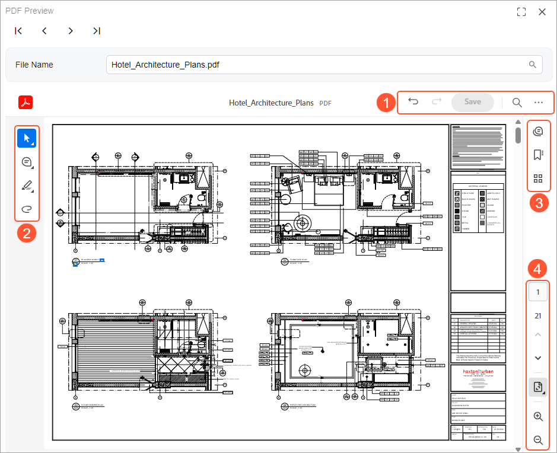

# Using Annotation Tools {#_b3c33970-d144-4b10-9dd3-3e56a61fd8fd .concept}

On the PDF Preview \(SM400009\) form, you use the embedded PDF Annotator viewer to review the selected PDF file, add comments, and apply markup. This topic describes where the main annotation tools are located in the viewer and how you can use the available buttons and commands.

## Annotation Tools {#section_xlb_cxc_cfc .section}

On the PDF Preview \(SM400009\) form, you can add review notes and annotate the selected file version. You use the buttons and commands in the following places in the embedded PDF Annotator viewer:

-   The top toolbar, including the More menu button \(Item 1 below\)
-   The quick action toolbar, including the **Select text**, **Add a comment**, and **Highlight selected text** menu buttons \(Item 2\)
-   The right pane \(Item 3\)
-   The page control toolbar, including the **View one page at a time** menu \(Item 4\)

**Attention:** The PDF preview shown in the screenshot is displayed in the embedded PDF Annotator viewer provided by Adobe and is subject to change. Adobe may change the tools and layout available for PDF annotation.

See the table below for descriptions of the tools available in the embedded PDF Annotator viewer.

|Location|Button/Command|What You Can Do|Notes|
|--------|--------------|---------------|-----|
|Top toolbar|**Undo**

 

|Reverse your most recent change|You can use the Ctrl + Z keyboard shortcut instead.|
|Top toolbar|**Redo**

 

|Reapply the last change you undid|You can use Ctrl + Z keyboard shortcut instead.|
|Top toolbar|**Save**

 

|Save the changes and create a new file version.| |
|Top toolbar|**Find in document**

 

|Search for text within the file|You can use Ctrl + F keyboard shortcut instead.|
|More menu|**Print this file**

 

|In the dialog box that opens, specify printing settings and print the document| |
|More menu|**Download this file**

 

|Download and save a copy of the file to your device| |
|More menu|**View legal notices**

 

|Open Adobe's legal notices|These include copyright, trademark, terms, privacy, and third-party notices.|
|Quick action toolbar|**Select text**

 

|Open the **Select Text** menu| |
|Quick action toolbar|**Add a comment**

 

|Open the **Add a comment** menu| |
|Quick action toolbar|**Highlight selected text**

 

|Open the **Highlight selected text** menu| |
|Quick action toolbar|**Draw freehand**

 

|Draw or write directly on the PDF| |
|Quick action toolbar|**Eraser**

 

|Remove the drawing| |
|Quick action toolbar|**Choose a color for a note**

 

|Select the color used for your note or markup| |
|**Select text** menu|**Select**

 

|Select text in the file to review it or apply a markup to it| |
|**Select text** menu|**Pan**

 

|Move the PDF view by dragging and dropping the page| |
|**Add a comment** menu|**Add a comment**

 

|Add a comment thread linked to a spot in the file|The comment text isn't placed on the page.|
|**Add a comment** menu|**Add text comment**

 

|Insert a text box directly on the page|The comment text is visible on the page.|
|**Highlight selected text** menu|**Highlight**

 

|Highlight the text with a colored background| |
|**Highlight selected text** menu|**Underline**

|Underline the selected text| |
|**Highlight selected text** menu|**Strikethrough**

 

|Draw a line through the selected text| |
|Right pane|**Comments**

 

|Open the **Comments** pane to view all comments in one place; add and reply to comments, or delete them| |
|Right pane|**Bookmarks**|Add a bookmark or open the list of bookmarks to go to a bookmarked page| |
|Right pane|**Pages**

 

|Open the **Pages** pane to view miniature pages for quick navigation| |
|Right pane|**View Permission Details**|Open the **Permission Details** page, which you use to view the file's properties and allowed actions|This appears when some actions are restricted for the document.|
|Page control toolbar|**Go to a specific page number**

 

|Jump to the page you type in|Enter the number of the page and press Enter.|
|Page control toolbar|**Go to previous page**

 

|Move one page back| |
|Page control toolbar|**Go to next page**

 

|Move one page forward| |
|Page control toolbar|**Zoom In**

 

|Make the page look bigger|You can use the Ctrl + keyboard shortcut instead.|
|Page control toolbar|**Zoom Out**

 

|Make the page look smaller|You can use the Ctrl - keyboard shortcut instead.|
|**View one page at a time** menu|**Single-page view**

 

|Show one page at a time| |
|**View one page at a time** menu|**Two-page view**

 

|Show two pages side by side| |
|**View one page at a time** menu|**View with scrolling**

 

|Show pages in a continuous column so that you can scroll through the document| |
|**View one page at a time** menu|**Fit one page**

 

|Resize the view so that the whole page fits on the screen| |
|**View one page at a time** menu|**Fit to width**

 

|Resize the view so that the page width matches the preview width| |
|**View one page at a time** menu|**Full screen**

 

|Show only the PDF \(hide menus and toolbars\)| |

**Parent topic:**[Integrating Acumatica ERP with PDF Annotator](../UserGuide/PDF_PDF_Annotator.md)

