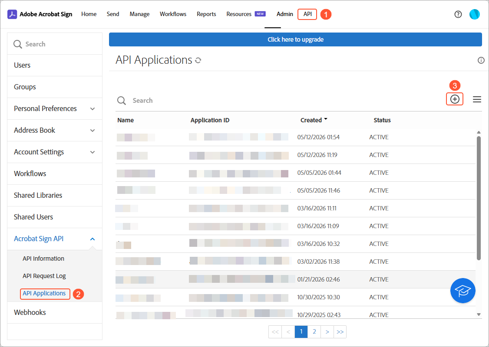
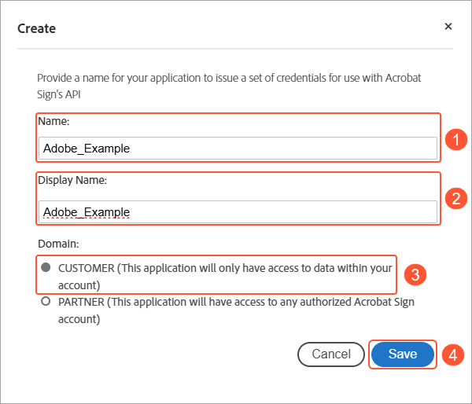
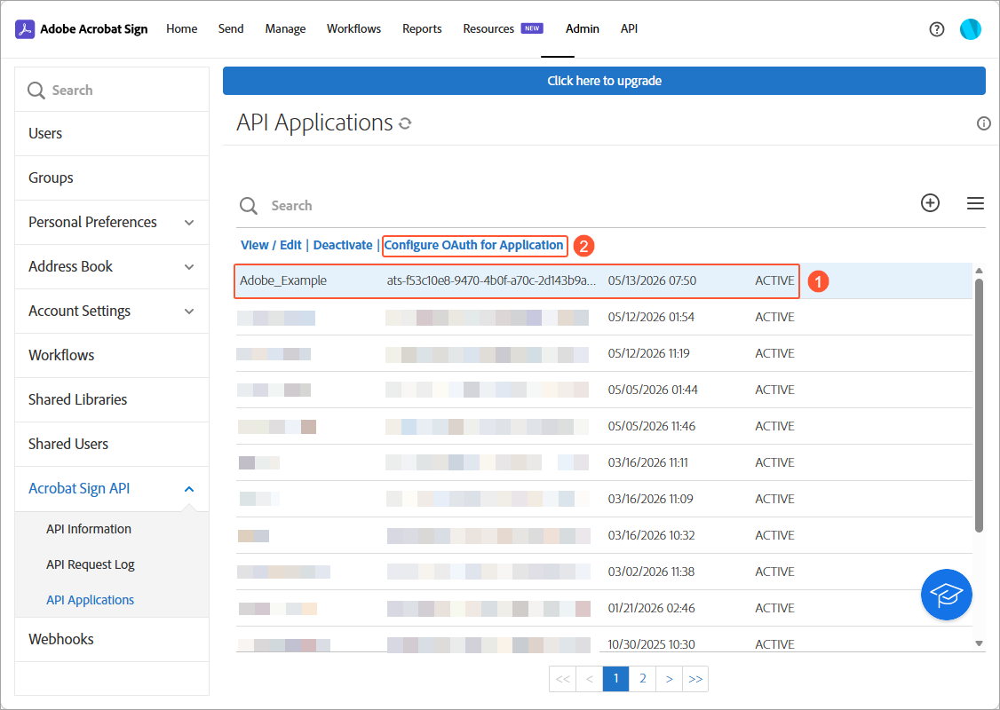
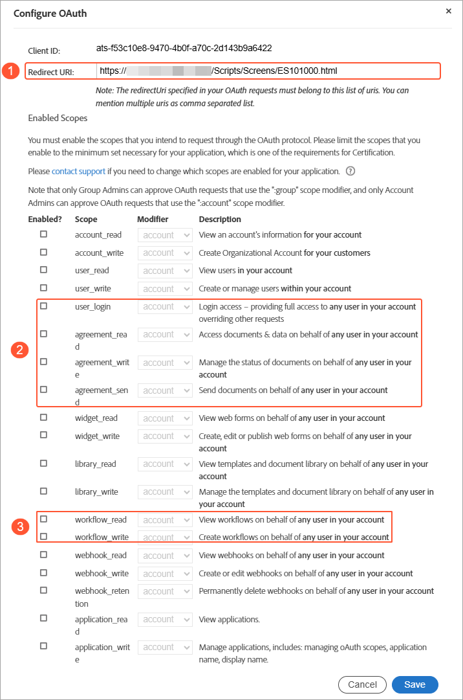
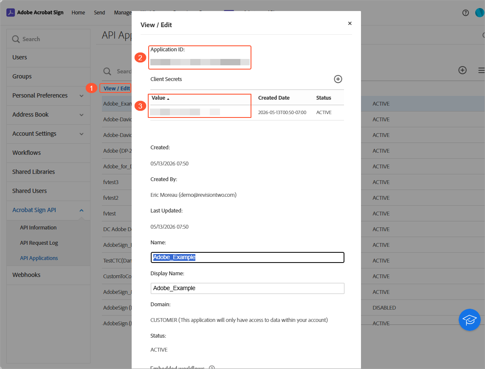
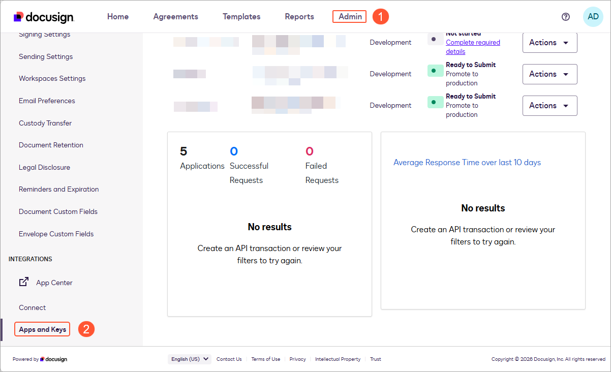
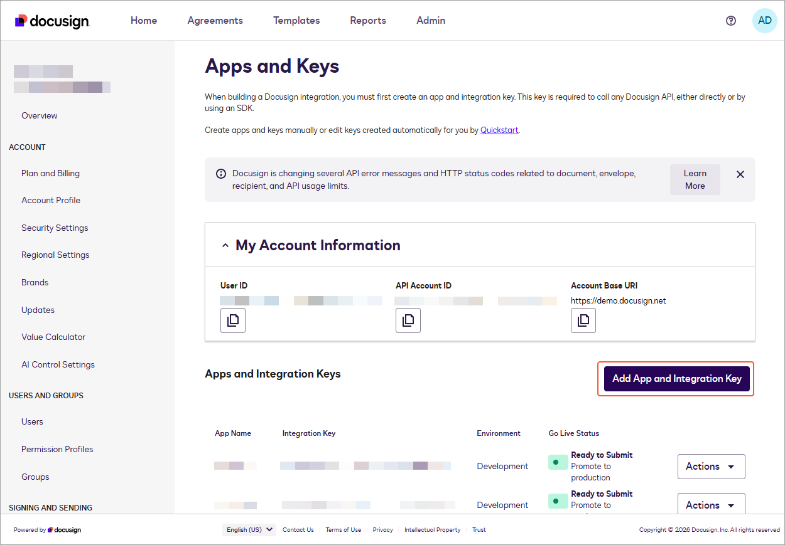
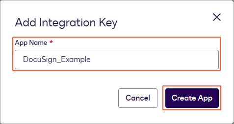
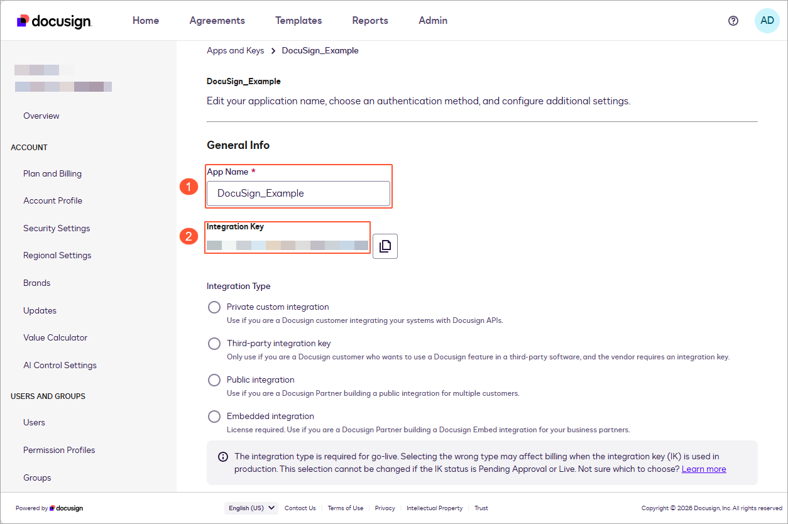
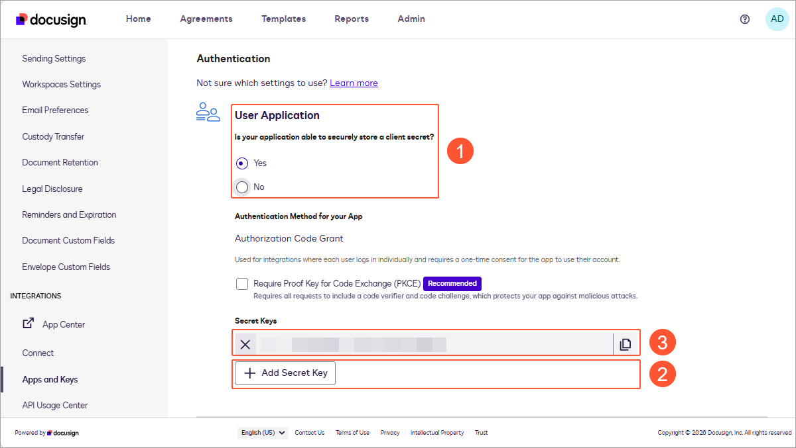

# Esignature Providers: General Information {#_8f342a2a-aa74-4a83-a1b6-d2c558e7d26f .concept}

Acumatica ERP integrates with Adobe® Acrobat® Sign and DocuSign™, letting you send documents for electronic signing, follow their progress, and retrieve the signed copies—all from within the system.

Documents often require a formal signature from multiple parties before work can proceed or a deal can close. Instead of taking the file out of Acumatica, sending it through an external tool, and uploading the result by hand, you handle the whole process from the record itself and can check the signing status at any point.

To request a signature, you open a file attached to a record—a sales order, purchase order, change request, contract, or similar document—choose the signing account and recipients, and submit the file. The provider sends the document to each recipient by email. The system automatically attaches the completed file back to the original record once everyone has signed.

## Requirements for the Integration { .section}

Before you set up the integration with the esignature provider, you must do the following:

-   Configure an API application in the esignature provider’s portal: Adobe® Acrobat® Sign or DocuSign™
-   Get the credentials for the API application.

## Getting Credentials at Adobe® Acrobat® Sign { .section}

To get credentials for the API application in the Adobe® Acrobat® Sign portal, do the following:

1.  Open the [Adobe Sign](https://www.adobe.com/acrobat/business/sign.html) portal and sign in to your account.
2.  Open the **API** tab \(Item 1 below\).
3.  In the menu on the right of the **Adobe Acrobat Sign** page, click **API Applications** in the **Acrobat Sign API** section \(Item 2\).
4.  Click the **Create** button \(Item 3\).

    

5.  Specify **Name** \(Item 1 below\) and **Display Name** \(Item 2\) for your application.
6.  Select *Customer* \(Item 3\) in the **Domain** box.
7.  Click **Save** \(Item 4\).

    

8.  Select your application \(Item 1 below\) in the list.

    The table toolbar appears.

9.  Click **Configure OAuth for Application** \(Item 2\) in the table toolbar.

    

10. In the **Configure OAuth** dialog box, do the following:

    1.  In the **Redirect URI** box \(Item 1 below\), specify the address of your instance in the following format: *https://&lt;your\_Acumatica\_URL&gt;/Scripts/Screens/ES101000.html.*
    2.  For the *user* and *agreement* scopes \(Item 2\), select the check box in the **Enabled?** column next to the following ones:
        -   *user\_login*
        -   *agreement\_read*
        -   *agreement\_write*
        -   *agreement\_sent*
    3.  For the *workflow* scopes \(Item 3\), select the check box in the **Enabled?** column next to the following ones:
        -   *workflow\_write*
        -   *workflow\_read*
    4.  Make sure that *account* \(the default option\) is selected in the **Modifier** column for all scopes you've selected.
    5.  Click **Save** \(Item 4\).
    

11. Select your API application and click **View / Edit** \(Item 1 below\) in the table toolbar.
12. In the **View / Edit** dialog box, copy and save the following values:

    -   The **Application ID** box \(Item 2\)
    -   The **Value** column \(Item 3\) in the **Client Secrets** table.
    

You have successfully created the credentials you will use to set up the connection to Adobe® Acrobat® Sign in Acumatica ERP.

## Getting Credentials at DocuSign™ { .section}

To get credentials for the API application in the DocuSign™ portal, do the following:

1.  Open the [DocuSign](https://account-d.docusign.com/) portal and sign in to your account.
2.  Open the Admin tab \(Item 1 below\).
3.  In the menu to the right of the browser window, click **Apps and Keys** \(Item 2\) in the **Integrations** section.

    

4.  On the **Apps and Keys** page, click the **Add App and Integration Key** button.

    

5.  In the **Add Integration Key** dialog box, specify the name of your app in the **App Name** box.

    

    The **&lt;Your\_Application\_Name&gt;** page opens.

6.  In the **General Info** section, do the following:

    1.  Copy the value of the **Integration Key** box \(Item 1 below\).
    2.  In the **Integration Type** box \(Item 2\), select *Third-party integration key*.
    

7.  In the **Authentication** section, do the following:

    1.  In the **User Application** box \(Item 1 below\), select *Yes*.
    2.  Click **Add Secret Key** \(Item 2\).
    3.  Copy and record the generated key \(Item 3\).
    

8.  In the **Additional Settings** section, do the following:
    1.  Click **Add URL** \(Item 1 below\).
    2.  In the empty box \(Item 2\), specify the address of your instance in the following format: *https://&lt;your\_Acumatica\_URL&gt;/Scripts/Screens/ES101000.html.*
    3.  Click **Save** \(Item 3\).

You have successfully created the credentials you will use to set up the connection to DocuSign™ in Acumatica ERP.

**Parent topic:**[Integrating with Esignature Providers](../UserGuide/Integrations_eSignature_Serviice_Mapref.md)

