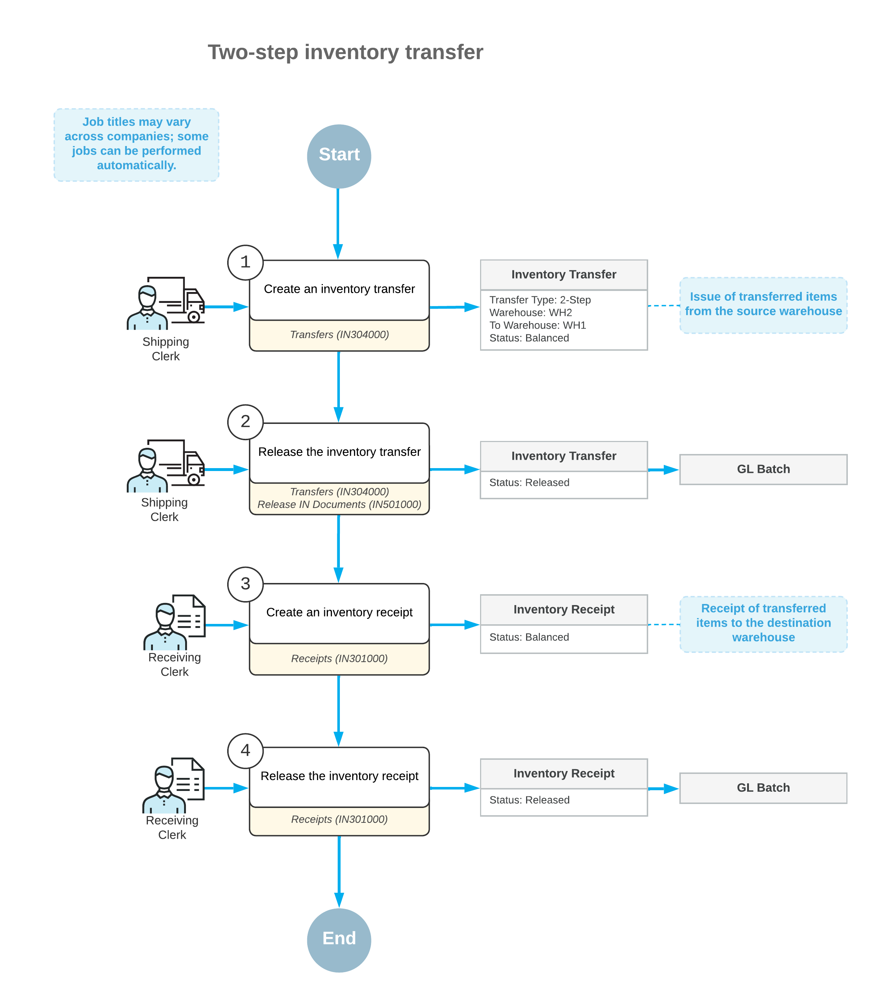

# Two-Step Transfers: General Information {#_f24901ad-718a-4293-90f9-491608c79bea .concept}

If your organization uses multiple warehouses to store items, you may need to transfer stock items between warehouses. To record stock movements between warehouses in Acumatica ERP, you use a two-step transfer—that is, you first issue the required quantity of items from a source warehouse, and you then receive the items in the destination warehouse.

## Learning Objectives { .section}

In this chapter, you will do the following:

-   Record the movement of stock items between warehouses by using a two-step transfer
-   Find information about items in transit

## Applicable Scenarios { .section}

You may need to use two-step transfers when you need to track movements of items between warehouses. A two-step transfer can reflect a movement between warehouses in different towns \(which may take up to multiple days\) or a movement between warehouses that are close to each other \(which may take up to several hours\).

## Two-Step Transfer Process { .section}

For a two-step transfer, you create both of the following documents:

1.  Transfer of the *2-Step* type: You create this document by using the [Transfers](IN_30_40_00.md) \(IN304000\) form. When this document is released, the on-hand quantity of the items in the source warehouse is decreased.
2.  Transfer receipt: When the transferred items are received, you create an inventory receipt for this transfer on the [Receipts](IN_30_10_00.md) \(IN301000\) form by selecting the reference number of the transfer in the **Transfer Nbr.** box. When you select this number, the relevant settings of the transfer, including the detail lines, will be inserted in the transfer receipt. When the receipt is released, the on-hand quantity of the items in the destination warehouse is increased.

## Workflow of a Two-Step Inventory Transfer { .section}

For a transfer of items between warehouses, the typical processing involves the actions and generated documents and transactions shown in the following diagram.

## Costs of Transferred Items { .section}

Moving stock items between warehouses usually requires some time. Items that have been issued from a source warehouse and have not been delivered to a destination warehouse are regarded as being in transit. The costs of items in transit are recorded temporarily to the In-Transit account, which is specified in the **In-Transit Account** box on the [Inventory Preferences](IN_10_10_00.md) \(IN101000\) form \(**Account Settings** section of the **General** tab\). When the items are received at the destination warehouse, their costs are transferred to the appropriate inventory account. For details, see [Two-Step Transfers: Generated Transactions](InvMgmt_2Step_Transfers_Transactions.md).

The costs the transferred items will have in the destination warehouse depend on the valuation methods assigned to the items on the [Stock Items](IN_20_25_00.md) \(IN202500\) form. For items with the *Average* and *Standard* valuation methods specified in the **Valuation Method** box, the cost of an item in the destination warehouse will be the same as the cost of the item at the source warehouse. For an item with the *FIFO* or *Specific* valuation method, a transfer receipt creates a new cost layer with the transferred quantity of the item and with the number and date of this transfer receipt.

**Parent topic:**[Processing Two-Step Inventory Transfers](../UserGuide/InvMgmt_2Step_Transfers_Mapref.md)

