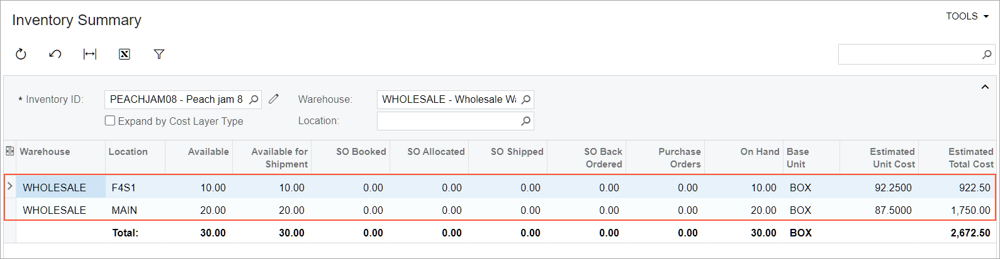
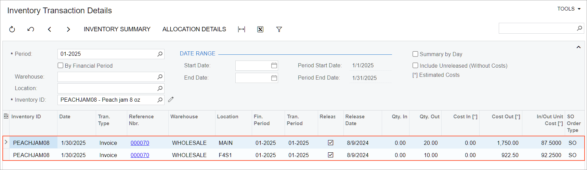

# Item Costs and Valuation Methods: To Sell Items with the Average Method {#_ba20c8fa-a19b-41e0-8e87-7540c77dba94 .task}

The following activity demonstrates how to completely process a sale of a stock item that is assigned the *Average* valuation method.

**Attention:** This activity is based on the *U100* dataset. If you are using another dataset or if any system settings have been changed in *U100*, these changes can affect the workflow of the activity and the results of the processing. To avoid issues, restore the *U100* dataset to its initial state.

## Story { .section}

SweetLife Fruits &amp; Jams is a midsize company that purchases fruit, jams, and spices from large fruit vendors and then sells these goods to wholesale customers, such as restaurants and cafes. Peach jam is among these goods. The *PEACHJAM08* stock item represents an 8-ounce \(small\) jar of peach jam and has been assigned the *Average* valuation method in Acumatica ERP.

Previously, SweetLife bought peach jam as follows:

-   On December 1, 2025, 10 boxes of peach jam for $85 each, which were received at the main warehouse location.
-   On December 15, 2025, 10 boxes of peach jam for $90 each, which were received at the main warehouse location.
-   On December 20, 2025, 10 boxes of peach jam for $92.25 each, which were received at the fruit warehouse location; costs for this location should be tracked separately. These boxes were bought from a particular vendor at a higher price for a special customer project, but the customer later refused to buy them.

On January 30, 2026, the FourStar Coffee &amp; Sweets Shop customer ordered 30 boxes of the jam. Acting as SweetLife's sales manager Regina Wiley, you need to process the sale and review the cost of the peach jam issued from the warehouse.

## Configuration Overview {#section_tz4_djx_cnb .section}

In the *U100* dataset, the following tasks have been performed to support this activity:

-   On the [Enable/Disable Features](CS_10_00_00.md) \(CS100000\) form, the following features have been enabled:
    -   *Inventory and Order Management*, which provides the standard functionality of inventory and order management
    -   *Inventory*, which gives you the ability to maintain stock items by using forms related to the inventory functionality and to create and process sales and purchase documents that include stock items
    -   *Multiple Warehouse Locations*, which gives you the ability to create multiple locations and store stock items at these locations
-   On the [Customers](AR_30_30_00.md) \(AR303000\) form, the *COFFEESHOP* \(FourStar Coffee &amp; Sweets Shop\) customer has been created.
-   On the [Stock Items](IN_20_25_00.md) \(IN202500\) form, the *PEACHJAM08* stock item has been created, and the *Average* valuation method has been assigned to it.
-   On the [Warehouses](IN_20_40_00.md) \(IN204000\) form, the *WHOLESALE* warehouse has been created. On the **Locations** tab, the following locations have been defined for it:
    -   The default *MAIN* location, which was added by the system
    -   The *F4S1* fruit location, for which the **Cost Separately** check box has been selected
-   On the [Receipts](IN_30_10_00.md) \(IN301000\) form, the following receipts have been created and released:
    -   A receipt dated 12/1/2025 for 10 units of the *PEACHJAM08* item with a cost of $85 each. The units have been received in the *MAIN* location.
    -   A receipt dated 12/15/2025 for 10 units of the *PEACHJAM08* item with a cost of $90 each. The units have been received in the *MAIN* location.
    -   A receipt dated 12/20/2025 for 10 units of the *PEACHJAM08* item with a cost of $92.25 each. The units have been received in the *F4S1* location.

## Process Overview { .section}

In this activity, you will do the following:

1.  On the [Inventory Summary](IN_40_10_00.md) \(IN401000\) form, review the costs of the purchased jam at different warehouse locations.
2.  On the [Sales Orders](SO_30_10_00.md) \(SO301000\) form, create a sales order.
3.  On the same form, quick-process the sales order.
4.  On the [Inventory Transaction Details](IN_40_40_00.md) \(IN404000\) form, review how the stock item has been issued and how its cost has been calculated.

## System Preparation { .section}

Before you start performing the steps of this activity, do the following:

1.  Launch the Acumatica ERP website with the *U100* dataset preloaded, and sign in as a sales manager by using the *wiley* username and the *123* password.
2.  In the info area at the upper-right corner of the top pane of the Acumatica ERP screen, make sure that the business date is set to *1/30/2026*. If a different date is displayed, click the Business Date menu button and select *1/30/2026* from the calendar. For simplicity, you'll create and process all documents in this activity using this business date.

## Step 1: Reviewing the Costs of the Purchased Item { .section}

To review the average costs of the *PEACHJAM08* item at the locations of the *WHOLESALE* warehouse, do the following:

1.  Open the [Inventory Summary](IN_40_10_00.md) \(IN401000\) form.
2.  In the Selection area, specify the following settings:
    1.  **Inventory ID**: *PEACHJAM08*
    2.  **Warehouse**: *WHOLESALE*
3.  Review the costs \(see the following screenshot\). Notice the following:

    -   The item's average cost in the *MAIN* location is $87.50. It was calculated as the total item cost divided by the total item quantity in the warehouse: \(10 \* 85 + 10 \* 90\) / 20 = 87.5.
    -   The item's average cost in the *F4S1* location, whose costs are tracked separately, is the same as the item's unit cost of $92.25.
    

## Step 2: Creating a Sales Order { .section}

To create the sales order for the FourStar Coffee &amp; Sweets Shop, do the following:

1.  On the [Sales Orders](SO_30_10_00.md) \(SO301000\) form, add a new record.
2.  In the Summary area, specify the following settings:
    -   **Order Type**: *SO*
    -   **Customer**: *COFFEESHOP*
    -   **Date**: *1/30/2026*
    -   **Description**: `Sale of 30 boxes of peach jam`
3.  On the table toolbar of the **Details** tab, click **Add Row**.
4.  Specify the following settings in this row:
    -   **Branch**: *HEADOFFICE*
    -   **Inventory ID**: *PEACHJAM08*
    -   **Warehouse**: *WHOLESALE*
    -   **Quantity**: `30`
5.  On the form toolbar, click **Save**.

## Step 3: Quick-Processing the Sales Order { .section}

To process the sales order, do the following:

1.  While you are still viewing the *Sale of 30 boxes of peach jam* order on the [Sales Orders](SO_30_10_00.md) \(SO301000\) form, click **Quick Process** on the form toolbar.
2.  In the **Process Order** dialog box, which opens, do the following:
    1.  In the **Warehouse ID** box, make sure that *WHOLESALE* is selected.
    2.  In the **Shipment Date** section, make sure that *Today* is selected.
    3.  In the **Shipping** section, make sure that the following check boxes are selected:
        -   **Create Shipment**
        -   **Confirm Shipment**
        -   **Update IN**
    4.  In the **Invoicing** section, do the following:
        1.  Make sure that the **Prepare Invoice** check box is selected.
        2.  Select the **Release Invoice** check box.
    5.  Click **OK**. The **Processing Results** dialog box opens. Wait for the system to create the documents.
    6.  Close the dialog box. Notice that the sales order now has the *Completed* status.

## Step 4: Reviewing the Costs of the Sold Item { .section}

To review how the system has calculated the costs for the issued *PEACHJAM08* item, do the following:

1.  Open the [Inventory Transaction Details](IN_40_40_00.md) \(IN404000\) form.
2.  In the Selection area, specify the following settings:
    -   **Period**: *01-2026*
    -   **Inventory ID**: *PEACHJAM08*
3.  Review the costs in the table \(see the following screenshot\). Notice that the cost of the 20 items issued from the *MAIN* location is *1,750.00*, which means that the system calculated the average unit cost of one item as $87.50 \(the average of $85 and $90\). Also notice that even though the warehouse is the same and the valuation method is *Average*, the system has issued the 10 items from the *F4S1* location at the separate unit cost of $92.25.

    

**Parent topic:**[Managing Item Costs and Valuation Methods](../UserGuide/Item_Costs_Valuation_Methods_Mapref.md)

