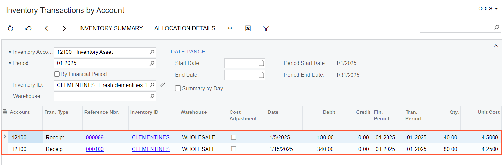
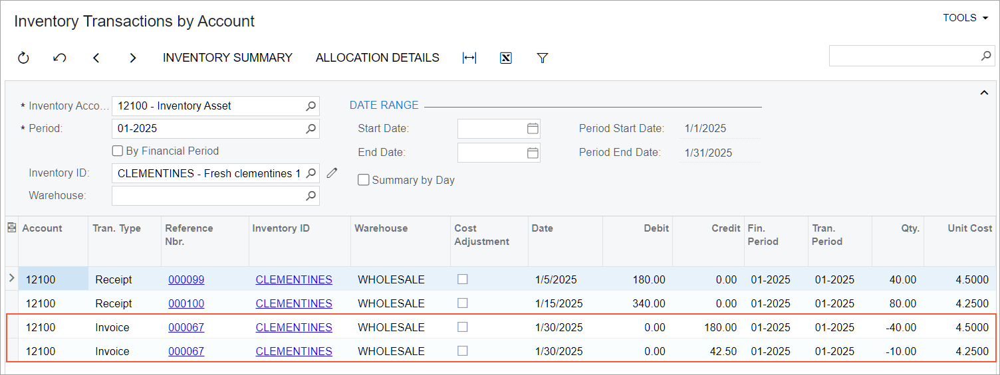

# Item Costs and Valuation Methods: To Sell Items with the FIFO Method {#_7c615d0c-4bf4-4b0f-b638-02f536f247fe .task}

The following activity demonstrates how to completely process a sale of stock item that is assigned the *FIFO* valuation method.

**Attention:** This activity is based on the *U100* dataset. If you are using another dataset or if any system settings have been changed in *U100*, these changes can affect the workflow of the activity and the results of the processing. To avoid issues, restore the *U100* dataset to its initial state.

## Story { .section}

SweetLife Fruits &amp; Jams is a midsize company that purchases fruit, jams, and spices from large fruit vendors and then sells these goods to wholesale customers such as restaurants and cafes. Clementines are among these goods. The *CLEMENTINES* stock item represents one pound of fresh clementines and has been assigned the *FIFO* valuation method in Acumatica ERP.

Previously SweetLife bought clementines as follows:

-   On January 5, 2026, 40 pounds for $4.50 each
-   On January 15, 2026, 80 pounds for $4.25 each

Suppose that you are Regina Wiley, a sales manager at SweetLife. The FourStar Coffee &amp; Sweets Shop customer ordered 50 pounds of clementines. You need to process the sale and review the cost of the items issued from the warehouse.

## Configuration Overview {#section_tz4_djx_cnb .section}

In the *U100* dataset, the following tasks have been performed to support this activity:

-   On the [Enable/Disable Features](CS_10_00_00.md) \(CS100000\) form, the following features have been enabled:
    -   *Inventory and Order Management*, which provides the standard functionality of inventory and order management
    -   *Inventory*, which gives you the ability to maintain stock items by using forms related to the inventory functionality and to create and process sales and purchase documents that include stock items
-   On the [Customers](AR_30_30_00.md) \(AR303000\) form, the *COFFEESHOP* \(FourStar Coffee &amp; Sweets Shop\) customer has been created.
-   On the [Stock Items](IN_20_25_00.md) \(IN202500\) form, the *CLEMENTINES* stock item has been created and the *FIFO* valuation method has been assigned to it.
-   On the [Receipts](IN_30_10_00.md) \(IN301000\) form, the following receipts have been created:
    -   The *000099* receipt dated 1/5/2026 with 40 pounds of the *CLEMENTINES* item and a cost of $4.50 each
    -   The *0000100* receipt dated 1/15/2026 with 80 pounds of the *CLEMENTINES* item and a cost of $4.25 each

## Process Overview { .section}

In this activity, you will do the following:

1.  On the [Inventory Transactions by Account](IN_40_30_00.md) \(IN403000\) form, review the costs of the purchased fruit.
2.  On the [Sales Orders](SO_30_10_00.md) \(SO301000\) form, create a sales order.
3.  On the same form, quick-process the sales order.
4.  On the [Inventory Transactions by Account](IN_40_30_00.md) form, review how the stock item has been issued and how its cost has been calculated.

## System Preparation { .section}

Before you start performing the steps of this activity, do the following:

1.  Launch the Acumatica ERP website with the *U100* dataset preloaded, and sign in as a sales manager by using the *wiley* username and the *123* password.
2.  In the info area at the upper-right corner of the top pane of the Acumatica ERP screen, make sure that the business date is set to *1/30/2026*. If a different date is displayed, click the Business Date menu button and select *1/30/2026* from the calendar. For simplicity, you'll create and process all documents in this activity using this business date.

## Step 1: Reviewing the Costs of the Purchased Item { .section}

To review the costs of the *CLEMENTINES* item at the *WHOLESALE* warehouse, do the following:

1.  Open the [Inventory Transactions by Account](IN_40_30_00.md) \(IN403000\) form.
2.  In the Selection area, specify the following settings:
    -   **Inventory Account**: *12100 - Inventory Asset*
    -   **Inventory ID**: *CLEMENTINES*
3.  Review the items that were received at two different costs \(see the following screenshot\).

    

## Step 2: Creating a Sales Order { .section}

To create the sales order for the FourStar Coffee &amp; Sweets Shop, do the following:

1.  On the [Sales Orders](SO_30_10_00.md) \(SO301000\) form, add a new record.
2.  In the Summary area, specify the following settings:
    -   **Order Type**: *SO*
    -   **Customer**: *COFFEESHOP*
    -   **Date**: *1/30/2026*
    -   **Description**: `Sale of 50 pounds of clementines`
3.  On the table toolbar of the **Details** tab, click **Add Row**.
4.  Specify the following settings in this row:
    -   **Branch**: *HEADOFFICE*
    -   **Inventory ID**: *CLEMENTINES*
    -   **Warehouse**: *WHOLESALE*
    -   **Quantity**: `50`
5.  On the form toolbar, click **Save**.

## Step 3: Quick-Processing the Sales Order { .section}

To process the sales order, do the following:

1.  While you are still viewing the *Sale of 50 pounds of clementines* order on the [Sales Orders](SO_30_10_00.md) \(SO301000\) form, click **Quick Process** on the form toolbar.
2.  In the **Process Order** dialog box, which opens, do the following:
    1.  In the **Warehouse ID** box, make sure that *WHOLESALE* is selected.
    2.  In the **Shipment Date** section, make sure that *Today* is selected.
    3.  In the **Shipping** section, make sure that the following check boxes are selected:
        -   **Create Shipment**
        -   **Confirm Shipment**
        -   **Update IN**
    4.  In the **Invoicing** section, do the following:
        1.  Make sure that the **Prepare Invoice** check box is selected.
        2.  Select the **Release Invoice** check box.
    5.  Click **OK**. The **Processing Results** dialog box opens. Wait for the system to create the documents.
    6.  Close the dialog box. Notice that the sales order now has the *Completed* status.

## Step 4: Reviewing the Item's Costs { .section}

To review how the system has calculated the costs for the issued *CLEMENTINES* item, do the following:

1.  Open the [Inventory Transactions by Account](IN_40_30_00.md) \(IN403000\) form.
2.  In the Selection area, specify the following settings:
    -   **Inventory Account**: *12100 - Inventory Asset*
    -   **Inventory ID**: *CLEMENTINES*
3.  Review the costs in the table \(see the following screenshot\). Notice that the 50 pounds of the item were issued as follows:

    -   For the 40 pounds that were received earlier, at the unit cost of $4.50
    -   For the 10 pounds that were received later, at the unit cost of $4.25
    

**Parent topic:**[Managing Item Costs and Valuation Methods](../UserGuide/Item_Costs_Valuation_Methods_Mapref.md)

