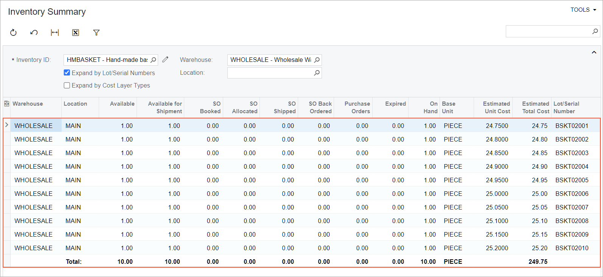
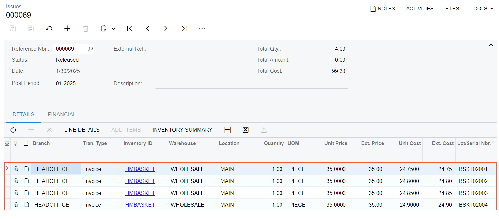
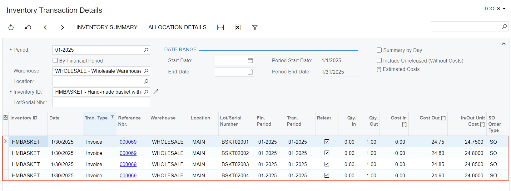

# Item Costs and Valuation Methods: To Sell Items with the Specific Method {#_62e9ab4a-f050-4a7b-bb52-97c4092c89e0 .task}

The following activity demonstrates how to completely process a sale of a stock item that is assigned the *Specific* valuation method.

**Attention:** This activity is based on the *U100* dataset. If you are using another dataset or if any system settings have been changed in *U100*, these changes can affect the workflow of the activity and the results of the processing. To avoid issues, restore the *U100* dataset to its initial state.

## Story { .section}

SweetLife Fruits &amp; Jams is a midsize company that purchases fruit, jams, and spices from large fruit vendors and then sells these goods to wholesale customers such as restaurants and cafes. Also, SweetLife offers hand-made gift baskets with a unique design for fruit and jam. The *HMBASKET* stock item \(which represents one hand-made gift basket\) has been assigned the *Specific* valuation method in Acumatica ERP.

On January 15, 2026, the company bought ten baskets, and each of them has a different serial number. On receipt of the baskets, the serial numbers have been assigned to them. Further suppose that the Delicious Energy restaurant ordered four baskets.

Suppose that you are Regina Wiley, a sales manager at SweetLife. You need to process the sale and review the cost of the baskets issued from the warehouse.

## Configuration Overview {#section_tz4_djx_cnb .section}

In the *U100* dataset, the following tasks have been performed to support this activity:

-   On the [Enable/Disable Features](CS_10_00_00.md) \(CS100000\) form, the following features have been enabled:
    -   *Inventory and Order Management*, which provides the standard functionality of inventory and order management
    -   *Inventory*, which gives you the ability to maintain stock items by using forms related to the inventory functionality and to create and process sales and purchase documents that include stock items
-   On the [Customers](AR_30_30_00.md) \(AR303000\) form, the *DELIENERGY* \(Delicious Energy Restaurant\) customer has been created.
-   On the [Lot/Serial Classes](IN_20_70_00.md) \(IN207000\) form, the *HMBSKT* serial class \(a class for tracking handmade baskets by serial number\) has been created.

    **Tip:** In a production system, after you enable the *Lot and Serial Tracking* feature, you would configure all needed lot and serial classes before creating stock items and processing documents. For simplicity, in the *U100* dataset, the serial class has already been created and assigned to a stock item, and the items have been received to inventory.

-   On the [Stock Items](IN_20_25_00.md) \(IN202500\) form, the *HMBASKET* stock item has been created with the *HMBSKT* serial class and the *Specific* valuation method.
-   On the [Receipts](IN_30_10_00.md) \(IN301000\) form, the *000103* receipt dated 1/15/2026 has been created for the *HMBASKET* item. It has the ten lines for ten baskets with serial numbers from *BSKT02001* through *BSKT02010*.

## Process Overview { .section}

In this activity, you will do the following:

1.  On the [Enable/Disable Features](CS_10_00_00.md) \(CS100000\) form, enable the *Lot and Serial Tracking* feature.
2.  On the [Inventory Summary](IN_40_10_00.md) \(IN401000\) form, review the costs of the purchased baskets.
3.  On the [Sales Orders](SO_30_10_00.md) \(SO301000\) form, create a sales order.
4.  On the same form, quick-process the sales order.
5.  On the [Issues](IN_30_20_00.md) \(IN302000\) and [Inventory Transaction Details](IN_40_40_00.md) \(IN404000\) forms, review how the stock item has been issued and how its cost has been calculated.

## System Preparation { .section}

Before you start performing the steps of this activity, do the following:

1.  Launch the Acumatica ERP website with the *U100* dataset preloaded, and sign in as a sales manager by using the *wiley* username and the *123* password.
2.  In the info area at the upper-right corner of the top pane of the Acumatica ERP screen, make sure that the business date is set to *1/30/2026*. If a different date is displayed, click the Business Date menu button and select *1/30/2026* from the calendar. For simplicity, you'll create and process all documents in this activity using this business date.

## Step 1: Enabling the Feature { .section}

To track items in documents by lot numbers, you enable the *Lot and Serial Tracking* feature as follows:

1.  Open the [Enable/Disable Features](CS_10_00_00.md) \(CS100000\) form.
2.  On the form toolbar, click **Modify**.
3.  In the *Inventory and Order Management* group of features, select **Lot and Serial Tracking**.
4.  On the form toolbar, click **Enable**.

## Step 2: Reviewing the Costs of the Purchased Item { .section}

To review the costs of the *HMBASKET* item, do the following:

1.  Open the [Inventory Summary](IN_40_10_00.md) \(IN401000\) form.
2.  In the Selection area, specify the following settings:
    1.  **Inventory ID**: *HMBASKET*
    2.  **Warehouse**: *WHOLESALE*
    3.  **Expand by Lot/Serial Numbers**: Selected
3.  Review the costs \(see the following screenshot\). Notice that the cost of each item with a serial number has been recorded separately.

    

## Step 3: Creating a Sales Order { .section}

To create a sales order for the Delicious Energy restaurant, do the following:

1.  On the [Sales Orders](SO_30_10_00.md) \(SO301000\) form, add a new record.
2.  In the Summary area, specify the following settings:
    -   **Order Type**: *SO*
    -   **Customer**: *DELIENERGY*
    -   **Date**: *1/30/2026*
    -   **Description**: `Sale of hand-made baskets`
3.  On the table toolbar of the **Details** tab, click **Add Row**.
4.  Specify the following settings in this row:
    -   **Branch**: *HEADOFFICE*
    -   **Inventory ID**: *HMBASKET*
    -   **Warehouse**: *WHOLESALE*
5.  On the table toolbar, click **Line Details**.
6.  In the **Line Details** dialog box, which opens, do the following:
    1.  On the table toolbar, click **Add Row**. The system adds a line for one unit of the *HMBASKET* item.
    2.  In the **Lot/Serial Nbr.** column, select `BSKT02001`.
    3.  Click **Add Row**. The system adds a line for the second unit of the *HMBASKET* item.
    4.  In the **Lot/Serial Nbr.** column, select `BSKT02002`.
    5.  Click **Add Row**. The system adds a line for the third unit of the *HMBASKET* item.
    6.  In the **Lot/Serial Nbr.** column, select `BSKT02003`
    7.  Click **Add Row**. The system adds a line for the fourth unit of the *HMBASKET* item.
    8.  In the **Lot/Serial Nbr.** column, select `BSKT02004`
    9.  Click **OK** to save your changes and close the dialog box.
7.  On the **Details** tab, make sure that the **Quantity** equals to *4*.
8.  On the form toolbar, click **Save**.

## Step 4: Quick-Processing the Sales Order { .section}

To process the sales order, do the following:

1.  While you are still viewing the *Sale of hand-made baskets* order on the [Sales Orders](SO_30_10_00.md) \(SO301000\) form, click **Quick Process** on the form toolbar.
2.  In the **Process Order** dialog box, which opens, do the following:
    1.  In the **Warehouse ID** box, make sure that *WHOLESALE* is selected.
    2.  In the **Shipment Date** section, make sure that *Today* is selected.
    3.  In the **Shipping** section, make sure that the following check boxes are selected:
        -   **Create Shipment**
        -   **Confirm Shipment**
        -   **Update IN**
    4.  In the **Invoicing** section, do the following:
        -   Make sure that the **Prepare Invoice** check box is selected.
        -   Select the **Release Invoice** check box.
    5.  Click **OK**. The **Processing Results** dialog box opens. Wait for the system to create the documents.
    6.  Close the dialog box. Notice that the sales order now has the *Completed* status.

## Step 5: Reviewing the Item's Costs { .section}

To review how the system has calculated the costs for the issued *HMBASKET* items, do the following:

1.  While you are still viewing the *Sale of hand-made baskets* order on the [Sales Orders](SO_30_10_00.md) \(SO301000\) form, open the **Shipments** tab.
2.  In the **Inventory Ref. Nbr.** column, click the link. The issue opens on the [Issues](IN_30_20_00.md) \(IN302000\) form in a pop-up window.
3.  Notice that four items with the following serial numbers have been issued \(see the following screenshot\):

    -   *BSKT02001*
    -   *BSKT02002*
    -   *BSKT02003*
    -   *BSKT02004*
    

4.  Open the [Inventory Transaction Details](IN_40_40_00.md) \(IN404000\) form.
5.  In the Selection area, specify the following settings:
    -   **Period**: *01-2026*
    -   **Warehouse**: *WHOLESALE*
    -   **Inventory ID**: *HMBASKET*
6.  In the table, click the header of the **Tran. Type** column.
7.  In the Sorting and Filtering Settings dialog box, which opens, do the following:
    1.  Click *Clear All*
    2.  Select the *Invoice* condition
    3.  Click **OK**
8.  Review the costs in the table \(see the following screenshot\). Notice that the items are issued at the unit cost for which the items have been received. The cost is tracked separately for each serial number assigned to the stock item.

    

**Parent topic:**[Managing Item Costs and Valuation Methods](../UserGuide/Item_Costs_Valuation_Methods_Mapref.md)

