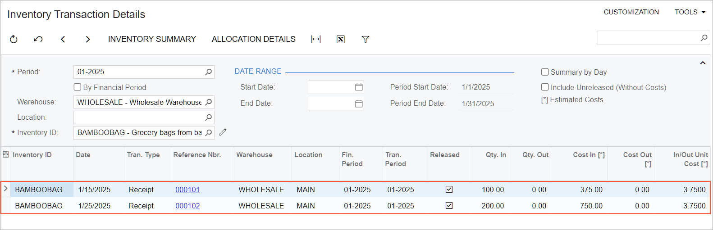
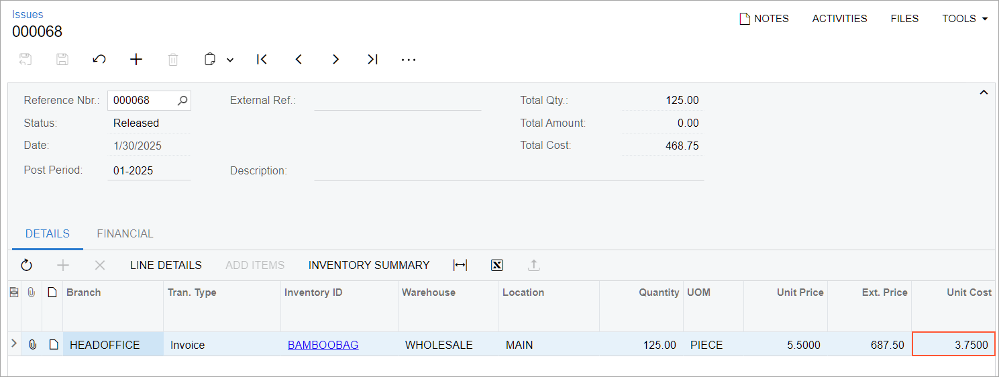

# Item Costs and Valuation Methods: To Sell Items with the Standard Method {#_969dcc00-3d20-463c-9c4e-523248bbbd5a .task}

The following activity demonstrates how to completely process a sale of a stock item that is assigned the *Standard* valuation method.

**Attention:** This activity is based on the *U100* dataset. If you are using another dataset or if any system settings have been changed in *U100*, these changes can affect the workflow of the activity and the results of the processing. To avoid issues, restore the *U100* dataset to its initial state.

## Story { .section}

SweetLife Fruits &amp; Jams is a midsize company that purchases fruit, jams, and spices from large fruit vendors and then sells these goods to wholesale customers such as restaurants and cafes. Also, SweetLife offers colorful grocery bags from bamboo fabric for wrapping its goods. The standard cost for a bag is $3.75.

On January 15, 2026, the company bought 100 bags at the cost of $3.75 from a regular vendor. On January 20, 2026, the company bought 200 bags at the cost of $3.50 from a new vendor. Further suppose that the HM's Bakery &amp; Cafe customer ordered 125 bags for giving out SweetLife's fruit at a corporate event.

Acting as sales manager Regina Wiley, you need to review how the costs of the purchased bags have been recorded in the system. You will then process the sale, and review the cost of the bags issued from the warehouse.

## Configuration Overview {#section_tz4_djx_cnb .section}

In the *U100* dataset, the following tasks have been performed to support this activity:

-   On the [Enable/Disable Features](CS_10_00_00.md) \(CS100000\) form, the following features have been enabled:
    -   *Inventory and Order Management*, which provides the standard functionality of inventory and order management
    -   *Inventory*, which gives you the ability to maintain stock items by using forms related to the inventory functionality and to create and process sales and purchase documents that include stock items
-   On the [Customers](AR_30_30_00.md) \(AR303000\) form, the *HMBAKERY* \(HM's Bakery &amp; Cafe\) customer has been created.
-   On the [Stock Items](IN_20_25_00.md) \(IN202500\) form, the *BAMBOOBAG* stock item has been created with the *Standard* valuation method and a cost of $3.75.
-   On the [Purchase Receipts](PO_30_20_00.md) \(PO302000\) form, the following purchase receipts that include the *BAMBOOBAG* item have been created and released:
    -   A purchase receipt dated 1/15/2026 for 100 pieces with a cost of $3.75
    -   A purchase receipt dated 1/25/2026 for 200 pieces with a cost of $3.50

## Process Overview { .section}

In this activity, you will do the following:

1.  On the [Receipts](IN_30_10_00.md) \(IN301000\) and [Inventory Transaction Details](IN_40_40_00.md) \(IN404000\) forms, review the cost of the purchased stock item.
2.  On the [Sales Orders](SO_30_10_00.md) \(SO301000\) form, create a sales order.
3.  On the same form, quick-process the sales order.
4.  On the [Issues](IN_30_20_00.md) \(IN302000\) form, review the issue related to the sales order to see how the stock item has been issued and its cost has been calculated.

## System Preparation { .section}

Before you begin performing the steps of this activity, do the following:

1.  Launch the Acumatica ERP website with the *U100* dataset preloaded, and sign in as a sales manager by using the *wiley* username and the *123* password.
2.  In the info area at the upper-right corner of the top pane of the Acumatica ERP screen, make sure that the business date is set to *1/30/2026*. If a different date is displayed, click the Business Date menu button and select *1/30/2026* from the calendar. For simplicity, you'll create and process all documents in this activity using this business date.

## Step 1: Reviewing the Cost of the Purchased Item { .section}

To review the costs of the *BAMBOOBAG* stock item, do the following:

1.  On the [Receipts](IN_30_10_00.md) \(IN301000\) form, open the receipt dated 1/25/2026 for 200 pieces of bags. Notice that the **Total Cost** is *700*, which means that the unit cost is $3.5.

    **Tip:** On the release of the receipt, which was generated when the purchase receipt was released, the system posted a transaction to the Inventory account. This transaction has the *BAMBOOBAG* item with its standard unit cost of $3.75. The difference between the actual cost of $3.5 and standard cost of $3.75 \(which is $0.25\) was posted to the Standard Cost Variance account. The transaction can be reviewed on the [Journal Transactions](GL_30_10_00.md) \(GL301000\) form.

2.  Open the [Inventory Transaction Details](IN_40_40_00.md) \(IN404000\) form.
3.  In the Selection area, specify the following settings:
    -   **Period**: *01-2026*
    -   **Warehouse**: *WHOLESALE*
    -   **Inventory ID**: *BAMBOOBAG*
4.  Review the amounts in the table \(see the following screenshot\). Notice that in the receipt dated 1/15/2026 for 100 bags, the **In/Out Unit Cost \[\*\]** is *3.75*. This means that the standard unit cost of $3.75 was used. Also notice that in the receipt dated 1/25/2026 for 200 bags, the **In/Out Unit Cost \[\*\]** is *3.75*. Despite the unit cost of $3.5 for the purchased items the system has recorded the standard cost of $3.75.

    

## Step 2: Creating a Sales Order { .section}

To create the sales order for HM's Bakery &amp; Cafe, do the following:

1.  On the [Sales Orders](SO_30_10_00.md) \(SO301000\) form, add a new record.
2.  In the Summary area, specify the following settings:
    -   **Order Type**: *SO*
    -   **Customer**: *HMBAKERY*
    -   **Date**: *1/30/2026*
    -   **Description**: `Sale of 125 bamboo grocery bags`
3.  On the table toolbar of the **Details** tab, click **Add Row**.
4.  Specify the following settings in this row:
    -   **Branch**: *HEADOFFICE*
    -   **Inventory ID**: *BAMBOOBAG*
    -   **Warehouse**: *WHOLESALE*
    -   **Quantity**: `125`
5.  On the form toolbar, click **Save**.

## Step 3: Quick-Processing the Sales Order { .section}

To process the sales order, do the following:

1.  While you are still viewing the *Sale of 125 bamboo grocery bags* order on the [Sales Orders](SO_30_10_00.md) \(SO301000\) form, click **Quick Process** on the form toolbar.
2.  In the **Process Order** dialog box, which opens, do the following:
    1.  In the **Warehouse ID** box, make sure that *WHOLESALE* is selected.
    2.  In the **Shipment Date** section, make sure that *Today* is selected.
    3.  In the **Shipping** section, make sure that the following check boxes are selected:
        -   **Create Shipment**
        -   **Confirm Shipment**
        -   **Update IN**
    4.  In the **Invoicing** section, do the following:
        1.  Make sure that the **Prepare Invoice** check box is selected.
        2.  Select the **Release Invoice** check box.
    5.  Click **OK**. The **Processing Results** dialog box opens. Wait for the system to create the documents.
    6.  Close the dialog box. Notice that the sales order now has the *Completed* status.

## Step 4: Reviewing the Item's Cost { .section}

To review how the system has recorded the cost for the issued *BAMBOOBAG* item, do the following:

1.  While you are still viewing the *Sale of 125 bamboo grocery bags* order on the [Sales Orders](SO_30_10_00.md) \(SO301000\) form, open the **Shipments** tab.
2.  In the **Inventory Ref. Nbr.** column, click the link. The issue opens on the [Issues](IN_30_20_00.md) \(IN302000\) form in a pop-up window. In the **Unit Cost** column, notice that the *3.75* standard cost is inserted.

    

**Parent topic:**[Managing Item Costs and Valuation Methods](../UserGuide/Item_Costs_Valuation_Methods_Mapref.md)

