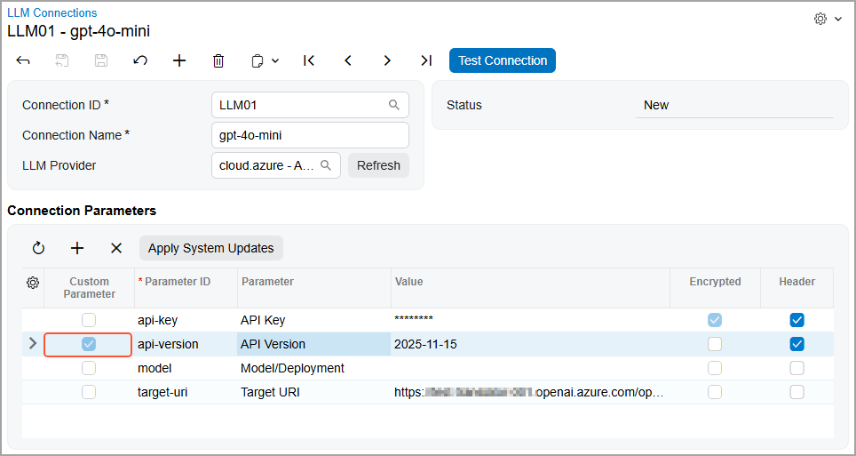
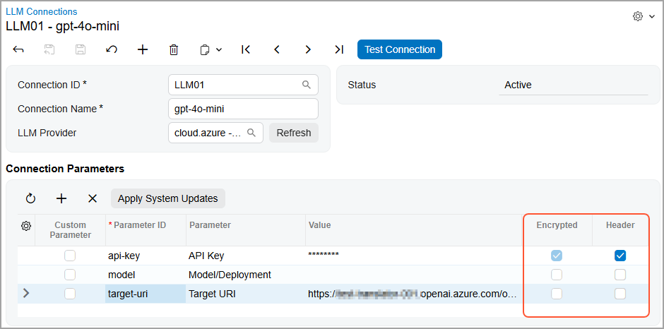
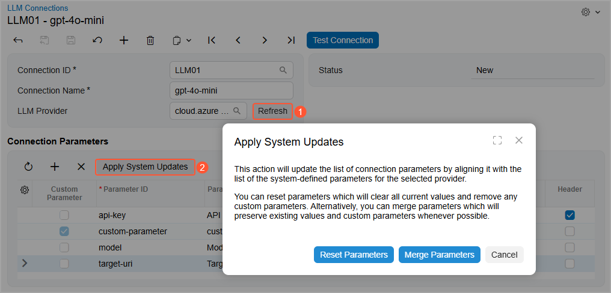

# Integration with LLM Providers: Use of Custom Connection Parameters {#_9bf85594-d22e-41fb-b97c-4bcf24aa91fb .concept}

Connection parameters depend on the large language model \(LLM\) provider you use. When the provider modifies any of those parameters, you need to update your connection settings accordingly. Doing so helps you avoid errors when you're testing the connection, running prompts, or invoking LLM-generated commands.

Acumatica developers update the list of connection parameters regularly; however, you might want to update the settings manually before you receive updates from us. If your provider has added a new parameter or removed an obsolete one, you can keep your connection data up-to-date with the help of custom parameters.

## Adding and Deleting Custom Parameters { .section}

Suppose that you've tested the LLM connection and your prompts work as expected. Then your LLM provider adds a new parameter. The next time you test a prompt that uses this connection or invoke an LLM-generated command, the system displays an error indicating that a parameter is missing.

To fix this, you add a custom parameter by clicking **Add Row** in the **Connection Parameters** table on the [LLM Connections](ML_20_10_00.md) \(ML201000\) form. You specify the ID, name, and value for the added parameter. The system automatically selects the check box in the new **Custom Parameter** column \(shown below\); this check box is read-only.

You can also select the **Encrypted** check box for the custom parameter to hide it on the form and encrypt it in the database \(see below\). If the parameter should be sent to the provider as an HTTP header, you select the **Header** check box.

We recommend that you select the **Encrypted** check box for sensitive data, such as credentials.

For a system parameter, the following rules apply to the **Encrypted** check box:

-   If the check box is selected, it’s always read-only.
-   If the check box is cleared, you can change its state until you save your changes on the form.

For a custom parameter, you can change the state of the check box until you save your changes on the form.

For a system or custom parameter, the check box becomes read-only after you successfully test the connection. Also, after you save your changes on the form, the system masks the **Value** column so that you can’t see the value of the parameter anymore.

If the provider removes a parameter, the system also displays an appropriate message. You can remove this parameter by clicking **Delete Row** on the table toolbar and test the connection or prompt again.

## Syncing Connection Settings { .section}

Suppose that after you've added custom parameters, Acumatica developers have updated the list of connection parameters in the system. To reflect these changes in your LLM connection, you need to synchronize your settings with the system data.

To do this, you click **Refresh** to the right of the **LLM Provider** box in the Summary area \(Item 1 below\). The system downloads the latest version of the connection parameters from the cloud service to the database. You then click **Apply System Updates** on the table toolbar of the **Connection Parameters** table \(Item 2\). In the dialog box that opens, you select how you want to proceed with the updates.

You can click **Reset Parameters** or **Merge Parameters**.

Clicking **Reset Parameters** removes custom parameters, updates the values of existing parameters, removes unneeded ones, and adds new parameters according to the provider's list. The table will contain only system parameters without any values, and you’ll need to reenter the values from scratch.

Clicking **Merge Parameters** adds updated parameters from the provider's list and preserves custom ones. Depending on whether the ID of a custom parameter matches the ID of a system parameter, the system handles this custom parameter as follows:

-   If the ID is the same: Updates the **Parameter**, **Encrypted**, and **Header** columns. Any value that you've entered in the **Value** column for this parameter remains unchanged.
-   If the ID is different: Does not change anything.

**Tip:** For each custom parameter whose ID matches a system parameter, the system clears the check box in the **Custom** column, indicating that the parameter is now a system one.

**Parent topic:**[Integrating with LLM Providers](../UserGuide/LLM_Providers_Mapref.md)

